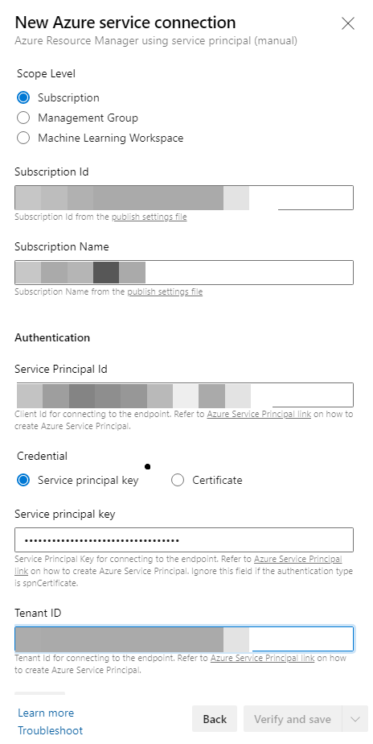
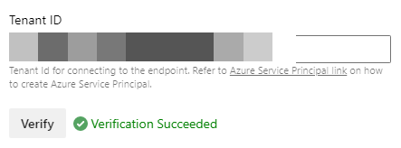

# Hadoop Migration on Azure PaaS

> Note: This is part of Enabling Hadoop Migrations to Azure reference implementation. For more information check out the [readme file in the root.] (https://github.com/Azure/Hadoop-Migrations/blob/main/README.md)

One of the challenges while migrating workloads from on-premises Hadoop to Azure is having the right deployment done which is aligning with the desired end state architecture and the application. With this bicep project we are aiming to reduce a significant effort which goes behind deploying the PaaS services on Azure and having a production ready architecture up and running.

We will be looking at the end state architecture for big data workloads on Azure PaaS listing all the components deployed as a part of bicep template deployment. With Bicep we also have an additional advantage of deploying only the modules we prefer for a customised architecture. In the later sections we will cover the pre-requisites for the template and different methods of deploying the resources on Azure such as Oneclick, Azure CLI, Github Actions and DevOps Pipeline. 


## Reference Architecture Deployment

By default, all the services which come under the reference architecture are enabled, and you must explicitly disable services that you don't want to be deployed from parameters which prompts in the ARM screen at portal or in the template files  `*.parameters.json` or directly in `*.bicep` 

> Note: Before deploying the resources, we recommend to check registration status of the required resource providers in your subscription. For more information, see [Resource providers for Azure services.](https://docs.microsoft.com/azure/azure-resource-manager/management/resource-providers-and-types)


Based on the detailed architecture above, the end state deployment is simplified below for better understanding.


For the reference architecture, the following services are created

- [Azure HDInsight](https://docs.microsoft.com/azure/hdinsight/)
- [Azure Synapse Analytics](https://docs.microsoft.com/azure/synapse-analytics/)
- [Azure Databricks](https://docs.microsoft.com/azure/databricks/)
- [Azure Data Factory](https://docs.microsoft.com/azure/data-factory/)
- [Azure Cosmos DB](https://docs.microsoft.com/azure/cosmos-db/)
- Infrastructure
  * [Azure Key Vault](https://docs.microsoft.com/azure/key-vault/general)
  * [VNet](https://docs.microsoft.com/azure/virtual-network/)
  * [VM](https://docs.microsoft.com/azure/virtual-machines/)
  * [Private DNS Zone](https://docs.microsoft.com/azure/dns/private-dns-overview)

For more details regarding the services that will be deployed, please read the [Hardoop Migration documentation.](https://github.com/Azure/Hadoop-Migrations)

## Before you start 

If you don't have an Azure subscription, [create your Azure free account today.](https://azure.microsoft.com/free/)

### Prerequisites

1. Azure CLI
2. Bicep

In this quickstart, you will create:

1. Resource Group
2. Service Principal and access
3. Public Key for SSH (Optional)

### 1. Resource Group

The Azure CLI's default authentication method uses a web browser and access token to sign in.

Run the login command

```command
az login
```

Once the authentication is successful, you should see a similar output:

```javascript
  {
    "cloudName": "AzureCloud",
    "homeTenantId": "xxxxxxxx-xxxx-xxxx-xxxx-xxxxxxxxxxxx",
    "id": "xxxxxxxx-xxxx-xxxx-xxxx-xxxxxxxxxxxx",
    "isDefault": true,
    "managedByTenants": [],
    "name": "xxxxxxxxxxxx",
    "state": "Enabled",
    "tenantId": "xxxxxxxx-xxxx-xxxx-xxxx-xxxxxxxxxxxx",
    "user": {
      "name": "xxxxxxx@xxxxxxxxx.com",
      "type": "user"
    }
  },
```

Copy the subscription `id` from output above, you will need it to create more resources.

Create a resource group using the below command

```commands
az group create -l <Your Region> -n <Resource Group Name> --subscription <Your Subscription Id>
```

### 2. Service Principal and access

An Azure service principal is an identity created for use with applications, hosted services, and automated tools to access Azure resources programatically. It needs to be generated for authentication and authorization by Key Vault. Following the principal of least privilege, assign the contributor role to the service principal where scope is resource group. Get the subscription id from the output saved earlier, open Cloud shell or Azure CLI, set the Azure context and execute the following commands to generate the required credentials:

> Note: The SP requires the Contributor role at a resource group scope in order to deploy the resources inside the resource group dedicated to a specific data domain and Network Contributor role to manage all network resources.


```commands
az ad sp create-for-rbac -n <Your App Name>
```

You should see the output similar to the following 

```javascript
{
  "appId": "xxxxxxxx-xxxx-xxxx-xxxx-xxxxxxxxxxxx",
  "displayName": "<Your App Name>",
  "name": "http://<Your App Name>",
  "password": "xxxxxxxxxxxxxxxxxxxxxxxxxxxxxxxxxx",
  "tenant": "xxxxxxxx-xxxx-xxxx-xxxx-xxxxxxxxxxxx"
}
```

Save the `appId` and `password` for the upcoming steps.

### 3. Public Key for SSH

This is an optional step, follow when you want to deploy VMs at VNets for testing purpose:
This article shows you how to quickly generate and use an SSH public-private key file pair for Linux VMs

[To create and use an SSH public-private key pair for Linux VMs in Azure](https://docs.microsoft.com/azure/virtual-machines/linux/mac-create-ssh-keys)

```commands
cat ~/.ssh/id_rsa.pub
```

Save the output of the above command as the public key and store in a safe location, to be used in the upcoming steps.

### Supported Regions

Most of Azure regions have all majority data & analytics services available, some of them are given below:
- Canada Central	
- Canada East	
- Central US	
- East US	
- East US 2	
- North Central US	
- South Central US	
- West Central US	
- West US	
- West US 2

To know more about a region or service availability you may refer [Azure docs](https://azure.microsoft.com/global-infrastructure/services/?products=all)


## Deployment methods

There are 4 ways to deploy the reference architecture, let's look at each one individually:

1. Oneclick button to Quickstart
2. CLI
3. Github Action 
4. Azure DevOps Pipeline

## 1. Quickstart Button

- Infrastructure

[](https://portal.azure.com/#create/Microsoft.Template/uri/https%3A%2F%2Fraw.githubusercontent.com%2Fnudbeach%2Fdata-platform-migration%2Fmain%2Fbuild%2Fmain-infra.json)
[](http://armviz.io/#/?load=https%3A%2F%2Fraw.githubusercontent.com%2Fnudbeach%2Fdata-platform-migration%2Fmain%2Fbuild%2Fmain-infra.json)

- Key Vault

[](https://portal.azure.com/#create/Microsoft.Template/uri/https%3A%2F%2Fraw.githubusercontent.com%2Fnudbeach%2Fdata-platform-migration%2Fmain%2Fbuild%2Fmain-keyvault.json) 
[](http://armviz.io/#/?load=https%3A%2F%2Fraw.githubusercontent.com%2Fnudbeach%2Fdata-platform-migration%2Fmain%2Fbuild%2Fmain-keyvault.json)

- Services all-at-once

[](https://portal.azure.com/#create/Microsoft.Template/uri/https%3A%2F%2Fraw.githubusercontent.com%2Fnudbeach%2Fdata-platform-migration%2Fmain%2Fbuild%2Fmain-service-all-at-once.json) 
[](http://armviz.io/#/?load=https%3A%2F%2Fraw.githubusercontent.com%2Fnudbeach%2Fdata-platform-migration%2Fmain%2Fbuild%2Fmain-service-all-at-once.json)

## 2. Deploying using CLI

Login to Azure. 

```command
az login
```

Create a resource group with location using your subscription id from previous step

```command
az group create -l koreacentral -n <Your Resource Group Name> \
 --subscription xxxxxxxx-xxxx-xxxx-xxxx-xxxxxxxxxxxx
```
Deploy components by running these commands sequentially

```command
az deployment group create -g <Your Resource Group Name> -f main/main-infra.bicep

az deployment group create -g <Your Resource Group Name> -f main/main-keyvault.bicep

az deployment group create -g <Your Resource Group Name> -f main/main-service-all-at-once.bicep
```

or 

```command
az deployment group create -g <Your Resource Group Name> \
 -f main/main-infra.bicep \
 --parameter main/main-service-infra.json

az deployment group create -g <Your Resource Group Name> \
 -f main/main-service-keyvault.bicep \
 --parameter main/main-service-keyvault.json

az deployment group create -g <Your Resource Group Name> \
 -f main/main-service-all-at-once.bicep \
 --parameter main/main-service-all-at-once.parameters.json
```

`--parameter <parameter filename>` is optional


Optionally you can run `./build.sh` from command line,

```command
az deployment group create -g <Your Resource Group Name> \
 -f build/main-infra.json \
 --parameter build/main-service-infra.json

az deployment group create -g <Your Resource Group Name> \
 -f build/main-service-keyvault.json \
 --parameter build/main-service-keyvault.json

az deployment group create -g <Your Resource Group Name> \
 -f build/main-service-all-at-once.json \
 --parameter build/main-service-all-at-once.parameters.json
```

## 3. Deploying using Github Action with automation

Deploying with Github Action includes 4 main steps

1. Role assignments to Service Principal
2. Setting up AZURE_CREDENTIAL
3. Pipeline implementation
4. Running Workflow

### 1. Role assignments to Service Principal

We are going to create a Service Principal for client authentication backed by Entra ID which's dedicated to GitHub Action and Azure DevOps Pipeline

```commands
az ad sp create-for-rbac --name <Your App Name -2> --role contributor \
 --scopes <Your Resource Group Id> \
 --role contributor --sdk-auth
```
You should see a similar output as below: 

```javascript
{
  "clientId": "xxxxxxxx-xxxx-xxxx-xxxx-xxxxxxxxxxxx",
  "clientSecret": "xxxxxxxxxxxxxxxxxxxxxxxxxxxxxxxxxx",
  "subscriptionId": "xxxxxxxx-xxxx-xxxx-xxxx-xxxxxxxxxxxx",
  "tenantId": "xxxxxxxx-xxxx-xxxx-xxxx-xxxxxxxxxxxx",
  "activeDirectoryEndpointUrl": "https://login.microsoftonline.com",
  "resourceManagerEndpointUrl": "https://management.azure.com/",
  "activeDirectoryGraphResourceId": "https://graph.windows.net/",
  "sqlManagementEndpointUrl": "https://management.core.windows.net:8443/",
  "galleryEndpointUrl": "https://gallery.azure.com/",
  "managementEndpointUrl": "https://management.core.windows.net/"
}
```

We have now assigned all the required contributor roles to the service principal

- Contributor
- Private DNS Zone Contributor
- Network Contributor
- User Access Administrator

User Access Administrator can assign roles to other users/services for hosting the data platform. Save the above output for further steps. 

```commands
az role assignment create \
 --assignee "xxxxxxxx-xxxx-xxxx-xxxx-xxxxxxxxxxxx" \
 --role "<Role Name>" \
 --resource-group <Your Resource Group>
```

Run this command on command line for all the required roles listed above.

```commands
./roleassign.sh <Your App Name -2> <Your Resource Group Name>
```

### 2. Setting up AZURE_CREDENTIAL

We setup AZURE_CREDENTIAL to authorise GitHub Action to access all the resources. Before that please fork the repo to your GithHub account so that you can easily update the actions. 
From the `setting` menu on the repo select `secrets` and click on 'New Repository Secret'. 
Name the secret AZURE_CREDENTIAL and in the value feild paste the entire output we saved earlier for service principal. Click 'Add secret'. With this, all access to your resources on Azure will be authenticated by using this token.


### 3. Pipeline implementation

Open the workflow file from `.github/workflows`, 'deployment-hdmi001.yml' and you can update environment variables with your values.

- AZURE_SUBSCRIPTION_ID
- AZURE_RESOURCE_GROUP_NAME
- AZURE_LOCATION

You can externalize these environment variables to env file. Refer [Github docs](https://docs.github.com/en/actions/reference/workflow-commands-for-github-actions#setting-an-environment-variable) for further details

Run the following command to update your repo.

```commands
git add . ; git commit -m "my first commit" ; git push
```

For this example, we are running the workflow manually with `workflow_dispatch` event. 

```javascript
# Controls when the action will run. 
on:
  # Triggers the workflow on push or pull request events but only for the main branch
  push:
    branches: [ main ]
  pull_request:
    branches: [ main ]
```

### 4. Running Workflow

Under 'Actions' tab in your repo click on 'Deployment for Project HDMI001'. Click on 'Run Workflow' on the right.


Workflow should be in running stage now.


## 4. Deploying using Azure DevOps with automation

Both GitHub Action and Azure DevOps are somehow similar in terms of structure and concepts but they aren't same. Comparing with instructions in GitHub Action, with DevOps you can reuse most of services that you've created at the intial steps 'Role assignments to Service Principal' and 'Setting up AZURE_CREDENTIAL'. While implenting pipeline there are a few differences in syntax of workflow, for example `on`, `env` are not supported in Azure DevOps, you can just remove and externalize them to "Environment" and "Variables". 
It is recommended to make a repo copy to Azure DevOps before you start deploying resources.

1. Create Azure ARM connection
2. Configure your Pipeline
3. Run the pieline

### 1. Create Azure ARM connection

After you create a project from "Project Settings" at the bottom left, go to "Service Connection" and click on "New Service Connection".

In the "New Service Connection" tab, select "Azure Resource Manager", and select "Next"

Select "Service principal (manual)" and click "Next"



From "New Azure service connection" tab, choose "Subscription" and give your subscription ID and Name, fill the service principal details saved earlir

- Service Principal Id = clientId
- Service Principal Key = clientSecret
- Tenant ID = tenantId

Click on Verify to make sure the connection works. 



Input your user-friendly connection name to use when referring to this service connection and description if you want. Take note of the name as this will be required in the parameter update process.


### 2. Configure your Pipeline

Go to Pipelines, click on "New Pipeline" button on top right.

Select "Azure Repo Git" if you've already made clone to your repo, or you can select Github to connect to your repo which's forked from this repo


Select "Existing Azure Pipelines YAML file", then you'll see the Github Action workflow file under `.github/workflows`. In the next window you can make any changes directly on the web UI to configure your pipeline and test it.

## Known issues

### Warning: no-unused-params

**Warning Message:**
```text wrap
data-platform-migration/modules/create-vnets-with-peering/azuredeploy.bicep(25,7) : Warning no-unused-params: Parameter is declared but never used. [https://aka.ms/bicep/linter/no-unused-params]
data-platform-migration/modules/create-vnets-with-peering/azuredeploy.bicep(28,7) : Warning no-unused-params: Parameter is declared but never used. [https://aka.ms/bicep/linter/no-unused-params]
data-platform-migration/modules/create-private-dns-zone/azuredeploy.bicep(11,7) : Warning no-unused-params: Parameter is declared but never used. [https://aka.ms/bicep/linter/no-unused-params]
data-platform-migration/modules/create-private-dns-zone/azuredeploy.bicep(14,7) : Warning no-unused-params: Parameter is declared but never used. [https://aka.ms/bicep/linter/no-unused-params]
data-platform-migration/modules/create-vm-simple-linux/azuredeploy.bicep(19,7) : Warning no-unused-params: Parameter is declared but never used. [https://aka.ms/bicep/linter/no-unused-params]
```

**Solution:**
Simply ignore these warnings. It's because of optional settings for VM, HDI, Synapse and so on. If you set these false, all corresponding parameters for these creations are not gonna get used. You can just ignore these when you try this with CLI or Quick Start Button but in Git Hub Action or Azure DevOps pipeline, you need to skip this warnings by adding `continue-on-error: true` to Jobs or Steps. That's because current version of deployment agent in Azure CLI detects it's an error than warning. It's `Bicep CLI version 0.3.255 (589f0375df)` for now. 

The warning is to guide to reduce confusion in your template, delete any parameters that are defined but not used. This test finds any parameters that aren't used anywhere in the template. Eliminating unused parameters also makes it easier to deploy your template because you don't have to provide unnecessary values. You can find further details from [here](https://aka.ms/bicep/linter/no-unused-params)

## Contributing

This project welcomes contributions and suggestions. Most contributions require you to agree to a Contributor License Agreement (CLA) declaring that you have the right to, and actually do, grant us the rights to use your contribution. For details, visit <https://cla.opensource.microsoft.com>.

When you submit a pull request, a CLA bot will automatically determine whether you need to provide a CLA and decorate the PR appropriately (e.g., status check, comment). Simply follow the instructions provided by the bot. You will only need to do this once across all repositories using our CLA.

[//]: # (This project has adopted the [Microsoft Open Source Code of Conduct](https://opensource.microsoft.com/codeofconduct/). For more information see the [Code of Conduct FAQ](https://opensource.microsoft.com/codeofconduct/faq/) or contact [opencode@microsoft.com](mailto:opencode@microsoft.com) with any additional questions or comments.)
