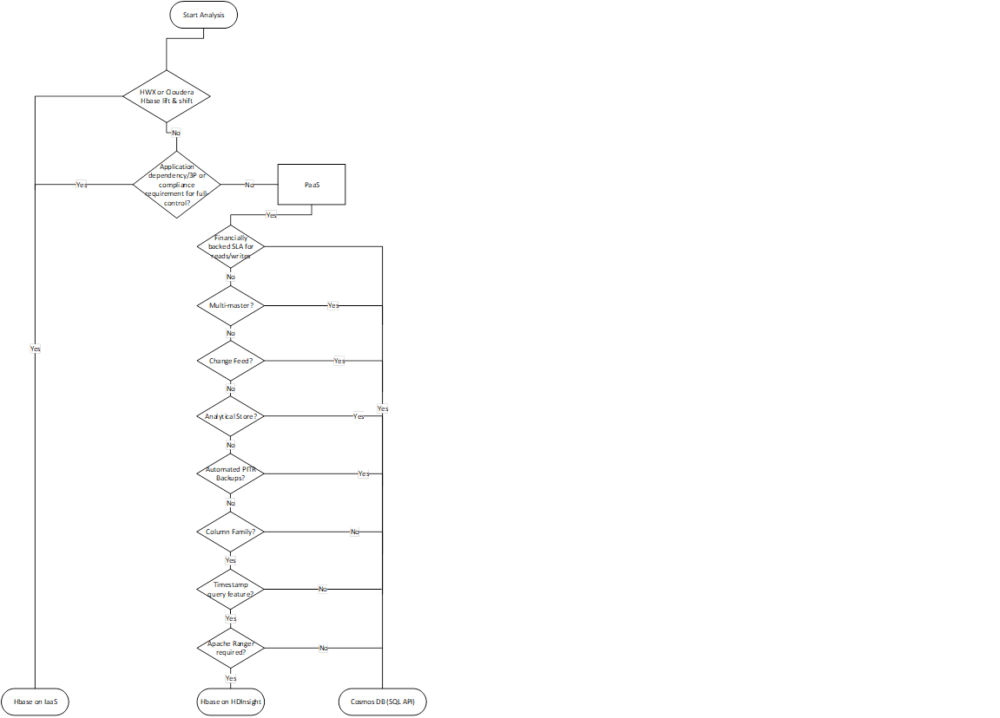

> Hadoop Migration Guide v1.0

**\
**

# Table of Contents {#table-of-contents .TOC-Heading}

[Structure of this guide 5](#structure-of-this-guide)

[Further reading 5](#further-reading)

[Hadoop Architecture & Components 6](#hadoop-architecture-components)

[Brief introduction to Apache Hadoop
6](#brief-introduction-to-apache-hadoop)

[Hadoop Distributed File Systems (HDFS)
7](#hadoop-distributed-file-systems-hdfs)

[Challenges of an on premise HDFS 7](#challenges-of-an-on-premise-hdfs)

[HDFS Architecture and Components 7](#hdfs-architecture-and-components)

[Considerations 9](#considerations)

[Migration Approach 10](#migration-approach)

[On premise Assessment 10](#on-premise-assessment)

[Data Extraction 12](#data-extraction)

[Data Migration 12](#data-migration)

[Data Validation 15](#data-validation)

[Feature Map & Workaround 15](#feature-map-workaround)

[Reference Implementation - ARM Templates
18](#reference-implementation---arm-templates)

[Pseudocode 18](#pseudocode)

[Architectural Guidance 18](#architectural-guidance)

[Patterns & Anti -- Patterns 18](#patterns-anti-patterns)

[Performance Tuning 18](#performance-tuning)

[HA & DR 18](#ha-dr)

[HBase 18](#hbase)

[Challenges of HBase on premise 18](#challenges-of-hbase-on-premise)

[HBase Architecture and Components
18](#hbase-architecture-and-components)

[Considerations 18](#considerations-1)

[Migration Approach 18](#migration-approach-1)

[Modernization 18](#modernization)

[Lift and Shift -- HDInsight 18](#lift-and-shift-hdinsight)

[Lift and Shift -- IAAS 18](#lift-and-shift-iaas)

[Decision Map/Flowchart 18](#decision-mapflowchart)

[Feature Map & Workaround 18](#feature-map-workaround-1)

[Reference Implementation - ARM Templates
19](#reference-implementation---arm-templates-1)

[Pseudocode 19](#pseudocode-1)

[Architectural Guidance 19](#architectural-guidance-1)

[Patterns & Anti -- Patterns 19](#patterns-anti-patterns-1)

[Performance Tuning 19](#performance-tuning-1)

[HA & DR 19](#ha-dr-1)

[Hive 19](#hive)

[Challenges of Hive on premise 19](#challenges-of-hive-on-premise)

[Hive Architecture and Components 19](#hive-architecture-and-components)

[Considerations 19](#considerations-2)

[Migration Approach 19](#migration-approach-2)

[Modernization -- Databricks 19](#modernization-databricks)

[Modernization -- Synapse 19](#modernization-synapse)

[Lift and Shift -- HDInsight 19](#lift-and-shift-hdinsight-1)

[Lift and Shift -- IAAS 19](#lift-and-shift-iaas-1)

[Decision Map/Flowchart 20](#decision-mapflowchart-1)

[Feature Map & Workaround 20](#feature-map-workaround-2)

[Reference Implementation - ARM Templates
20](#reference-implementation---arm-templates-2)

[Pseudocode 20](#pseudocode-2)

[Architectural Guidance 20](#architectural-guidance-2)

[Patterns & Anti -- Patterns 20](#patterns-anti-patterns-2)

[Performance Tuning 20](#performance-tuning-2)

[HA & DR 20](#ha-dr-2)

[Apache Ranger 20](#apache-ranger)

[Challenges of Ranger on premise 20](#challenges-of-ranger-on-premise)

[Apache Ranger Architecture and Components
21](#apache-ranger-architecture-and-components)

[Considerations 21](#considerations-3)

[Migration Approach 21](#migration-approach-3)

[Modernization -- AAD + Azure PAAS Services
21](#modernization-aad-azure-paas-services)

[Modernization -- AAD + Synapse 21](#modernization-aad-synapse)

[Lift and Shift -- HDInsight 21](#lift-and-shift-hdinsight-2)

[Lift and Shift -- IAAS 21](#lift-and-shift-iaas-2)

[Decision Map/Flowchart 21](#decision-mapflowchart-2)

[Feature Map & Workaround 21](#feature-map-workaround-3)

[Reference Implementation - ARM Templates
21](#reference-implementation---arm-templates-3)

[Pseudocode 21](#pseudocode-3)

[Architectural Guidance 21](#architectural-guidance-3)

[Patterns & Anti -- Patterns 21](#patterns-anti-patterns-3)

[Performance Tuning 21](#performance-tuning-3)

[HA & DR 21](#ha-dr-3)

[Apache Spark 21](#apache-spark)

[Challenges of Spark on premise 21](#challenges-of-spark-on-premise)

[Apache Spark Architecture and Components
21](#apache-spark-architecture-and-components)

[Considerations 21](#considerations-4)

[Migration Approach 22](#migration-approach-4)

[Modernization -- Databricks 22](#modernization-databricks-1)

[Modernization -- Synapse 22](#modernization-synapse-1)

[Lift and Shift -- HDInsight 22](#lift-and-shift-hdinsight-3)

[Lift and Shift -- IAAS 22](#lift-and-shift-iaas-3)

[Decision Map/Flowchart 22](#decision-mapflowchart-3)

[Feature Map & Workaround 22](#feature-map-workaround-4)

[Reference Implementation - ARM Templates
22](#reference-implementation---arm-templates-4)

[Pseudocode 22](#pseudocode-4)

[Architectural Guidance 22](#architectural-guidance-4)

[Patterns & Anti -- Patterns 22](#patterns-anti-patterns-4)

[Performance Tuning 22](#performance-tuning-4)

[HA & DR 22](#ha-dr-4)

# Structure of this guide

This guide recognizes that Hadoop provides an extensive ecosystem of
services and frameworks. This guide is not intended to be a definitive
document that describes components of the Hadoop ecosystem in detail, or
how they are implemented on Azure. Rather, this guide focuses on
specific guidance and considerations you can follow to help move your
existing data storage -- HDFS , Other Cloud Storage like AWS S3 data to
Azure.

It is assumed that you already have HDFS deployed in an on-premises
datacentre or Cloud storage- AWS S3 and exploring one of migration
targets on Azure -- Azure ADLS Gen2 ;

## Further reading

For customers new to Azure, we recommend [Enterprise Scale Landing Zone
guidance](https://docs.microsoft.com/en-us/azure/cloud-adoption-framework/ready/enterprise-scale/)
to build fundamental capabilities so that and scale in a performant
fashion. These capabilities enable customers to land new workloads
whilst maintaining a strong policy-driven governance to ensure that the
platform and workloads are compliant.

For designing and deploying workloads to Azure, we recommend [Microsoft
Azure Well-Architected
Framework](https://docs.microsoft.com/en-us/azure/architecture/framework/).
It serves as a guide and highlights key areas like scalability,
operations, reliability etc. that one must consider and factor-in while
building a solution on Azure.

For support on Azure migration , we recommend [Azure Migration
Program](https://gearup.microsoft.com/resources/azure-migration-program-overview)
( AMP) is a centrally managed program to help simplify and accelerate
migration and enable customer success. Customers can get the help they
need to simplify the journey to the cloud. Wherever they are in their
cloud journey, AMP help accelerate progress. AMP offers **proactive
guidance and the right mix of expert help** at every stage of the
migration journey to ensure they can migrate infrastructure, databases
and application workloads with confidence. All customers can access
resources and tools such as free migration tools, step-by-step technical
guidance, training and help in finding a migration partner.

# Hadoop Architecture & Components

## Brief introduction to Apache Hadoop

Hadoop provides a distributed file system and a framework for the
analysis and transformation of very large data sets using the MapReduce
paradigm. An important characteristic of Hadoop is the partitioning of
data and computation across many (thousands) of hosts, and executing
application computations in parallel close to their data. A Hadoop
cluster scales computation capacity, storage capacity and IO bandwidth
by simply adding commodity servers . The key components of an Hadoop
system include-

  HDFS        Distributed File System
  ----------- ----------------------------------------------------
  MapReduce   Distributed computation framework
  HBase       Column-oriented table service
  Pig         Dataflow language and parallel execution framework
  Hive        Datawarehouse infrastructure
  Zookeeper   Distributed coordination service
  Chukwa      System for collecting management data
  Avro        Data serialization system

{width="6.131944444444445in"
height="4.443669072615923in"}

Reference : <https://gearup.microsoft.com/resources/azure-migration>

# Hadoop Distributed File Systems (HDFS)

HDFS is the file system component of Hadoop. While the interface to HDFS
is patterned after the UNIX file system, faithfulness to standards was
sacrificed in favor of improved performance for the applications at
hand. HDFS stores file system metadata and application data separately.

-   As in other distributed file systems, like PVFS, Lustre and GFS,
    HDFS stores metadata on a dedicated server, called the NameNode.

-   Application data are stored on other servers called DataNodes.

-   All servers are fully connected and communicate with each other
    using TCP-based protocols. Unlike Lustre and PVFS, the DataNodes in
    HDFS do not use data protection mechanisms such as RAID to make the
    data durable.

-   Instead, like GFS, the file content is replicated on multiple
    DataNodes for reliability. While ensuring data durability, this
    strategy has the added advantage that data transfer bandwidth is
    multiplied, and there are more opportunities for locating
    computation near the needed data.

## Challenges of an on premise HDFS 

-   Frequent HDFS version upgrades

-   The amount of data stored on HDFS keeps growing

-   Limiting the number of small files that filter through the system
    . - Because NameNode loads all file metadata in memory, storing
    small files increases memory pressure on the NameNode. In addition,
    small files lead to an increase of read RPC calls for accessing the
    same amount of data when clients are reading the files, as well as
    an increase in RPC calls when files are generated.

-   Multiple teams require a large percentage of stored data, making it
    impossible to split clusters by use case or organization without
    duplications and in turn decreasing efficiency while increasing
    costs.

-   Ability to scale our HDFS without compromising the UX--- the
    performance and throughput of
    the [NameNode](https://wiki.apache.org/hadoop/NameNode), the
    directory tree of all files in the system that tracks where data
    files are kept.

-   All metadata is stored in the NameNode, client requests to an HDFS
    cluster must first pass through it.

-   A
    single [ReadWriteLock](https://docs.oracle.com/javase/7/docs/api/java/util/concurrent/locks/ReentrantReadWriteLock.html) on
    the NameNode namespace limits the maximum throughput the NameNode
    can support because any write request will exclusively hold
    the write lock and force any other requests to wait in the queue.

## HDFS Architecture and Components

Hadoop Distributed Filesystem (HDFS) - a Java-based file system that
provides scalable and reliable data storage designed to span large
clusters of commodity servers

-   **Namenode**: The master node. It manages access to files on the
    system and also manages the namespace of the file system.

    -   The HDFS namespace is a hierarchy of files and directories.

    -   Files and directories are represented on the NameNode by inodes,
        which record attributes like permissions, modification and
        access times, namespace and disk space quotas.

    -   The file content is split into large blocks (typically 128
        megabytes, but user selectable file-by-file) and each block of
        the file is independently replicated at multiple DataNodes
        (typically three, but user selectable file-by-file).

    -   The NameNode maintains the namespace tree and the mapping of
        file blocks to DataNodes (the physical location of file data).

    -   An HDFS client wanting to read a file first contacts the
        NameNode for the locations of data blocks comprising the file
        and then reads block contents from the DataNode closest to the
        client.

    -   When writing data, the client requests the NameNode to nominate
        a suite of three DataNodes to host the block replicas.

    -   The client then writes data to the DataNodes in a pipeline
        fashion. The current design has a single NameNode for each
        cluster.

    -   The cluster can have thousands of DataNodes and tens of
        thousands of HDFS clients per cluster, as each DataNode may
        execute multiple application tasks concurrently.

    -   HDFS keeps the entire namespace in RAM.

    -   The inode data and the list of blocks belonging to each file
        comprise the metadata of the name system called the image.

    -   The persistent record of the image stored in the local host's
        native files system is called a checkpoint.

    -   The NameNode also stores the modification log of the image
        called the journal in the local host's native file system.

    -   During restarts the NameNode restores the namespace by reading
        the namespace and replaying the journal. The locations of block
        replicas may change over time and are not part of the persistent
        checkpoint.

```{=html}
<!-- -->
```
-   **DataNode**: The slave node. It performs read/write operations on
    the file system as well as block operations such as creation,
    deletion, and replication.

    -   Each block replica on a DataNode is represented by two files in
        the local host's native file system.

    -   The first file contains the data itself and the second file is
        block's metadata including checksums for the block data and the
        block's generation stamp.

    -   The size of the data file equals the actual length of the block
        and does not require extra space to round it up to the nominal
        block size as in traditional file systems.

    -   Thus, if a block is half full it needs only half of the space of
        the full block on the local drive.

    -   A DataNode that is newly initialized and without any namespace
        ID is permitted to join the cluster and receive the cluster's
        namespace ID. After the handshake the DataNode registers with
        the NameNode. DataNodes persistently store their unique storage
        IDs.

    -   The storage ID is an internal identifier of the DataNode, which
        makes it recognizable even if it is restarted with a different
        IP address or port. The storage ID is assigned to the DataNode
        when it registers with the NameNode for the first time and never
        changes after that.

    -   A DataNode identifies block replicas in its possession to the
        NameNode by sending a block report. A block report contains the
        block id, the generation stamp and the length for each block
        replica the server hosts.

-   **HDFS Client** User applications access the file system using the
    HDFS client, a code library that exports the HDFS file system
    interface.

    -   Similar to most conventional file systems, HDFS supports
        operations to read, write and delete files, and operations to
        create and delete directories.

    -   The user references files and directories by paths in the
        namespace. The user application generally does not need to know
        that file system metadata and storage are on different servers,
        or that blocks have multiple replicas.

    -   When an application reads a file, the HDFS client first asks the
        NameNode for the list of DataNodes that host replicas of the
        blocks of the file. It then contacts a DataNode directly and
        requests the transfer of the desired block.

    -   When a client writes, it first asks the NameNode to choose
        DataNodes to host replicas of the first block of the file. The
        client organizes a pipeline from node-to-node and sends the
        data.

    -   Unlike conventional file systems, HDFS provides an API that
        exposes the locations of a file blocks. This allows applications
        like the MapReduce framework to schedule a task to where the
        data are located, thus improving the read performance. It also
        allows an application to **set the replication factor of a
        file.** By default a file's replication factor is three. For
        critical files or files which are accessed very often, having a
        higher replication factor improves their tolerance against
        faults and increase their read bandwidth.

-   Block: The unit of storage. A file is broken up into blocks, and
    different blocks are stored on different data nodes as per
    instructions of the namenode.

## Considerations

-   Don't store small, frequently-queried tables in HDFS, especially not
    if they consist of thousands of files.ed tables in HDFS

-   HDFS symlinks - Jobs requiring file system features like strictly
    atomic directory renames, fine-grained HDFS permissions, or HDFS
    symlinks can only work on HDFS

-   Azure Storage can be geo-replicated. Although geo-replication gives
    geographic recovery and data redundancy, a failover to the
    geo-replicated location severely impacts the performance, and it may
    incur additional costs. The recommendation is to choose the
    geo-replication wisely and only if the value of the data is worth
    the additional cost.

-   If the file names have common prefixes , the storage treats them as
    a single partition and hence if ADF is used , all DMUs write to a
    single partition.

-   {width="4.888888888888889in"
    height="1.7569444444444444in"}

## 

## 

## 

## Migration Approach

### On premise Assessment

On premises assessment scripts can be run to plan what data is to be
migrated to the Azure Storage account. The below decision flow helps
decide the criteria and appropriate scripts can be run to get the data/
metrics. Tools like Unravel can support in getting the metrics.

###  Data Extraction

Based on the identified strategy for data migration identify the data
sets to be copied.

###  Data Migration

## 

Pre-checks prior to migration

1.  Plan the number of storage accounts needed

2.  Availability Requirements

3.  Check for corrupted/missing blocks

4.  Check if NFS is enabled

5.  Check if snapshots are needed

Data Transfer

<https://docs.microsoft.com/en-us/azure/storage/common/storage-choose-data-transfer-solution>

### Data Validation

## Feature Map & Workaround

##  

Core functionality of Hadoop Distributed File System and Azure Data Lake
Storage Gen2 comparison map is as follows:

+----------------------+----------------------+----------------------+
| **Feature**          | **ADLS**             | **HDFS**             |
+======================+======================+======================+
| **Access that is     | Can manage and       | MapR cluster can     |
| compatible with      | access data just as  | access an external   |
| Hadoop**             | you would with a     | HDFS cluster with    |
|                      | Hadoop Distributed   | the hdfs:// or       |
|                      | File System (HDFS).  | webhdfs:// protocols |
|                      | The Azure Blob File  |                      |
|                      | System (ABFS) driver |                      |
|                      | is available within  |                      |
|                      | all Apache Hadoop    |                      |
|                      | environments,        |                      |
|                      | including Azure      |                      |
|                      | HDInsight and Azure  |                      |
|                      | Databricks. Use ABFS |                      |
|                      | to access data       |                      |
|                      | stored in Data Lake  |                      |
|                      | Storage Gen2         |                      |
+----------------------+----------------------+----------------------+
| **POSIX              | The security model   | Jobs requiring file  |
| permissions**        | for Data Lake Gen2   | system features like |
|                      | supports ACL and     | strictly atomic      |
|                      | POSIX permissions    | directory renames,   |
|                      | along with some      | fine-grained HDFS    |
|                      | extra granularity    | permissions, or HDFS |
|                      | specific to Data     | symlinks can only    |
|                      | Lake Storage Gen2.   | work on HDFS         |
|                      | Settings can be      |                      |
|                      | configured through   |                      |
|                      | admin tools or       |                      |
|                      | frameworks like      |                      |
|                      | Apache Hive and      |                      |
|                      | Apache Spark.        |                      |
+----------------------+----------------------+----------------------+
| **Cost               | Data Lake Storage    |                      |
| effectiveness**      | Gen2 offers low-cost |                      |
|                      | storage capacity and |                      |
|                      | transactions. Azure  |                      |
|                      | Blob storage life    |                      |
|                      | cycles help lower    |                      |
|                      | costs by adjusting   |                      |
|                      | billing rates as     |                      |
|                      | data moves through   |                      |
|                      | its life cycle.      |                      |
+----------------------+----------------------+----------------------+
| **Optimized driver** | The ABFS driver is   |                      |
|                      | optimized            |                      |
|                      | specifically for big |                      |
|                      | data analytics. The  |                      |
|                      | corresponding REST   |                      |
|                      | APIs are surfaced    |                      |
|                      | through the          |                      |
|                      | distributed file     |                      |
|                      | system (DFS)         |                      |
|                      | endpoint,            |                      |
|                      | dfs.core.windows.net |                      |
+----------------------+----------------------+----------------------+
| **Large Data Sets**  |                      | Applications that    |
|                      |                      | run on HDFS have     |
|                      |                      | large data sets. A   |
|                      |                      | typical file in HDFS |
|                      |                      | is gigabytes to      |
|                      |                      | terabytes in size.   |
|                      |                      | Thus, HDFS is tuned  |
|                      |                      | to support large     |
|                      |                      | files. It should     |
|                      |                      | provide high         |
|                      |                      | aggregate data       |
|                      |                      | bandwidth and scale  |
|                      |                      | to hundreds of nodes |
|                      |                      | in a single cluster. |
|                      |                      | It should support    |
|                      |                      | tens of millions of  |
|                      |                      | files in a single    |
|                      |                      | instance.            |
+----------------------+----------------------+----------------------+
| **Simple Coherency   |                      | HDFS applications    |
| Model**              |                      | need a               |
|                      |                      | write-once-read-many |
|                      |                      | access model for     |
|                      |                      | files. A file once   |
|                      |                      | created, written,    |
|                      |                      | and closed need not  |
|                      |                      | be changed except    |
|                      |                      | for appends and      |
|                      |                      | truncates. Appending |
|                      |                      | the content to the   |
|                      |                      | end of the files is  |
|                      |                      | supported but cannot |
|                      |                      | be updated at        |
|                      |                      | arbitrary point.     |
|                      |                      | This assumption      |
|                      |                      | simplifies data      |
|                      |                      | coherency issues and |
|                      |                      | enables high         |
|                      |                      | throughput data      |
|                      |                      | access. A MapReduce  |
|                      |                      | application or a web |
|                      |                      | crawler application  |
|                      |                      | fits perfectly with  |
|                      |                      | this model.          |
+----------------------+----------------------+----------------------+
| **Metadata**         | Metadata in Azure    | The NameNode is the  |
|                      | can be stored in     | arbitrator and       |
|                      | Azure Purview        | repository for all   |
|                      |                      | HDFS metadata.       |
+----------------------+----------------------+----------------------+
| **Block Size**       |                      | HDFS stores the data |
|                      |                      | in the form of the   |
|                      |                      | block where the size |
|                      |                      | of each data block   |
|                      |                      | is 128MB in size     |
|                      |                      | which is             |
|                      |                      | configurable means   |
|                      |                      | you can change it    |
|                      |                      | according to your    |
|                      |                      | requirement          |
|                      |                      | in                   |
|                      |                      | *hdfs-site.xml* file |
|                      |                      | in your Hadoop       |
|                      |                      | directory.           |
+----------------------+----------------------+----------------------+
| **File Format**      |                      |                      |
+----------------------+----------------------+----------------------+
| **Consistency        |                      |                      |
| Model**              |                      |                      |
+----------------------+----------------------+----------------------+
| **Default ACLS**     | Files do not have    | Files do not have    |
|                      | default ACLs and Not | default ACLs         |
|                      | enabled by default   |                      |
+----------------------+----------------------+----------------------+
| **Binary Files**     | Binary files can be  | Hadoop provides the  |
|                      | moved to Azure Blob  | facility to          |
|                      | Storage . Objects in | read/write binary    |
|                      | Blob storage are     | files. SequenceFile  |
|                      | accessible via the   | is a flat file       |
|                      | Azure Storage REST   | consisting of binary |
|                      | API, Azure           | key/value pairs. The |
|                      | PowerShell, Azure    | SequenceFile         |
|                      | CLI, or an Azure     | provides a Writer,   |
|                      | Storage client       | Reader and Sorter    |
|                      | library. Client      | classes for writing, |
|                      | libraries are        | reading and sorting  |
|                      | available for        | respectively.        |
|                      | different languages, | Convert the          |
|                      | including:           | image/video file     |
|                      |                      | into a SequenceFile  |
|                      | .NET Java Node.js    | and store it into    |
|                      | Python Go PHP Ruby   | the HDFS then the    |
|                      |                      | put command is used. |
|                      |                      | bin/hadoop fs -put   |
|                      |                      | /src_image_file      |
|                      |                      | /dst_image_file or   |
|                      |                      | the HDFS             |
|                      |                      | Seque                |
|                      |                      | nceFileReader/Writer |
|                      |                      | methods              |
+----------------------+----------------------+----------------------+
| **Permission         |                      | Permissions for an   |
| inheritance**        |                      | item are stored on   |
|                      |                      | the item itself. In  |
|                      |                      | other words,         |
|                      |                      | permissions for an   |
|                      |                      | item cannot be       |
|                      |                      | inherited from the   |
|                      |                      | parent items if the  |
|                      |                      | permissions are set  |
|                      |                      | after the child item |
|                      |                      | has already been     |
|                      |                      | created.             |
|                      |                      |                      |
|                      |                      | Permissions are only |
|                      |                      | inherited if default |
|                      |                      | permissions have     |
|                      |                      | been set on the      |
|                      |                      | parent items before  |
|                      |                      | the child items have |
|                      |                      | been created.        |
+----------------------+----------------------+----------------------+
| **Data Replication** |                      | By default a file's  |
|                      |                      | replication factor   |
|                      |                      | is three. For        |
|                      |                      | critical files or    |
|                      |                      | files which are      |
|                      |                      | accessed very often, |
|                      |                      | having a higher      |
|                      |                      | replication factor   |
|                      |                      | improves their       |
|                      |                      | tolerance against    |
|                      |                      | faults and increase  |
|                      |                      | their read bandwidth |
+----------------------+----------------------+----------------------+
| **Sticky bit**       | The Sticky bit can   | In the context of    |
|                      | be set on            | Data Lake Storage    |
|                      | directories,         | Gen2, it is unlikely |
|                      | preventing anyone    | that the sticky bit  |
|                      | except the           | will be needed. In   |
|                      | superuser, directory | summary, if the      |
|                      | owner or file owner  | sticky bit is        |
|                      | from deleting or     | enabled on a         |
|                      | moving the files     | directory, a child   |
|                      | within the           | item can only be     |
|                      | directory.           | deleted or renamed   |
|                      |                      | by the child item\'s |
|                      | Setting the sticky   | owning user.         |
|                      | bit for a file has   |                      |
|                      | no effect.           | The sticky bit       |
|                      |                      | isn\'t shown in the  |
|                      |                      | Azure portal.        |
+----------------------+----------------------+----------------------+
| **The mask**         |                      | Mask limits access   |
|                      |                      | for named users, the |
|                      |                      | owning group, and    |
|                      |                      | named groups.        |
|                      |                      |                      |
|                      |                      | For a new Data Lake  |
|                      |                      | Storage Gen2         |
|                      |                      | container, the mask  |
|                      |                      | for the access ACL   |
|                      |                      | of the root          |
|                      |                      | directory (\"/\")    |
|                      |                      | defaults to 750 for  |
|                      |                      | directories          |
|                      |                      | and 640 for files.   |
|                      |                      | The following table  |
|                      |                      | shows the symbolic   |
|                      |                      | notation of these    |
|                      |                      | permission levels.   |
+----------------------+----------------------+----------------------+
| **Checksum**         |                      |                      |
+----------------------+----------------------+----------------------+

### 

## Reference Implementation - ARM Templates 

TBD v2

## Pseudocode

TBD v2

## Architectural Guidance

TBD v2

### Patterns & Anti -- Patterns

### Performance Tuning

### HA & DR

# HBase


## Challenges of HBase on premise 
Common challenges associated with Hbase deployments:

• Scalability  
• Ageing infrastructure  
• Capacity  
• Hard to achieve HA-DR due lack of data-centre sites.  
• Lack of native tools that enable:  
- Cost transparency
- Monitoring
- DevOps
- Automation

## HBase Architecture and Components  
### **Brief introduction to Apache Hbase**

Apache Hbase is a Java-based, NoSQL column-store, distributed application that is built on top of Apache Hadoop Distributed Filesystem (HDFS). It is modelled after Google BigTable paper and brings most of the BigTable capabilities to Hadoop ecosystem.  

In terms of workload profile, it is designed to serve as a datastore for data-intensive applications that require low-latency and near real-time random reads and writes.  

It is a distributed system and from CAP theorem perspective, Hbase is designed for Consistency and Partitioning.  

We will discuss components and principles that will play a role in planning and building of a Hbase cluster on Azure especially while migrating to Azure HDI Hbase or Hbase on Azure virtual machines. These concepts will also play role when it comes to re-platforming Hbase to Cosmos DB migration.  

Hbase is a distributed system, and it follows a leader-follower model. A typical Hbase deployment consists of nodes with following roles.

#### **Head nodes or Master nodes**  
[Master server](https://hbase.apache.org/book.html#architecture.master) is responsible for all metadata operations for an Hbase cluster. This includes but not limited to creation/deletion of objects; monitoring RegionServers etc. There are usually two Master servers deployed for high availability (HA).

#### **ZooKeeper nodes**   
[ZooKeeper (ZK)](https://zookeeper.apache.org/) nodes are required for coordination in a distributed application environment such as Hbase.  
#### **RegionServers**
[RegionServers](https://hbase.apache.org/book.html#regionserver.arch) are responsible for serving and managing Regions (or partitions). This is where bulk of the processing happens when a client read/write request comes in. In a distributed deployment of Hbase RegionServer runs on a Hadoop Data Node.  

### **Core Concepts**  

- #### **Namespace**  
    Logical grouping of tables. It is like a database within relational world. It is a key-enabler for several features related to multi-tenancy.  

- #### **Tables**  
    Hbase tables are a grouping or collection of multiple rows. Tables are stored in Regions (or partitions) spread across Region Servers.  

- #### **Row**  
    A row consists of a row key and a grouping of columns called column family. The rows are sorted and stored based on the row key.  

- #### **Column Family**  
    Columns in Hbase are grouped into column families. All columns in a column have the same prefix.  

- #### **Cells**  
    A {row, column, version} tuple represent a cell.  

- #### **Data model operations**  
    There are 4 types of data model operations:  
• **Get** – returns attributes for a specified row.  
• **Put** – either adds new rows to the table or updates existing rows.  
• **Scans** – allows iteration over multiple rows for specified attributes.  
• **Delete** – removes a row from the table. A marker (called tombstone) is placed on record mark for deletion. These are then removed during major compactions.  


**////// Image goes here //////**

#### **Write Path**
HBase uses a combination of data structures that reside in-memory and persistent storage to deliver fast writes. When a write happens, data first gets written to a Write-Ahead Log (WAL), which is a data structure stored on persistent storage. Role of WAL is to track changes so that logs can be replayed in case there’s a server failure. WAL is purely for resiliency purposes.
Once data is committed to WAL, data gets written to MemStore, which is an in-memory data structure. At this stage, a write is completed.  

For long-term data persistence, Hbase uses a data structure called Hbase file (HFile). HFile is stored on HDFS. Depending on MemStore size and data flush interval, data from MemStore is written to Hbase file or [Hfile](https://hbase.apache.org/book.html#_hfile_format_2).  

**////// write path Image goes here //////**  

  
    

To summarise, the components on the write-path are:  
• **Write Ahead Log (WAL)** is a data structure that is stored on persistent storage.   
• **MemStore** – in-memory data structure. It’s an on-heap data structure.  
• **Hfile** – Hbase file used for data persistence and stored on HDFS.

#### **Read Path** 
To deliver fast random and sequential reads, Hbase uses several data structures. When a read request is sent to Hbase, it tries to serve the read request through data cached in BlockCache and failing that, from MemStore. Both are stored on-heap. If the data is not available in cache, then the data is fetched from HFile and caches the data in BlockCache.  

For scenarios where you want low latency on reads, there is an option to persist data in BucketCache which is also an in-memory data structure, but it’s hosted off-heap.  

**////// Read path Image goes here //////**  

To summarise, Hbase tries to serve a read request using data stored in cache – BlockCache and MemStore. If data is not there, a read request is served using HFile.  

#### **Offheap Read and Write paths**
To reduce read and write latencies, Hbase 2.x has introduced a pool of offheap buffers that are used along read and write paths. The workflow for writing and reading data does its best to avoid on-heap memory allocations reducing the amount of work that Garbage Collection (GC) must do to complete reads and writes. These must be fine-tuned and optimized as part of the overall migration because they are heavily dependent on number of Regions and RegionServers; size of memory; and premium storage attached to the HBase cluster on Azure. The reason is that these parameters can change post-migration to Azure.

## Considerations  

• If HBase IaaS migration is your first workload on Azure, we strongly recommend investing time and effort in building a strong foundation for workloads hosted on Azure by leveraging Cloud Adoption Framework enterprise-scale landing zone (ESLZ) guidance. Enterprise-scale is an architectural approach and a reference implementation that enables effective construction and operationalization of landing zones on Azure, at scale. This approach aligns with the [Azure roadmap and the Cloud Adoption Framework for Azure](https://docs.microsoft.com/en-us/azure/cloud-adoption-framework/ready/enterprise-scale/architecture).  

• We strongly recommend all workloads deployed on Azure must be designed and deployed in alignment with [Well-Architected Framework](https://docs.microsoft.com/en-us/azure/architecture/framework/). The Azure Well-Architected Framework is a set of guiding tenets that can be used to improve the quality of a workload. The framework consists of five pillars of architecture excellence: Cost Optimization, Operational Excellence, Performance Efficiency, Reliability, and Security.  

• While designing and choosing Azure compute and storage, individual service limits must be factored-in. Compute and Storage have limits and these have an implication of sizing of infrastructure for a data-intensive application such as HBase. [Azure scale-limits](https://docs.microsoft.com/en-us/azure/azure-resource-manager/management/azure-subscription-service-limits) should be considered when planning Hbase deployment on Azure VMs and storage.  

• Subscription should be used as a unit of scale and more instances of a service must be used to scale-out and go beyond limits associated with a single instance of a service. Taking from Cloud Adoption Framework enterprise-scale design principles, we use subscription as a unit of management and scale aligned with business needs and priorities to support business areas and portfolio owners to accelerate application migrations and new application development. Subscriptions should be provided to business units to support the design, development, and testing of new workloads and migration of workloads.

• Apache HBase allows customers to use different types of storage options for caching and persistent storage. This must be considered while designing Apache HBase solutions on Azure.  

• There is a level of performance optimization and right-sizing of infrastructure involved post-migration to Azure IaaS. Reason is that performance of HBase is dictated by size of infrastructure deployed; choice of storage; and distribution of Regions. Even though we are focusing on lift & shift scenario, Azure infrastructure is fundamentally different to on-premises and there are Azure features and limits that one must consider to meet performance requirements.  


## Migration Approach
Azure has several landing targets for Apache Hbase. Depending on requirements and product features, customers can choose between Azure IaaS, HDI Hbase or Cosmos DB (SQL API).  

  

### Modernization

### Lift and Shift -- HDInsight

### **Lift and Shift - IaaS**  

#### **Planning and Sizing for Azure Compute & Storage**  

The following set of assessment questions are designed to gain an insight into existing deployment of HBase and establish a set of requirements that must be considered for any type of HBase migration scenario to Azure.  

| Layer  | Questions | Background  |
|---|---|---|
|  **Infrastructure**  | Number of servers for each type of role - <br />  HBase Master; RegionServers; ZooKeeper nodes | Understand scale and design of incumbent solution.  
&nbsp; | Number of cores per server | ```lscpu``` *OR* ```cat /proc/cpuinfo``` commands can be used to list cores per server.
&nbsp; | Available memory per server | This is the total memory available per server. On Linux, commands such as ```free -mg``` *OR* ```cat /proc/meminfo``` can be used to report on memory available on each server.
&nbsp; | Is the existing environment virtualized or deployed on bare-metal servers? | The information will be used as one of the inputs when it comes to sizing and understanding performance characterstics of on-premises HBase environment.
&nbsp; | Network | Understand the network bandwidth each VM can support; and if any special NIC configuration is used to support high bandwidth between Hbase servers. <br />  Use the following commands to extract details of VM network configuration ```ifconfig -a``` *OR* ```ethtool <name of the interface>```
&nbsp; | Storage | What is the total size of data post-replication? Usually, default configuration of HDFS replicates data 3x. HDFS CLI can be used to extract total size of data persisted via HBase <br> ```hdfs dfs -du -h hdfs://<data node address>/hbase``` <br> In addition, one should ask for storage performance targets (IOPS and throughput). This information will be used to provision storage and also understand level of throughput/IOPS required to support HBase deployment on Azure.
**Operating System** | Version and distro type | The following command will print out details of Linux distro and version in use <br> ```uname -a```
&nbsp; | Kernel parameters | Understand if customer has applied any specific kernel-level parameters to improve the performance of HBase deployment. Hence, we do not recommend changing default parameters straightaway unless it has been recommended by your OS and/or application vendor. In most cases, customers tweak these parameters to address specific workload performance requirements. Whilst it's fairly straight-forward to change config, however customers usually arrive at this decision after carrying out extensive testing. <br> **Linux memory and block device parameters** <br> ```cat /sys/kernel/mm/transparent_hugepage/enabled``` <br>```cat /sys/kernel/mm/transparent_hugepage/defrag```<br>```cat /sys/block/sda/queue/scheduler```<br>```cat /sys/class/block/sda/queue/rotational```<br>```cat /sys/class/block/sda/queue/read_ahead_kb```<br>```cat /proc/sys/vm/zone_reclaim_mode```<br> **Linux network stack parameters** <br> ```sudo sysctl -a \ grep -i "net.core.rmem_max\|net.core.wmem_max\|net.core.rmem_default\| net.core.wmem_default\|net.core.optmem_max\|net.ipv4.tcp_rmem\|net.ipv4.tcp_wmem"```
**Application** | What version of HBase and Hadoop distro (Hortonworks or Cloudera) etc. are in use? | There are a few popular distros that are commonly used across the board. It's usually one of the following - HortonWorks (HDP); Cloudera (CDP); MapR or open-source (OSS) version of Hadoop and HBase.<br> To find out version of HBase and Hadoop, use the following commands:<br> ```hbase version``` and ```hdfs version```
&nbsp; | HBase-specific information - number of tables; metadata for each table (Regions; Column-Family) | Information related to HBase deployment can be extracted via Ambari UI. However, if it's not available, one can use CLI. <br> ```scan 'hbase:meta' {FILTER=>"PrefixFilter('tableName')", COLUMNS=>['info:regioninfo']}}```<br> To list all the regions associated with a given table, please use <br> ```list_regions '<table name>'```
&nbsp; | JAVA (JDK) version | ```java -version```
&nbsp; | HBase GC configuration | What GC type is used? Most popular ones that are Concurrent Mark & Sweep (CMS) and G1GC. This is defined in ```hbase-env.sh``` configuration file. Recent researches have shown G1GC garbage collector to be more efficient for large heap sizes.
**Security & administration** | Accessing HBase | How do users access the data in Hbase? Is it via APIs or directly via Hbase shell?<br> How applications consume data?<br> How is data written to Hbase and proximity of these systems? Are they within the same data centre or located outside of DC where Hbase is deployed?
&nbsp; | User provisioning | How are users authenticated and authorized? <br>•Ranger?<br>•Knox?<br>•Kerberos?
&nbsp; | Encryption | Is there a requirement to have data encrypted in transport and/or at-rest? What encryption solutions are currently in-use?
&nbsp; | Tokenization | Is there a requirement to tokenize data? If yes, how is data tokenized? Popular applications used for tokenization include (but not limited to) Protegrity; Vormetric etc.
&nbsp; | Compliance | Are there any special regulatory requirements applicable to Hbase workloads? For example – PCI-DSS; HIPAA etc.
&nbsp; | Keys, certificates, and secrets management policies. | If applicable, please describe and what tools/applications are used for this function.
**High-Availability and Disaster Recovery** | What is the SLA, RPO and RTO of the source Hbase deployment? | This will drive decision on the landing target on Azure and whether to have a hot-standby OR active-active regional deployment on Azure.
&nbsp | BC and DR strategy for Hbase workloads. | Describe BR and DR strategy in detail. Impact of HBase being unavailable.
**Data** | Growth | How much data will be migrated to HBase on day 1; what is the organic growth expected in 6,12,18 months' time. This information is used for capacity planning and sizing the cluster. Eventually, this information is also used for cost optimization of a deployment.
&nbsp; | Ingestion | How is data written to HBase? Please describe.
&nbsp; | Consumption | How is data stored in HBase used? APIs or a compute engine such as HDI Spark or Databricks Spark?
&nbsp; | Access pattern | Is traffic on HBase read-heavy or write-heavy? This will have an implication on how we fine-tune HBase configuration parameters defined in ```hbase-site.xml``` and ```hdfs-site.xml``` files.

There are several third-party (3P) solutions that can assist with assessment. [Unravel](https://www.unraveldata.com/cloud-migration-assessment/) is one such partner that offers solutions that can help customers fast-track assessment for data migrations to Azure.  

**[Azure Virtual Machines](https://docs.microsoft.com/en-au/azure/virtual-machines/linux/overview)** is one of several types of on-demand, scalable computing resources that Azure offers. Typically, you choose a VM when you need more control over the computing environment than the other choices offer. This article gives you information about what you should consider before you create a VM, how you create it, and how you manage it.  

**[What do I need to think about before creating a VM?](https://docs.microsoft.com/en-au/azure/virtual-machines/linux/overview#what-do-i-need-to-think-about-before-creating-a-vm)**  
There are always a multitude of design considerations when you build out an application infrastructure in Azure. These aspects of a VM are important to think about before you start:  
- The names of your application resources  
- The location where the resources are stored  
- The size of the VM  
- The maximum number of VMs that can be created  
- The operating system that the VM runs  
- The configuration of the VM after it starts  
- The related resources that the VM needs

**[Azure VM Families and Limits](https://docs.microsoft.com/en-au/azure/virtual-machines/linux/overview#vm-size)**  
Azure VM families are optimized to suit different use-cases and provide a balance of compute (vCores) and memory.  

| Type  | Size | Description  |
|---|---|---|
|  [Entry Level](https://docs.microsoft.com/en-us/azure/virtual-machines/sizes-general) | A,Av2   | A-series VMs have CPU performance and memory configurations best suited for entry level workloads like development and test. They are economical and provide a low-cost option to get started with Azure.   |
| [General Purpose](https://docs.microsoft.com/en-us/azure/virtual-machines/sizes-general)   | D, DSv2, Dv2   | Balanced CPU-to-memory ratio. Ideal for testing and development, small to medium databases, and low to medium traffic web servers.  |
| [Compute Optimized](https://docs.microsoft.com/en-us/azure/virtual-machines/sizes-compute)  | F    | These VMs have a high CPU-to-memory ratio. Good for medium traffic web servers, network appliances, batch processes, and application servers.  |
|  [Memory Optimized](https://docs.microsoft.com/en-us/azure/virtual-machines/sizes-memory) | Esv3, Ev3   | These VMs have a high memory-to-CPU ratio. Great for relational database servers, medium to large caches, and in-memory analytics.  |
|   |   |   |  

In terms of nature of resource footprint, Apache Hbase is designed to leverage memory and premium storage (such as SSDs).  

- HBase ships with features like BucketCache which can significantly improve read performance. BucketCache is stored off-heap.  Hence, we recommend VMs that have higher memory to CPU ratio.  
  
- HBase write path includes writing changes to a write-ahead log (WAL) which is a data structure persisted on a storage medium. Storing WAL on fast storage medium such as SSDs will improve write performance.
- Hbase is designed to scale-out as performance and storage requirements grow.  

Scalability targets of Azure compute [Ds-series](https://docs.microsoft.com/en-us/azure/virtual-machines/dv2-dsv2-series-memory) and [Es-series](https://docs.microsoft.com/en-us/azure/virtual-machines/ev3-esv3-series) along with [premium SSD (managed disks)](https://docs.microsoft.com/en-us/azure/virtual-machines/disks-types#premium-ssd) are available on Microsoft Docs and these must be considered during sizing and planning.  

From compute and memory perspective, we recommend using the following Azure compute family types for various Hbase node types:  

- **Hbase Master** – For enterprise deployments, we recommend at least 2 x Master (from HA perspective). For a large Hbase cluster, a DS5_v2 Azure VM with 16 vCPUs and 56 GiB memory should suffice most deployments. For medium-sized clusters, recommendation is to have at least 8 vCPU and 20-30GB memory.  

- **HDFS NameNode** – We recommend hosting NameNode on separate set of virtual machines and not to co-locate with Hbase Master. From HA perspective, 2 x NameNodes should be deployed. Like Hbase Master, Azure VM DS5_v2 is recommended for large production-grade clusters.  

- **Hbase RegionServer** – We recommend using Azure VMs with high memory to vCPU ratio. Hbase has several features that can leverage memory for improving reads and writes. Azure VMs like DS14_v2 or DS15_v2 will be a good starting point. Hbase is designed for scale-out and more Region Servers can be added to improve performance.  

- **ZooKeeper (ZK)** – Hbase relies on ZK for operations. An Azure VM with 4-8 vCPU; 4-8 GB memory is a good starting point. Ensure that there is local storage available. ZK nodes should be deployed on a separate set of VMs.  

**Azure Storage**  
For an Azure IaaS-based Hbase deployment, Azure offers several storage options. The following flowchart uses features of various options to land on a storage target. Each storage option on Azure has a different performance, availability, and cost targets.  

  

There are two key factors that influence of sizing of Hbase storage – **volume** and **throughput**. These two parameters also have an implication on choice of Azure VM size/numbers and Azure Storage (Managed Disks or ADLS).

- **Volume of data**  
  This is the data that must be persisted on Hbase. The data gets persisted to underlying storage and when we refer to volume of data, for sizing and planning purposes, volume includes raw data + 3x replication. Total storage size is the metric that we use to drive volume.

- **Throughput of reads and writes**
This is how fast one wants Hbase to service writes and reads. IOPS and throughput are the two metrics that drive this.  

If you are planning a greenfield deployment of Hbase on Azure IaaS and there's no reference point in terms of existing deployment, our recommendation is to go with the following sizing and then add RegionServers as the volume of data and/or demand for higher read/write throughput grows. Azure compute belonging to Ds or Es series is well suited for Hbase RegionServer roles. For Hbase Master and ZooKeeper nodes, we recommend using smaller Ds-series VMs. See Azure compute for guidance on compute size suitable for workloads.  

For more sizing accuracy and establishing a performance baseline, we recommend customers to run tests on Azure IaaS using Hbase dataset, model, and workload pattern. If moving data is not possible, we recommend using benchmarking tools such as YCSB to generate synthetic data and simulate sequential and random I/O traffic. The intent of this exercise is to help customers gain an understanding of level of performance one can expect using a combination of Azure compute and premium storage. It’s worth calling out that the tests should include day-to-day workload pattern and special cases like any workloads which may cause a spike in resource usage such as month-end or year-end activities. For example, a retailer using Hbase will observe spike in resource usage around holiday periods whereas a financial services customer will observe spikes around key financial periods.  

Inputs from assessment and performance baseline should give customers a fairly accurate view of sizing on Azure IaaS. Due to the nature of the workloads, there will be room to optimize operations by scaling-out or scaling-in clusters post go-live. We recommend customers should familiarise themselves with various [Cost Optimization](https://docs.microsoft.com/en-us/azure/architecture/framework/cost/overview) levers available to them to optimize costs and operations.  

#### **Data Migration**  

**Note** - Apache Hbase persists data in a file called HFile which are stored on HDFS. From migration perspective, it’s **not recommended** to directly copy HFiles between two Hbase clusters outside of HBase. For HBase cluster to cluster data migrations, recommendation is to use one of the out-of-the-box feature that HBase ships with.  
 

**Pattern** | **Migration Approach** | **Considerations**
--- | --- | ---
**Bulk load scenarios** where source data is not being read from an HBase instance.<br />  <br /> **Examples -** source data in a file format such as CSV, TSV, Parquet *OR* data is in a database or 3P proprietary format.<br />  <br /> For this pattern, depending on source(s) and/or tool used for reading and loading data into HBase   | Overall approach is to build a pipeline using tools such as **WANDisco** or **Databricks** to read from source and <br />  <br />**Source file format** - csv, parquet, tsv or a 3P proprietary format etc.  <br />  <br />  **Data migration tooling options -** If the data is sitting on a file-system or HDFS, then tools such as WANDisco or Spark (HDI or Databricks) can be leverged to read from source and write to HBase on Azure. <br /> <br /> At a high-level, a migration pipeline can be built per target table on HBase where data is extracted from source and written to Azure HDFS first. Then a separate pipeline can be built to read from Azure HDFS to Azure HBase. | **Separate infrastructure** required to host migration tool runtime. <br />  <br /> **Handling encryption** and tokenisation requirements during data migration. <br />  <br /> **Network latency** between source and target (Azure HBase).
**Source is an Hbase instance** but different versions i.e. HBase version at source is different from HBase version deployed on Azure VM. | Since source is also a HBase datastore, one can explore direct HBase cluster to cluster data migration options such as <br />  <br /> **HBase CopyTable** <br /> *Note* - CopyTable supports full and delta table copy features. <br /> OR <br /> **Azure HDI Spark or Databricks** <br /> OR <br /> **HBase Export and Import Utility** <br /> OR <br /> **HashTable/SyncTable** | Same as above plus a few related to specific tool used for migration. <br />  <br />  **Hbase CopyTable** Hbase version on source and target sides. <br />  <br /> Clusters must be online on source and target side. <br />  <br /> Additional resources required on source side to support additional read traffic on the source Hbase instance. <br />  <br /> **CopyTable** feature by default, it only copies the latest version of a row cell. It also copies all Cells between a specified time range. There might be changes happening on source Hbase while CopyTable is running, in such a scenario, new changes will either be completed included or excluded. <br />  <br /> **Azure HDI Spark or Databricks** require additional resources or a separate cluster for migrating data however it's a tried and tested approach. <br />  <br /> **HBase Export Utility** by default, always copies the latest version of a Cell across to HBbase target. <br />  <br /> **HashTable/SyncTable** is more efficient compared to CopyTable feature.
Source is a HBase database with the same version i.e., data is being migrated between two instances of HBase. | All the options stated above <br /> and <br /> **HBase Snapshots** | Same considerations as stated above and certain that are related to **HBase Snapshots**. <br />  <br /> Snapshot doesn’t create copy of data however it does create a reference back to HFiles. The referenced HFiles are archived separately in case compaction is triggered on parent table which is referenced in a snapshot.<br />  <br /> Footprint on source and target Hbase when a snapshot restore is triggered.<br /> <br /> Keeping data source and target (Hbase) in-sync during migration and then planning for final cut-over.  <br /> <br /> Network latency between source and target.  

#### **Security**  

For an HBase cluster to operate, it must be able to communicate with other virtual machines that form part of the cluster. This includes VMs that host Master; RegionServers; ZooKeeper etc.  

To enable servers to authenticate to each other seamlessly, various authentication models can be applied. The most common patterns are discussed here.  

##### **Kerberized Linux servers domain-joined to a Windows Domain Controller (DC)**  
 
 Linux servers hosting Apache Hadoop ecosystem are domain-joined to an AD domain. In this setup, we see that there is no need to have a separately hosted KDC as this capability sits within Windows DC.  

 *Considerations*  
 - Location of the domain controller.  
 - Role(s) assigned to the domain controller.

If the domain controller (DC) is located on-premises or outside of an Azure region or in a 3P cloud, latency impact must be considered/factored-in for operations requiring interaction with the domain controller. One option could be to host a second [domain controller on Azure](https://docs.microsoft.com/en-us/azure/architecture/reference-architectures/identity/adds-extend-domain). The Azure-based DC is then used for all authentication and authorisation scenarios for workloads running on Azure. We recommend you do not assign operations [masters roles to the domain controllers](https://docs.microsoft.com/en-us/windows-server/identity/ad-ds/plan/planning-operations-master-role-placement) deployed in Azure. In such a scenario, primary DC (or PDC) is hosted on-premises.  

##### **Kerberized Linux environment using Azure Active Directory Domain Services (AAD-DS)**  
[Azure Active Directory Domain Services (AD DS)](https://docs.microsoft.com/en-us/azure/active-directory-domain-services/overview) provides managed domain services such as domain join, group policy, lightweight directory access protocol (LDAP), and Kerberos/NTLM authentication. One can use AAD-DS without the need to deploy, manage, and patch domain controllers (DCs) in the cloud.  

*Considerations*
- Regional availability of AAD-DS
- Networking requirements for AAD-DS
- HA-DR and uptime SLA for AAD-DS

##### **Standalone MIT KDC**  
There are some deployments of Hadoop that use a standalone KDC such as MIT KDC. MIT KDC is deployed on a separate set of Azure VMs for HA. Instructions for deploying MIT KDC on Linux servers is available [here](https://web.mit.edu/kerberos/krb5-1.13/doc/admin/install_kdc.html).  

*Considerations*  
- Surface area of management
- HA-DR for MIT KDC  
- Well-Architected framework treatment for MIT KDC  

##### **Authorization - Apache Hbase and Apache Ranger**  
[Apache Ranger](https://ranger.apache.org/) provides comprehensive security across the Apache Hadoop ecosystem. 
In context of Apache HBase, Ranger is used to build and deploy policy-based authorization. See <Ranger section> for more information on Apache Ranger integration with HBase.  

#### **Monitoring**  

There are several monitoring options available for monitoring full Hbase stack on Azure IaaS. We will go through each layer of the stack and various popular options available for monitoring.  

For a **lift and shift** to Azure IaaS, customers have an **option to reuse** the same monitoring and observability platform and practices which they had been using on-premises or 3P cloud.  

**Note** – for migration scenarios from 3P clouds, where a native monitoring solution was in use for the source Hbase deployment, we recommend using native Azure monitoring solution post-migration. With a combination of application and infrastructure monitoring, one can get a full end-to-end picture of combination.  

##### **Application Stack Monitoring**  

Apache Ambari for monitoring Hadoop and Hbase stack  

[Apache Ambari](https://ambari.apache.org/index.html) is a project aimed at simplifying management of distributed applications such as Hadoop; Hbase etc. simpler. It uses [Ambari Metrics System](https://cwiki.apache.org/confluence/display/AMBARI/Ambari+Server+Metrics) to surface metrics in Ambari-managed clusters. Ambari can report on metrics specific to Hbase such as Cluster Load; Network Usage; Memory Usage; HBase Master Heap etc.  

Detailed guidance for deploying Ambari managed Hadoop and HBase clusters is published [here](https://ambari.apache.org/1.2.2/installing-hadoop-using-ambari/content/ambari-chap3-3.html). Ambari managed clusters ship with dashboards for monitoring clusters.  

JMX Monitoring and Azure Monitor  

HBase and Hadoop processes run in a JVM. JVM has built-in instrumentation to expose monitoring data using Java Management Extensions (JMX). One can also monitor any appropriately instrumented applications using the JMX API.  

In addition to the standard output contexts supported by the Hadoop metrics package, one can also export HBase metrics via Java Management Extensions (JMX). Using JMX, it’s possible to view HBase stats in JConsole or any other JMX client.  

Using Log Analytics Agent, it’s possible to capture custom JSON data sources and store the output in Log Analytics for reporting via Azure Monitor.  

- Once Linux servers have been deployed. Please [install](https://docs.microsoft.com/en-us/azure/azure-monitor/vm/quick-collect-linux-computer) and configure Log Analytics agent for Linux.  
- Configure Log Analytics agent to [collect custom JSON data](https://docs.microsoft.com/en-us/azure/azure-monitor/agents/data-sources-json). The output of the following endpoints is a JSON output which can be collected and parsed using various FluentD plugins.  
- Here’s a sample of how to configure input and output plugin to collect metrics for HBase RegionServer Write-Ahead Logs (WAL).  

```xml
<source>
  type exec
  command 'curl -XGET http://<regionServerName>:16030/jmx?qry=Hadoop:service=HBase,name=RegionServer,sub=WAL'
  format json
  tag oms.api.metrics_regionserver
  run_interval 1m
</source>

<filter oms.api.metrics_regionserver>
  type filter_flatten
  select record['beans'][0]
</filter>

<match oms.api.metrics*>
  type out_oms_api
  log_level info

  buffer_chunk_limit 5m
  buffer_type file
  buffer_path /var/opt/microsoft/omsagent/state/out_oms_api*.buffer
  buffer_queue_limit 10
  flush_interval 20s
  retry_limit 10
  retry_wait 5s
  max_retry_wait 5m

  compress true
</match>
```

Using the example above, one can create INPUT and OUTPUT plugins for the list below. The list contains JMX endpoints that one can query to extract metrics for HBase Master and RegionServer.

```xml

curl -XGET http://<region_server>:16030/jmx?qry=Hadoop:service=HBase,name=RegionServer,sub=Server
curl -XGET http://<region_server>:16030/jmx?qry=Hadoop:service=HBase,name=RegionServer,sub=Replication
curl -XGET http://<rest_server>:8085/jmx?qry=Hadoop:service=HBase,name=REST
curl -XGET http://<rest_server>:8085/jmx?qry=Hadoop:service=HBase,name=JvmMetrics
curl -XGET http://<region_server>:16030/jmx?qry=Hadoop:service=HBase,name=RegionServer,sub=WAL
curl -XGET http://<region_server>:16030/jmx?qry=Hadoop:service=HBase,name=RegionServer,sub=IPC
curl -XGET http://<region_server>:16030/jmx?qry=Hadoop:service=HBase,name=JvmMetrics
curl -XGET http://<region_server>:16030/jmx?qry=java.lang:type=OperatingSystem
curl -XGET http://<hbase_master>:16010/jmx?qry=Hadoop:service=HBase,name=Master,sub=AssignmentManger
curl -XGET http://<hbase_master>:16010/jmx?qry=Hadoop:service=HBase,name=Master,sub=IPC
curl -XGET http://<hbase_master>:16010/jmx?qry=java.lang:type=OperatingSystem
curl -XGET http://<hbase_master>:16010/jmx?qry=Hadoop:service=HBase,name=Master,sub=Balancer
curl -XGET http://<hbase_master>:16010/jmx?qry=Hadoop:service=HBase,name=JvmMetrics
curl -XGET http://<hbase_master>:16010/jmx?qry=Hadoop:service=HBase,name=Master,sub=Server
curl -XGET http://<hbase_master>:16010/jmx?qry=Hadoop:service=HBase,name=Master,sub=FileSystem
```

Once configured, each individual source will appear under Custom Logs blade. In the snippet above, we used the name oms.api.metrics_regionservers for the input, Log Analytics uses the following format for displaying custom table name with a suffix_CL.

  

##### **Infrastructure (VM, storage disks and networking) logging and metrics**  
Azure Monitor and Log Analytics Agent  

Linux distros ship with several out-of-the-box tools (sar etc.) for capturing and reporting on metrics. Whilst this is good for monitoring health of an individual virtual machine, however for a large enterprise -grade deployment of Apache Hbase, it’s not feasible to rely on such options. Hence, our recommendation is to leverage Azure Monitor which provides a single pane of glass for monitoring all the virtual machines.  

Azure Monitor relies on [Log Analytics agent](https://docs.microsoft.com/en-us/azure/azure-monitor/agents/log-analytics-agent?context=/azure/virtual-machines/context/context) (installed on each Azure VM). The agent captures data written to Syslog and performance data from individual virtual machines and sends them to Azure Log Analytics for storage and indexing. Azure Monitor dashboards then pull data from a configured Log Analytics Workspace and presents administrators a view of overall health of all the virtual machines. This is a native option which can be enabled seamlessly for Linux-based Azure VMs.  

Instructions for setting up Azure Monitor to collect data from Linux are available [here](https://docs.microsoft.com/en-us/azure/azure-monitor/vm/quick-collect-linux-computer). Once data has been written to Log Analytics, analysis can be done using [Kusto](https://docs.microsoft.com/en-us/azure/azure-monitor/logs/log-analytics-tutorial).


## Decision Map/Flowchart

## 

## Feature Map & Workaround

Core functionality of HBase and Azure Cosmos DB comparison map is as
follows -

  **Feature**   **HBase**   **Azure Cosmos DB**
  ------------- ----------- ---------------------
                            
                            
                            
                            
                            
                            
                            
                            
                            
                            
                            
                            
                            
                            
                            
                            
                            

## Reference Implementation - ARM Templates 

TBD v2

## Pseudocode

TBD v2

## Architectural Guidance

TBD v2

### Patterns & Anti -- Patterns

### Performance Tuning

### HA & DR

# Hive

## Challenges of Hive on premise

## Hive Architecture and Components

## Considerations

## Migration Approach

### Modernization -- Databricks

When an Azure Databricks workspace provisioned, a default Hive
[Metastore](https://docs.microsoft.com/en-us/azure/databricks/data/metastores/)
comes automatically with the workspace. Alternative, an [external Hive
Metastore](https://docs.microsoft.com/en-us/azure/databricks/data/metastores/external-hive-metastore)
can be provision on Azure and connected to Azure Databricks. The
migration of on-premises Hive to Azure Databricks essentially include
two major parts: Metastore migration and underlying hive table data
migration.

#### Metastore Migration

The first step is to migrate the Hive Metastore from Hadoop to Azure
Databricks (or Azure SQL-DB). Hive Metastore contains all the location
and structure of all the data assets in the Hadoop environment.
Migrating the Hive Metastore is required for users to query tables in
Databricks notebooks using SQL statements. During migration process, the
locations of the underlying datasets will need to be updated to
reference the Azure Databricks file system mounts.

You can [export all table
metadata](https://docs.microsoft.com/en-us/azure/databricks/kb/metastore/create-table-ddl-for-metastore)
from Hive to the Databricks default or external metastore:

1.  Use the Apache Spark Catalog API to list the tables in the databases
    contained in the metastore.

2.  Use the SHOW CREATE TABLE statement to generate the DDLs and store
    them in a file.

3.  Use the file to import the table DDLs into the external metastore.

#### Hive Data & Job Assets Migration

Once the Hive metastore have been migrated over, the actual data
residing in Hive can be migrated.

There are several tools available for the data migration:

-   [Azure Data
    Factory](https://docs.microsoft.com/en-us/azure/data-factory/connector-hive)
    -- connect directly to Hive and copy data, in a parallelized manner,
    to ADLS or [Databricks Delta
    Lake](https://docs.microsoft.com/en-us/azure/data-factory/connector-azure-databricks-delta-lake)
    (big data solution)

-   Connect to Hive via [ODBC/JDBC
    driver](https://docs.microsoft.com/en-us/azure/databricks/integrations/bi/jdbc-odbc-bi)
    and copy to Hive storing in Azure (small data option)

> Finally, the Hive jobs can be migrated over to Azure Databricks. Given
> that Apache Spark SQL in Azure Databricks is designed to be
> [compatible](https://docs.microsoft.com/en-us/azure/databricks/spark/latest/spark-sql/compatibility/hive)
> with the Apache Hive, including metastore connectivity, SerDes, and
> UDFs, even the "copy/paste" approach to Hive job migration is
> feasible. The [Workspace
> CLI](https://docs.microsoft.com/en-us/azure/databricks/dev-tools/cli/workspace-cli)
> can be used to perform bulk imports of scripts onto Azure Databricks.

### Modernization -- Synapse

### Lift and Shift -- HDInsight

### Lift and Shift -- IAAS 

## Decision Map/Flowchart

## 

## Feature Map & Workaround

Core functionality of HIVE and Azure Synapse comparison map is as
follows -

  **Feature**   **Hive**   **Synapse**
  ------------- ---------- -------------
                           
                           
                           
                           
                           
                           
                           
                           
                           
                           
                           
                           
                           
                           
                           
                           
                           

## Reference Implementation - ARM Templates 

TBD v2

## Pseudocode

TBD v2

## Architectural Guidance

TBD v2

### Patterns & Anti -- Patterns

### Performance Tuning

### HA & DR

# Apache Ranger

## Challenges of Ranger on premise

## Apache Ranger Architecture and Components

## Considerations

## Migration Approach

### Modernization -- AAD + Azure PAAS Services

### Modernization -- AAD + Synapse

### Lift and Shift -- HDInsight

### Lift and Shift -- IAAS 

## Decision Map/Flowchart

## 

## Feature Map & Workaround

## Reference Implementation - ARM Templates 

TBD v2

## Pseudocode

TBD v2

## Architectural Guidance

TBD v2

### Patterns & Anti -- Patterns

### Performance Tuning

### HA & DR

# Apache Spark

## Challenges of Spark on premise

## Apache Spark Architecture and Components

## Considerations

## Migration Approach

### Modernization -- Databricks

[Azure
Databricks](https://azure.microsoft.com/en-us/services/databricks/) is a
fast, easy, and collaborative Apache Spark based analytics service.
Engineered by the original creators of Apace Spark, Azure Databricks
provides the latest versions of Apache Spark and allows you to
seamlessly integrate with open-source libraries. You can spin up
clusters and build quickly in a fully managed Apache Spark environment
with the global scale and availability of Azure. Clusters are set up,
configured, and fine-tuned to ensure reliability and performance without
the need for monitoring. Take advantage of autoscaling and
auto-termination to improve total cost of ownership (TCO).

On top of Apache Spark, Azure Databricks offers additional capabilities:

-   [Photon
    Engine](https://techcommunity.microsoft.com/t5/analytics-on-azure/turbocharge-azure-databricks-with-photon-powered-delta-engine/ba-p/1694929) -
    a vectorized query engine that leverages modern CPU architecture to
    enhance Apache Spark 3.0's performance by up to 20x.

-   [DBIO
    Cache](https://docs.microsoft.com/en-us/azure/databricks/delta/optimizations/delta-cache) -
    Transparent caching of Parquet data on local disk

-   [Skew Join
    Optimization](https://docs.microsoft.com/en-us/azure/databricks/delta/join-performance/skew-join)

-   [Managed Delta
    Lake](https://docs.microsoft.com/en-us/azure/databricks/delta/)

-   [Managed
    MLflow](https://docs.microsoft.com/en-us/azure/databricks/applications/mlflow/)

The migration of Spark jobs onto Azure Databricks is trivial, and
requires minimal, if any, modifications to scripts. Job scripts can be
imported into Azure Databricks in bulk using the [Workspace
CLI](https://docs.microsoft.com/en-us/azure/databricks/dev-tools/cli/workspace-cli).

### Modernization -- Synapse

### Lift and Shift -- HDInsight

### Lift and Shift -- IAAS 

## Decision Map/Flowchart

## 

## Feature Map & Workaround

## Reference Implementation - ARM Templates 

TBD v2

## Pseudocode

TBD v2

## Architectural Guidance

TBD v2

### Patterns & Anti -- Patterns

### Performance Tuning

### HA & DR
