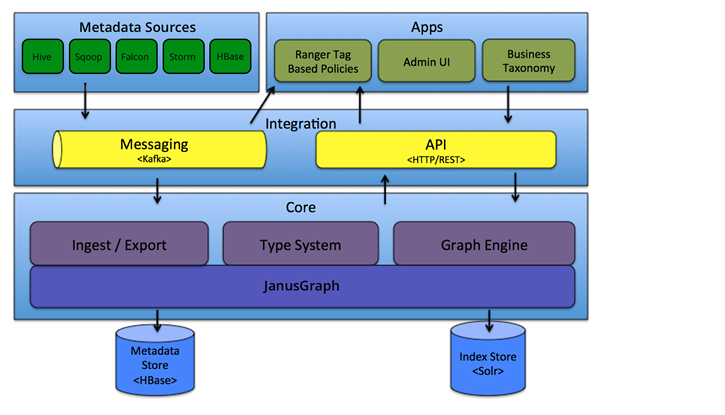
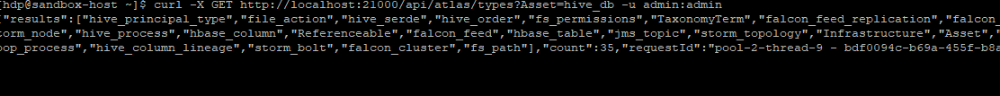

# Overview

[Apache Atlas](https://atlas.apache.org/) is an open source framework for data governance and Metadata Management. It enables the effective compliance requirements of the organization within Hadoop and integrates with other systems across the organization.

## Apache Atlas Architecture

 
## Features

### Metadata types & instances

-	Pre-defined types for various system’s metadata
	Provision to define new types for the metadata to be managed.
-	Ability to define different Types of attributes( primitive attributes, complex attributes, object references)
-	entities, metadata object details and their relationships
-	REST APIs to work with types and instances allow easier integration.

### Lineage

-	Inbuilt UI to view lineage of data flow.
-	REST APIs to perform different function on lineage.

### Classification

-	 create classifications dynamically. 
-	Entities can be associated with multiple classifications, enabling easier discovery and security enforcement
-	Propagation of classifications via lineage - automatically ensures that classifications follow the data as it goes through various processing

### Search/Discovery

-	In built  UI to search entities by type, classification, attribute value or free-text
-	Rich REST APIs 
-	SQL like query language to search entities Security & Data Masking
-	Granular level security for metadata access, enabling controls on access to entity instances and operations like add/update/remove classifications
-	Tight Integration with Apache Ranger

## Type System

### Overview
Atlas allows users to define a model for the metadata objects they want to manage. The model is composed of definitions called ‘types’. Instances of ‘types’ called ‘entities’ represent the actual metadata objects that are managed. The Type System is a component that allows users to define and manage the types and entities. All metadata objects managed by Atlas out of the box (like Hive tables, for e.g.) are modelled using types and represented as entities. To store new types of metadata in Atlas, one needs to understand the concepts of the type system component.

#### Types

A ‘Type’ in Atlas is a definition of how a particular type of metadata objects are stored and accessed. A type represents one or a collection of attributes that define the properties for the metadata object. Users with a development background will recognize the similarity of a type to a ‘Class’ definition of object oriented programming languages, or a ‘table schema’ of relational databases.
An example of a type that comes natively defined with Atlas is a Hive table. A Hive table is defined with these attributes:

	  >  Name:         hive_table	
	  >  
	  >  TypeCategory: Entity
	  >  
	  >   SuperTypes:   DataSet
	  >
	  >	Attributes:
	  >	
	  >    name:             string
	  >    
	  >    db:               hive_db
	  >    
	  >   owner:            string
	  >   
	  >   createTime:       date
	  >  
	  >    lastAccessTime:   date
	  >     
	  >    comment:          string
	  >     
	  >    retention:        int
	  >    
	  >   sd:               hive_storagedesc
	  >   
	  >   partitionKeys:    array<hive_column>
	  >   
	  >   aliases:          array<string>
	  >
	  >  columns:          array<hive_column>
	  >	
	  >    parameters:       map<string,string>
	  >	
	  >    viewOriginalText: string
	  >	
	  >    viewExpandedText: string
	  >	
	  >    tableType:        string
	  >	
	  >    temporary:        boolean
  
#### Entities
  
An ‘entity’ in Atlas is a specific value or instance of an Entity ‘type’ and thus represents a specific metadata object in the real world. Referring back to our analogy of Object Oriented Programming languages, an ‘instance’ is an ‘Object’ of a certain ‘Class’.
An example of an entity will be a specific Hive Table. Say Hive has a table called ‘customers’ in the ‘default’ database. This table will be an ‘entity’ in Atlas of type hive_table. By virtue of being an instance of an entity type, it will have values for every attribute that are a part of the Hive table ‘type’, such as:
	
	>	 guid:     "9ba387dd-fa76-429c-b791-ffc338d3c91f"

	>	typeName: "hive_table"

	>	status:   "ACTIVE"

	>	values:

	>   name:             “customers”

	> db:               { "guid": "b42c6cfc-c1e7-42fd-a9e6-890e0adf33bc", "typeName": "hive_db" }

	>  owner:            “admin”

	> createTime:       1490761686029

	> updateTime:       1516298102877

	> comment:          null

	> retention:        0

	>  sd:               { "guid": "ff58025f-6854-4195-9f75-3a3058dd8dcf", "typeName": "hive_storagedesc" }

	> partitionKeys:    null

	> aliases:          null

	> columns:          [ { "guid": ""65e2204f-6a23-4130-934a-9679af6a211f", "typeName": "hive_column" }, { "guid": ""d726de70-faca-46fb-9c99-cf04f6b579a6", "typeName": "hive_column" }, ...]

	>  parameters:       { "transient_lastDdlTime": "1466403208"}

	> viewOriginalText: null

	> viewExpandedText: null

	> tableType:        “MANAGED_TABLE”

	> temporary:        false

#### Attributes
  
We already saw that attributes are defined inside metatypes like Entity, Struct, Classification and Relationship. But we implistically referred to attributes as having a name and a metatype value. However, attributes in Atlas have some more properties that define more concepts related to the type system.
An attribute has the following properties:
	
	    >  name:        string,

	    >  typeName:    string,

	    >  isOptional:  boolean,

	    >  isIndexable: boolean,

	    >  isUnique:    boolean,

	    >  cardinality: enum
	
	
# Azure Purview
	
## Overview

Azure Purview is a unified data governance service that helps you manage and govern your on-premises, multi-cloud, and software-as-a-service (SaaS) data. Easily create a holistic, up-to-date map of your data landscape with automated data discovery, sensitive data classification, and end-to-end data lineage. Empower data consumers to find valuable, trustworthy data.

For more information please refer Microsoft documentation [Azure Purview](https://docs.microsoft.com/en-us/azure/purview/overview) 

###  Purview excels over Atlas in below features
	
**Support for hybrid data platforms** – This service supports sourcing metadata from supported data repositories hosted on-premises, on Azure cloud, as well as on cross-clouds
	
**Automated data discovery** – It offers a mechanism to scan data repositories and detect metadata with more than 100 classification rules that automatically classify the attributes based on the matching rules
	
**Lineage identification** – Purview has a mechanism with which one can bind it to services like Azure Data Factory from which it can automatically extract lineage
	
**Purview Metadata Catalog and Business Glossary** – It supports the creation of business glossary terms that can be used and mapped with the metadata created in the purview metadata catalog
	
**Data Map with Search** – Different data repositories from different hosting sources can be organized in the form of collections which allows the creation of data maps. The metadata created for these data sources can be easily discovered using the search functionality

March Ahead with Azure Purview: Unify ALL your data using Apache Atlas open API support - Microsoft Tech Community

### Migration Approach
	
Azure Purview is compatible with Atlas API. If you are migrating from Atlas follow below steps:
	
-   it's recommended to scan your data sources first using Azure Purview.

      -  **Finding Hive DB in Atlas**
        
       
     
       -   **Regeistering Atlas  Asset in Purview**
        
       
	
	-  **Scanning registered asset in Purview**
	
	 

        
          
	-    Please refer the Link for Hive metastore scan [Scan-Hive-Metastore](https://docs.microsoft.com/en-us/azure/purview/register-scan-hive-metastore-source)
	
-   Once the assets are available in your account, you can use similar Atlas APIs to integrate such as updating assets or adding custom lineage. 
	- Please refer below links for Setup, Authentication, and using Purview Atlas Endpoints
	   - For Purview tutorial using rest apis [tutorial-using-rest-apis](https://docs.microsoft.com/en-us/azure/purview/tutorial-using-rest-apis)
	   - For additional Technical information on Unify ALL your data using Apache Atlas open API support [Purview Atlas APIs](https://techcommunity.microsoft.com/t5/azure-purview/march-ahead-with-azure-purview-unify-all-your-data-using-apache/ba-p/2185411)
	   - For Azure Purview rest API deep Dive [Purview-Azure-Rest-API](https://www.youtube.com/watch?v=4qzjnMf1GN4&t=362s)
	   - Refer Apache Atlas API documentation for Rest API [Apache Atlas REST API](https://docs.cloudera.com/HDPDocuments/HDP3/HDP-3.0.0/using-atlas/content/apache_atlas_rest_api.html)
	
	  - extracting information from Atlas using REST Api
	  
	  
-   Azure Purview modifies the Search API to use Azure Search so you should be able to use Advance Search.
- 
