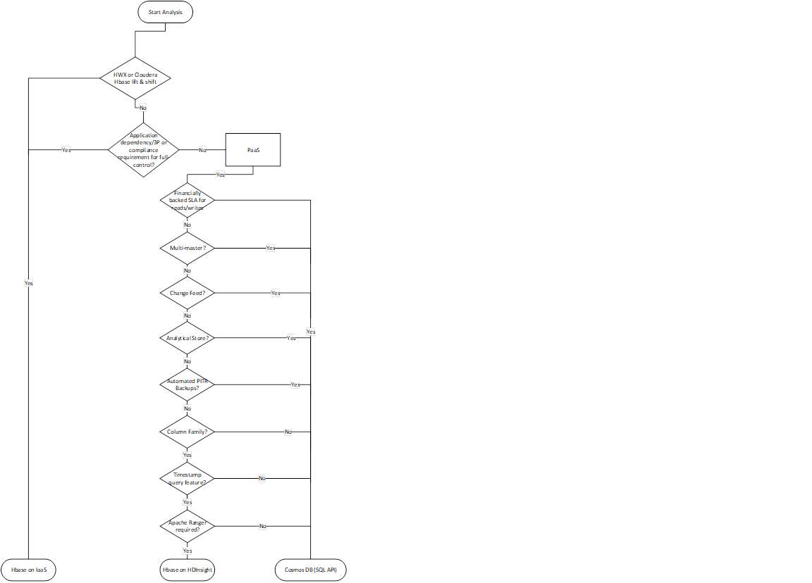

# Migration Approach

Azure has several landing targets for Apache Hbase. Depending on requirements and product features, customers can choose between Azure IaaS, HDI Hbase or Cosmos DB (SQL API).  



## Lift and shift migration to Azure IaaS  

### **Planning and Sizing for Azure Compute & Storage**  

The following set of assessment questions are designed to gain an insight into existing deployment of HBase and establish a set of requirements that must be considered for any type of HBase migration scenario to Azure.  

| Layer  | Questions | Background  |
|---|---|---|
|  **Infrastructure**  | Number of servers for each type of role - <br />  HBase Master; RegionServers; ZooKeeper nodes | Understand scale and design of incumbent solution.  
&nbsp; | Number of cores per server | ```lscpu``` *OR* ```cat /proc/cpuinfo``` commands can be used to list cores per server.
&nbsp; | Available memory per server | This is the total memory available per server. On Linux, commands such as ```free -mg``` *OR* ```cat /proc/meminfo``` can be used to report on memory available on each server.
&nbsp; | Is the existing environment virtualized or deployed on bare-metal servers? | The information will be used as one of the inputs when it comes to sizing and understanding performance characterstics of on-premises HBase environment.
&nbsp; | Network | Understand the network bandwidth each VM can support; and if any special NIC configuration is used to support high bandwidth between Hbase servers. <br />  Use the following commands to extract details of VM network configuration ```ifconfig -a``` *OR* ```ethtool <name of the interface>```
&nbsp; | Storage | What is the total size of data post-replication? Usually, default configuration of HDFS replicates data 3x. HDFS CLI can be used to extract total size of data persisted via HBase <br> ```hdfs dfs -du -h hdfs://<data node address>/hbase``` <br> In addition, one should ask for storage performance targets (IOPS and throughput). This information will be used to provision storage and also understand level of throughput/IOPS required to support HBase deployment on Azure.
**Operating System** | Version and distro type | The following command will print out details of Linux distro and version in use <br> ```uname -a```
&nbsp; | Kernel parameters | Understand if customer has applied any specific kernel-level parameters to improve the performance of HBase deployment. Hence, we do not recommend changing default parameters straightaway unless it has been recommended by your OS and/or application vendor. In most cases, customers tweak these parameters to address specific workload performance requirements. Whilst it's fairly straight-forward to change config, however customers usually arrive at this decision after carrying out extensive testing. <br> **Linux memory and block device parameters** <br> ```cat /sys/kernel/mm/transparent_hugepage/enabled``` <br>```cat /sys/kernel/mm/transparent_hugepage/defrag```<br>```cat /sys/block/sda/queue/scheduler```<br>```cat /sys/class/block/sda/queue/rotational```<br>```cat /sys/class/block/sda/queue/read_ahead_kb```<br>```cat /proc/sys/vm/zone_reclaim_mode```<br> **Linux network stack parameters** <br> ```sudo sysctl -a \ grep -i "net.core.rmem_max\|net.core.wmem_max\|net.core.rmem_default\| net.core.wmem_default\|net.core.optmem_max\|net.ipv4.tcp_rmem\|net.ipv4.tcp_wmem"```
**Application** | What version of HBase and Hadoop distro (Hortonworks or Cloudera) etc. are in use? | There are a few popular distros that are commonly used across the board. It's usually one of the following - HortonWorks (HDP); Cloudera (CDP); MapR or open-source (OSS) version of Hadoop and HBase.<br> To find out version of HBase and Hadoop, use the following commands:<br> ```hbase version``` and ```hdfs version```
&nbsp; | HBase-specific information - number of tables; metadata for each table (Regions; Column-Family) | Information related to HBase deployment can be extracted via Ambari UI. However, if it's not available, one can use CLI. <br> ```scan 'hbase:meta' {FILTER=>"PrefixFilter('tableName')", COLUMNS=>['info:regioninfo']}}```<br> To list all the regions associated with a given table, please use <br> ```list_regions '<table name>'```
&nbsp; | JAVA (JDK) version | ```java -version```
&nbsp; | HBase GC configuration | What GC type is used? Most popular ones that are Concurrent Mark & Sweep (CMS) and G1GC. This is defined in ```hbase-env.sh``` configuration file. Recent researches have shown G1GC garbage collector to be more efficient for large heap sizes.
**Security & administration** | Accessing HBase | How do users access the data in Hbase? Is it via APIs or directly via Hbase shell?<br> How applications consume data?<br> How is data written to Hbase and proximity of these systems? Are they within the same data centre or located outside of DC where Hbase is deployed?
&nbsp; | User provisioning | How are users authenticated and authorized? <br>•Ranger?<br>•Knox?<br>•Kerberos?
&nbsp; | Encryption | Is there a requirement to have data encrypted in transport and/or at-rest? What encryption solutions are currently in-use?
&nbsp; | Tokenization | Is there a requirement to tokenize data? If yes, how is data tokenized? Popular applications used for tokenization include (but not limited to) Protegrity; Vormetric etc.
&nbsp; | Compliance | Are there any special regulatory requirements applicable to Hbase workloads? For example – PCI-DSS; HIPAA etc.
&nbsp; | Keys, certificates, and secrets management policies. | If applicable, please describe and what tools/applications are used for this function.
**High-Availability and Disaster Recovery** | What is the SLA, RPO and RTO of the source Hbase deployment? | This will drive decision on the landing target on Azure and whether to have a hot-standby OR active-active regional deployment on Azure.
&nbsp | BC and DR strategy for Hbase workloads. | Describe BR and DR strategy in detail. Impact of HBase being unavailable.
**Data** | Growth | How much data will be migrated to HBase on day 1; what is the organic growth expected in 6,12,18 months' time. This information is used for capacity planning and sizing the cluster. Eventually, this information is also used for cost optimization of a deployment.
&nbsp; | Ingestion | How is data written to HBase? Please describe.
&nbsp; | Consumption | How is data stored in HBase used? APIs or a compute engine such as HDI Spark or Databricks Spark?
&nbsp; | Access pattern | Is traffic on HBase read-heavy or write-heavy? This will have an implication on how we fine-tune HBase configuration parameters defined in ```hbase-site.xml``` and ```hdfs-site.xml``` files.

There are several third-party (3P) solutions that can assist with assessment. [Unravel](https://www.unraveldata.com/cloud-migration-assessment/) is one such partner that offers solutions that can help customers fast-track assessment for data migrations to Azure.  

**[Azure Virtual Machines](https://docs.microsoft.com/en-au/azure/virtual-machines/linux/overview)** is one of several types of on-demand, scalable computing resources that Azure offers. Typically, you choose a VM when you need more control over the computing environment than the other choices offer. This article gives you information about what you should consider before you create a VM, how you create it, and how you manage it.  

**[What do I need to think about before creating a VM?](https://docs.microsoft.com/en-au/azure/virtual-machines/linux/overview#what-do-i-need-to-think-about-before-creating-a-vm)**  
There are always a multitude of design considerations when you build out an application infrastructure in Azure. These aspects of a VM are important to think about before you start:  
- The names of your application resources  
- The location where the resources are stored  
- The size of the VM  
- The maximum number of VMs that can be created  
- The operating system that the VM runs  
- The configuration of the VM after it starts  
- The related resources that the VM needs

**[Azure VM Families and Limits](https://docs.microsoft.com/en-au/azure/virtual-machines/linux/overview#vm-size)**  
Azure VM families are optimized to suit different use-cases and provide a balance of compute (vCores) and memory.  

| Type  | Size | Description  |
|---|---|---|
|  [Entry Level](https://docs.microsoft.com/en-us/azure/virtual-machines/sizes-general) | A,Av2   | A-series VMs have CPU performance and memory configurations best suited for entry level workloads like development and test. They are economical and provide a low-cost option to get started with Azure.   |
| [General Purpose](https://docs.microsoft.com/en-us/azure/virtual-machines/sizes-general)   | D, DSv2, Dv2   | Balanced CPU-to-memory ratio. Ideal for testing and development, small to medium databases, and low to medium traffic web servers.  |
| [Compute Optimized](https://docs.microsoft.com/en-us/azure/virtual-machines/sizes-compute)  | F    | These VMs have a high CPU-to-memory ratio. Good for medium traffic web servers, network appliances, batch processes, and application servers.  |
|  [Memory Optimized](https://docs.microsoft.com/en-us/azure/virtual-machines/sizes-memory) | Esv3, Ev3   | These VMs have a high memory-to-CPU ratio. Great for relational database servers, medium to large caches, and in-memory analytics.  |
|   |   |   |  

In terms of nature of resource footprint, Apache Hbase is designed to leverage memory and premium storage (such as SSDs).  

- HBase ships with features like BucketCache which can significantly improve read performance. BucketCache is stored off-heap.  Hence, we recommend VMs that have higher memory to CPU ratio.  
  
- HBase write path includes writing changes to a write-ahead log (WAL) which is a data structure persisted on a storage medium. Storing WAL on fast storage medium such as SSDs will improve write performance.
- Hbase is designed to scale-out as performance and storage requirements grow.  

Scalability targets of Azure compute [Ds-series](https://docs.microsoft.com/en-us/azure/virtual-machines/dv2-dsv2-series-memory) and [Es-series](https://docs.microsoft.com/en-us/azure/virtual-machines/ev3-esv3-series) along with [premium SSD (managed disks)](https://docs.microsoft.com/en-us/azure/virtual-machines/disks-types#premium-ssd) are available on Microsoft Docs and these must be considered during sizing and planning.  

From compute and memory perspective, we recommend using the following Azure compute family types for various Hbase node types:  

- **Hbase Master** – For enterprise deployments, we recommend at least 2 x Master (from HA perspective). For a large Hbase cluster, a DS5_v2 Azure VM with 16 vCPUs and 56 GiB memory should suffice most deployments. For medium-sized clusters, recommendation is to have at least 8 vCPU and 20-30GB memory.  

- **HDFS NameNode** – We recommend hosting NameNode on separate set of virtual machines and not to co-locate with Hbase Master. From HA perspective, 2 x NameNodes should be deployed. Like Hbase Master, Azure VM DS5_v2 is recommended for large production-grade clusters.  

- **Hbase RegionServer** – We recommend using Azure VMs with high memory to vCPU ratio. Hbase has several features that can leverage memory for improving reads and writes. Azure VMs like DS14_v2 or DS15_v2 will be a good starting point. Hbase is designed for scale-out and more Region Servers can be added to improve performance.  

- **ZooKeeper (ZK)** – Hbase relies on ZK for operations. An Azure VM with 4-8 vCPU; 4-8 GB memory is a good starting point. Ensure that there is local storage available. ZK nodes should be deployed on a separate set of VMs.  

**Azure Storage**  
For an Azure IaaS-based Hbase deployment, Azure offers several storage options. The following flowchart uses features of various options to land on a storage target. Each storage option on Azure has a different performance, availability, and cost targets.  


There are two key factors that influence of sizing of Hbase storage – **volume** and **throughput**. These two parameters also have an implication on choice of Azure VM size/numbers and Azure Storage (Managed Disks or ADLS).

- **Volume of data**  
  This is the data that must be persisted on Hbase. The data gets persisted to underlying storage and when we refer to volume of data, for sizing and planning purposes, volume includes raw data + 3x replication. Total storage size is the metric that we use to drive volume.

- **Throughput of reads and writes**
This is how fast one wants Hbase to service writes and reads. IOPS and throughput are the two metrics that drive this.  

If you are planning a greenfield deployment of Hbase on Azure IaaS and there's no reference point in terms of existing deployment, our recommendation is to go with the following sizing and then add RegionServers as the volume of data and/or demand for higher read/write throughput grows. Azure compute belonging to Ds or Es series is well suited for Hbase RegionServer roles. For Hbase Master and ZooKeeper nodes, we recommend using smaller Ds-series VMs. See Azure compute for guidance on compute size suitable for workloads.  

For more sizing accuracy and establishing a performance baseline, we recommend customers to run tests on Azure IaaS using Hbase dataset, model, and workload pattern. If moving data is not possible, we recommend using benchmarking tools such as YCSB to generate synthetic data and simulate sequential and random I/O traffic. The intent of this exercise is to help customers gain an understanding of level of performance one can expect using a combination of Azure compute and premium storage. It’s worth calling out that the tests should include day-to-day workload pattern and special cases like any workloads which may cause a spike in resource usage such as month-end or year-end activities. For example, a retailer using Hbase will observe spike in resource usage around holiday periods whereas a financial services customer will observe spikes around key financial periods.  

Inputs from assessment and performance baseline should give customers a fairly accurate view of sizing on Azure IaaS. Due to the nature of the workloads, there will be room to optimize operations by scaling-out or scaling-in clusters post go-live. We recommend customers should familiarise themselves with various [Cost Optimization](https://docs.microsoft.com/en-us/azure/architecture/framework/cost/overview) levers available to them to optimize costs and operations.  

#### **Data Migration**  

**Note** - Apache Hbase persists data in a file called HFile which are stored on HDFS. From migration perspective, it’s **not recommended** to directly copy HFiles between two Hbase clusters outside of HBase. For HBase cluster to cluster data migrations, recommendation is to use one of the out-of-the-box feature that HBase ships with.  
 

**Pattern** | **Migration Approach** | **Considerations**
--- | --- | ---
**Bulk load scenarios** where source data is not being read from an HBase instance.<br />  <br /> **Examples -** source data in a file format such as CSV, TSV, Parquet *OR* data is in a database or 3P proprietary format.<br />  <br /> For this pattern, depending on source(s) and/or tool used for reading and loading data into HBase   | Overall approach is to build a pipeline using tools such as **WANDisco** or **Databricks** to read from source and <br />  <br />**Source file format** - csv, parquet, tsv or a 3P proprietary format etc.  <br />  <br />  **Data migration tooling options -** If the data is sitting on a file-system or HDFS, then tools such as WANDisco or Spark (HDI or Databricks) can be leverged to read from source and write to HBase on Azure. <br /> <br /> At a high-level, a migration pipeline can be built per target table on HBase where data is extracted from source and written to Azure HDFS first. Then a separate pipeline can be built to read from Azure HDFS to Azure HBase. | **Separate infrastructure** required to host migration tool runtime. <br />  <br /> **Handling encryption** and tokenisation requirements during data migration. <br />  <br /> **Network latency** between source and target (Azure HBase).
**Source is an Hbase instance** but different versions i.e. HBase version at source is different from HBase version deployed on Azure VM. | Since source is also a HBase datastore, one can explore direct HBase cluster to cluster data migration options such as <br />  <br /> **HBase CopyTable** <br /> *Note* - CopyTable supports full and delta table copy features. <br /> OR <br /> **Azure HDI Spark or Databricks** <br /> OR <br /> **HBase Export and Import Utility** <br /> OR <br /> **HashTable/SyncTable** | Same as above plus a few related to specific tool used for migration. <br />  <br />  **Hbase CopyTable** Hbase version on source and target sides. <br />  <br /> Clusters must be online on source and target side. <br />  <br /> Additional resources required on source side to support additional read traffic on the source Hbase instance. <br />  <br /> **CopyTable** feature by default, it only copies the latest version of a row cell. It also copies all Cells between a specified time range. There might be changes happening on source Hbase while CopyTable is running, in such a scenario, new changes will either be completed included or excluded. <br />  <br /> **Azure HDI Spark or Databricks** require additional resources or a separate cluster for migrating data however it's a tried and tested approach. <br />  <br /> **HBase Export Utility** by default, always copies the latest version of a Cell across to HBbase target. <br />  <br /> **HashTable/SyncTable** is more efficient compared to CopyTable feature.
Source is a HBase database with the same version i.e., data is being migrated between two instances of HBase. | All the options stated above <br /> and <br /> **HBase Snapshots** | Same considerations as stated above and certain that are related to **HBase Snapshots**. <br />  <br /> Snapshot doesn’t create copy of data however it does create a reference back to HFiles. The referenced HFiles are archived separately in case compaction is triggered on parent table which is referenced in a snapshot.<br />  <br /> Footprint on source and target Hbase when a snapshot restore is triggered.<br /> <br /> Keeping data source and target (Hbase) in-sync during migration and then planning for final cut-over.  <br /> <br /> Network latency between source and target.  

#### **Security**  

For an HBase cluster to operate, it must be able to communicate with other virtual machines that form part of the cluster. This includes VMs that host Master; RegionServers; ZooKeeper etc.  

To enable servers to authenticate to each other seamlessly, various authentication models can be applied. The most common patterns are discussed here.  

##### **Kerberized Linux servers domain-joined to a Windows Domain Controller (DC)**  
 
 Linux servers hosting Apache Hadoop ecosystem are domain-joined to an AD domain. In this setup, we see that there is no need to have a separately hosted KDC as this capability sits within Windows DC.  

 *Considerations*  

 - Location of the domain controller.  
 - Role(s) assigned to the domain controller.

If the domain controller (DC) is located on-premises or outside of an Azure region or in a 3P cloud, latency impact must be considered/factored-in for operations requiring interaction with the domain controller. One option could be to host a second [domain controller on Azure](https://docs.microsoft.com/en-us/azure/architecture/reference-architectures/identity/adds-extend-domain). The Azure-based DC is then used for all authentication and authorisation scenarios for workloads running on Azure. We recommend you do not assign operations [masters roles to the domain controllers](https://docs.microsoft.com/en-us/windows-server/identity/ad-ds/plan/planning-operations-master-role-placement) deployed in Azure. In such a scenario, primary DC (or PDC) is hosted on-premises.  

##### **Kerberized Linux environment using Azure Active Directory Domain Services (AAD-DS)**  

[Azure Active Directory Domain Services (AD DS)](https://docs.microsoft.com/en-us/azure/active-directory-domain-services/overview) provides managed domain services such as domain join, group policy, lightweight directory access protocol (LDAP), and Kerberos/NTLM authentication. One can use AAD-DS without the need to deploy, manage, and patch domain controllers (DCs) in the cloud.  

*Considerations*  

- Regional availability of AAD-DS
- Networking requirements for AAD-DS
- HA-DR and uptime SLA for AAD-DS

##### **Standalone MIT KDC**  

There are some deployments of Hadoop that use a standalone KDC such as MIT KDC. MIT KDC is deployed on a separate set of Azure VMs for HA. Instructions for deploying MIT KDC on Linux servers is available [here](https://web.mit.edu/kerberos/krb5-1.13/doc/admin/install_kdc.html).  

*Considerations*  

- Surface area of management
- HA-DR for MIT KDC  
- Well-Architected framework treatment for MIT KDC  

##### **Authorization - Apache Hbase and Apache Ranger**  

[Apache Ranger](https://ranger.apache.org/) provides comprehensive security across the Apache Hadoop ecosystem. 
In context of Apache HBase, Ranger is used to build and deploy policy-based authorization. See <Ranger section> for more information on Apache Ranger integration with HBase.  

#### **Monitoring**  

There are several monitoring options available for monitoring full Hbase stack on Azure IaaS. We will go through each layer of the stack and various popular options available for monitoring.  

For a **lift and shift** to Azure IaaS, customers have an **option to reuse** the same monitoring and observability platform and practices which they had been using on-premises or 3P cloud.  

**Note** – for migration scenarios from 3P clouds, where a native monitoring solution was in use for the source Hbase deployment, we recommend using native Azure monitoring solution post-migration. With a combination of application and infrastructure monitoring, one can get a full end-to-end picture of combination.  

##### **Application Stack Monitoring**  

Apache Ambari for monitoring Hadoop and Hbase stack  

[Apache Ambari](https://ambari.apache.org/index.html) is a project aimed at simplifying management of distributed applications such as Hadoop; Hbase etc. simpler. It uses [Ambari Metrics System](https://cwiki.apache.org/confluence/display/AMBARI/Ambari+Server+Metrics) to surface metrics in Ambari-managed clusters. Ambari can report on metrics specific to Hbase such as Cluster Load; Network Usage; Memory Usage; HBase Master Heap etc.  

Detailed guidance for deploying Ambari managed Hadoop and HBase clusters is published [here](https://ambari.apache.org/1.2.2/installing-hadoop-using-ambari/content/ambari-chap3-3.html). Ambari managed clusters ship with dashboards for monitoring clusters.  

JMX Monitoring and Azure Monitor  

HBase and Hadoop processes run in a JVM. JVM has built-in instrumentation to expose monitoring data using Java Management Extensions (JMX). One can also monitor any appropriately instrumented applications using the JMX API.  

In addition to the standard output contexts supported by the Hadoop metrics package, one can also export HBase metrics via Java Management Extensions (JMX). Using JMX, it’s possible to view HBase stats in JConsole or any other JMX client.  

Using Log Analytics Agent, it’s possible to capture custom JSON data sources and store the output in Log Analytics for reporting via Azure Monitor.  

- Once Linux servers have been deployed. Please [install](https://docs.microsoft.com/en-us/azure/azure-monitor/vm/quick-collect-linux-computer) and configure Log Analytics agent for Linux.  
- Configure Log Analytics agent to [collect custom JSON data](https://docs.microsoft.com/en-us/azure/azure-monitor/agents/data-sources-json). The output of the following endpoints is a JSON output which can be collected and parsed using various FluentD plugins.  
- Here’s a sample of how to configure input and output plugin to collect metrics for HBase RegionServer Write-Ahead Logs (WAL).  

```xml
<source>
  type exec
  command 'curl -XGET http://<regionServerName>:16030/jmx?qry=Hadoop:service=HBase,name=RegionServer,sub=WAL'
  format json
  tag oms.api.metrics_regionserver
  run_interval 1m
</source>

<filter oms.api.metrics_regionserver>
  type filter_flatten
  select record['beans'][0]
</filter>

<match oms.api.metrics*>
  type out_oms_api
  log_level info

  buffer_chunk_limit 5m
  buffer_type file
  buffer_path /var/opt/microsoft/omsagent/state/out_oms_api*.buffer
  buffer_queue_limit 10
  flush_interval 20s
  retry_limit 10
  retry_wait 5s
  max_retry_wait 5m

  compress true
</match>
```

Using the example above, one can create INPUT and OUTPUT plugins for the list below. The list contains JMX endpoints that one can query to extract metrics for HBase Master and RegionServer.

```xml

curl -XGET http://<region_server>:16030/jmx?qry=Hadoop:service=HBase,name=RegionServer,sub=Server
curl -XGET http://<region_server>:16030/jmx?qry=Hadoop:service=HBase,name=RegionServer,sub=Replication
curl -XGET http://<rest_server>:8085/jmx?qry=Hadoop:service=HBase,name=REST
curl -XGET http://<rest_server>:8085/jmx?qry=Hadoop:service=HBase,name=JvmMetrics
curl -XGET http://<region_server>:16030/jmx?qry=Hadoop:service=HBase,name=RegionServer,sub=WAL
curl -XGET http://<region_server>:16030/jmx?qry=Hadoop:service=HBase,name=RegionServer,sub=IPC
curl -XGET http://<region_server>:16030/jmx?qry=Hadoop:service=HBase,name=JvmMetrics
curl -XGET http://<region_server>:16030/jmx?qry=java.lang:type=OperatingSystem
curl -XGET http://<hbase_master>:16010/jmx?qry=Hadoop:service=HBase,name=Master,sub=AssignmentManger
curl -XGET http://<hbase_master>:16010/jmx?qry=Hadoop:service=HBase,name=Master,sub=IPC
curl -XGET http://<hbase_master>:16010/jmx?qry=java.lang:type=OperatingSystem
curl -XGET http://<hbase_master>:16010/jmx?qry=Hadoop:service=HBase,name=Master,sub=Balancer
curl -XGET http://<hbase_master>:16010/jmx?qry=Hadoop:service=HBase,name=JvmMetrics
curl -XGET http://<hbase_master>:16010/jmx?qry=Hadoop:service=HBase,name=Master,sub=Server
curl -XGET http://<hbase_master>:16010/jmx?qry=Hadoop:service=HBase,name=Master,sub=FileSystem
```

Once configured, each individual source will appear under Custom Logs blade. In the snippet above, we used the name oms.api.metrics_regionservers for the input, Log Analytics uses the following format for displaying custom table name with a suffix_CL.


##### **Infrastructure (VM, storage disks and networking) logging and metrics**  

Azure Monitor and Log Analytics Agent  

Linux distros ship with several out-of-the-box tools (sar etc.) for capturing and reporting on metrics. Whilst this is good for monitoring health of an individual virtual machine, however for a large enterprise -grade deployment of Apache Hbase, it’s not feasible to rely on such options. Hence, our recommendation is to leverage Azure Monitor which provides a single pane of glass for monitoring all the virtual machines.  

Azure Monitor relies on [Log Analytics agent](https://docs.microsoft.com/en-us/azure/azure-monitor/agents/log-analytics-agent?context=/azure/virtual-machines/context/context) (installed on each Azure VM). The agent captures data written to Syslog and performance data from individual virtual machines and sends them to Azure Log Analytics for storage and indexing. Azure Monitor dashboards then pull data from a configured Log Analytics Workspace and presents administrators a view of overall health of all the virtual machines. This is a native option which can be enabled seamlessly for Linux-based Azure VMs.  

Instructions for setting up Azure Monitor to collect data from Linux are available [here](https://docs.microsoft.com/en-us/azure/azure-monitor/vm/quick-collect-linux-computer). Once data has been written to Log Analytics, analysis can be done using [Kusto](https://docs.microsoft.com/en-us/azure/azure-monitor/logs/log-analytics-tutorial).

