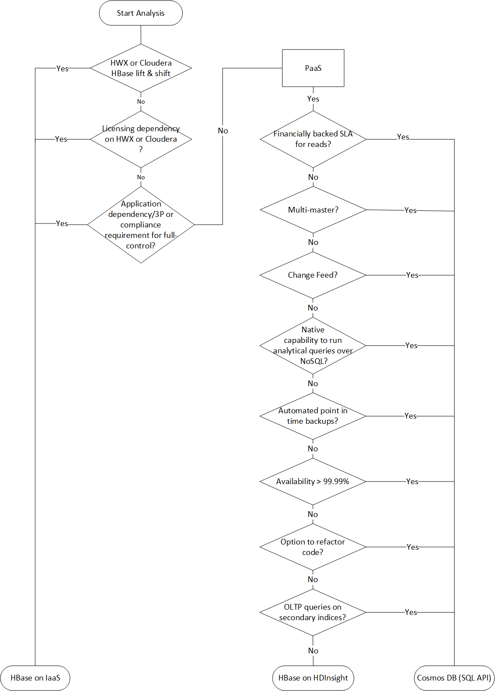

# Migration Approach

Azure has several landing targets for Apache HBase. Depending on requirements and product features, customers can choose between Azure IaaS, HDI HBase or Cosmos DB (SQL API).  


## Lift and shift migration to Azure IaaS  

### **Planning and Sizing for Azure Compute & Storage**  

The following set of assessment questions are designed to gain an insight into existing deployment of HBase and establish a set of requirements that must be considered for any type of HBase migration scenario to Azure.  

| Layer  | Questions | Background  |
|---|---|---|
|  **Infrastructure**  | Number of servers for each type of role - <br />  HBase Master; RegionServers; ZooKeeper nodes | Understand scale and design of incumbent solution.  
&nbsp; | Number of cores per server | ```lscpu``` *OR* ```cat /proc/cpuinfo``` commands can be used to list cores per server.
&nbsp; | Available memory per server | This is the total memory available per server. On Linux, commands such as ```free -mg``` *OR* ```cat /proc/meminfo``` can be used to report on memory available on each server.
&nbsp; | Is the existing environment virtualized or deployed on bare-metal servers? | The information will be used as one of the inputs when it comes to sizing and understanding performance characterstics of on-premises HBase environment.
&nbsp; | Network | Understand the network bandwidth each VM can support; and if any special NIC configuration is used to support high bandwidth between HBase servers. <br />  Use the following commands to extract details of VM network configuration ```ifconfig -a``` *OR* ```ethtool <name of the interface>```
&nbsp; | Storage | What is the total size of data post-replication? Usually, default configuration of HDFS replicates data 3x. HDFS CLI can be used to extract total size of data persisted via HBase <br> ```hdfs dfs -du -h hdfs://<data node address>/HBase``` <br> In addition, one should ask for storage performance targets (IOPS and throughput). This information will be used to provision storage and also understand level of throughput/IOPS required to support HBase deployment on Azure.
**Operating System** | Version and distro type | The following command will print out details of Linux distro and version in use <br> ```uname -a```
&nbsp; | Kernel parameters | Understand if customer has applied any specific kernel-level parameters to improve the performance of HBase deployment. Hence, we do not recommend changing default parameters straightaway unless it has been recommended by your OS and/or application vendor. In most cases, customers tweak these parameters to address specific workload performance requirements. Whilst it's fairly straight-forward to change config, however customers usually arrive at this decision after carrying out extensive testing. <br> **Linux memory and block device parameters** <br> ```cat /sys/kernel/mm/transparent_hugepage/enabled``` <br>```cat /sys/kernel/mm/transparent_hugepage/defrag```<br>```cat /sys/block/sda/queue/scheduler```<br>```cat /sys/class/block/sda/queue/rotational```<br>```cat /sys/class/block/sda/queue/read_ahead_kb```<br>```cat /proc/sys/vm/zone_reclaim_mode```<br> **Linux network stack parameters** <br> ```sudo sysctl -a \ grep -i "net.core.rmem_max\|net.core.wmem_max\|net.core.rmem_default\| net.core.wmem_default\|net.core.optmem_max\|net.ipv4.tcp_rmem\|net.ipv4.tcp_wmem"```
**Application** | What version of HBase and Hadoop distro (Hortonworks or Cloudera) etc. are in use? | There are a few popular distros that are commonly used across the board. It's usually one of the following - HortonWorks (HDP); Cloudera (CDP); MapR or open-source (OSS) version of Hadoop and HBase.<br> To find out version of HBase and Hadoop, use the following commands:<br> ```hbase version``` and ```hdfs version```
&nbsp; | HBase-specific information - number of tables; metadata for each table (Regions; Column-Family) | Information related to HBase deployment can be extracted via Ambari UI. However, if it's not available, one can use CLI. <br> ```scan 'hbase:meta' {FILTER=>"PrefixFilter('tableName')", COLUMNS=>['info:regioninfo']}}```<br> To list all the regions associated with a given table, please use <br> ```list_regions '<table name>'```
&nbsp; | JAVA (JDK) version | ```java -version```
&nbsp; | HBase GC configuration | What GC type is used? Most popular ones that are Concurrent Mark & Sweep (CMS) and G1GC. This is defined in ```hbase-env.sh``` configuration file. Recent researches have shown G1GC garbage collector to be more efficient for large heap sizes.
**Security & administration** | Accessing HBase | How do users access the data in HBase? Is it via APIs or directly via HBase shell?<br> How applications consume data?<br> How is data written to HBase and proximity of these systems? Are they within the same data centre or located outside of DC where HBase is deployed?
&nbsp; | User provisioning | How are users authenticated and authorized? <br>•Ranger?<br>•Knox?<br>•Kerberos?
&nbsp; | Encryption | Is there a requirement to have data encrypted in transport and/or at-rest? What encryption solutions are currently in-use?
&nbsp; | Tokenization | Is there a requirement to tokenize data? If yes, how is data tokenized? Popular applications used for tokenization include (but not limited to) Protegrity; Vormetric etc.
&nbsp; | Compliance | Are there any special regulatory requirements applicable to HBase workloads? For example – PCI-DSS; HIPAA etc.
&nbsp; | Keys, certificates, and secrets management policies. | If applicable, please describe and what tools/applications are used for this function.
**High-Availability and Disaster Recovery** | What is the SLA, RPO and RTO of the source HBase deployment? | This will drive decision on the landing target on Azure and whether to have a hot-standby OR active-active regional deployment on Azure.
&nbsp | BC and DR strategy for HBase workloads. | Describe BR and DR strategy in detail. Impact of HBase being unavailable.
**Data** | Growth | How much data will be migrated to HBase on day 1; what is the organic growth expected in 6,12,18 months' time. This information is used for capacity planning and sizing the cluster. Eventually, this information is also used for cost optimization of a deployment.
&nbsp; | Ingestion | How is data written to HBase? Please describe.
&nbsp; | Consumption | How is data stored in HBase used? APIs or a compute engine such as HDI Spark or Databricks Spark?
&nbsp; | Access pattern | Is traffic on HBase read-heavy or write-heavy? This will have an implication on how we fine-tune HBase configuration parameters defined in ```hbase-site.xml``` and ```hdfs-site.xml``` files.

There are several third-party (3P) solutions that can assist with assessment. [Unravel](https://www.unraveldata.com/cloud-migration-assessment/) is one such partner that offers solutions that can help customers fast-track assessment for data migrations to Azure.  

**[Azure Virtual Machines](https://docs.microsoft.com/en-au/azure/virtual-machines/linux/overview)** is one of several types of on-demand, scalable computing resources that Azure offers. Typically, you choose a VM when you need more control over the computing environment than the other choices offer. This article gives you information about what you should consider before you create a VM, how you create it, and how you manage it.  

**[What do I need to think about before creating a VM?](https://docs.microsoft.com/en-au/azure/virtual-machines/linux/overview#what-do-i-need-to-think-about-before-creating-a-vm)**  
There are always a multitude of design considerations when you build out an application infrastructure in Azure. These aspects of a VM are important to think about before you start:  
- The names of your application resources  
- The location where the resources are stored  
- The size of the VM  
- The maximum number of VMs that can be created  
- The operating system that the VM runs  
- The configuration of the VM after it starts  
- The related resources that the VM needs

**[Azure VM Families and Limits](https://docs.microsoft.com/en-au/azure/virtual-machines/linux/overview#vm-size)**  
Azure VM families are optimized to suit different use-cases and provide a balance of compute (vCores) and memory.  

| Type  | Size | Description  |
|---|---|---|
|  [Entry Level](https://docs.microsoft.com/en-us/azure/virtual-machines/sizes-general) | A,Av2   | A-series VMs have CPU performance and memory configurations best suited for entry level workloads like development and test. They are economical and provide a low-cost option to get started with Azure.   |
| [General Purpose](https://docs.microsoft.com/en-us/azure/virtual-machines/sizes-general)   | D, DSv2, Dv2   | Balanced CPU-to-memory ratio. Ideal for testing and development, small to medium databases, and low to medium traffic web servers.  |
| [Compute Optimized](https://docs.microsoft.com/en-us/azure/virtual-machines/sizes-compute)  | F    | These VMs have a high CPU-to-memory ratio. Good for medium traffic web servers, network appliances, batch processes, and application servers.  |
|  [Memory Optimized](https://docs.microsoft.com/en-us/azure/virtual-machines/sizes-memory) | Esv3, Ev3   | These VMs have a high memory-to-CPU ratio. Great for relational database servers, medium to large caches, and in-memory analytics.  |
|   |   |   |  

In terms of nature of resource footprint, Apache HBase is designed to leverage memory and premium storage (such as SSDs).  

- HBase ships with features like BucketCache which can significantly improve read performance. BucketCache is stored off-heap.  Hence, we recommend VMs that have higher memory to CPU ratio.  
  
- HBase write path includes writing changes to a write-ahead log (WAL) which is a data structure persisted on a storage medium. Storing WAL on fast storage medium such as SSDs will improve write performance.
- HBase is designed to scale-out as performance and storage requirements grow.  

Scalability targets of Azure compute [Ds-series](https://docs.microsoft.com/en-us/azure/virtual-machines/dv2-dsv2-series-memory) and [Es-series](https://docs.microsoft.com/en-us/azure/virtual-machines/ev3-esv3-series) along with [premium SSD (managed disks)](https://docs.microsoft.com/en-us/azure/virtual-machines/disks-types#premium-ssd) are available on Microsoft Docs and these must be considered during sizing and planning.  

From compute and memory perspective, we recommend using the following Azure compute family types for various HBase node types:  

- **HBase Master** – For enterprise deployments, we recommend at least 2 x Master (from HA perspective). For a large HBase cluster, a DS5_v2 Azure VM with 16 vCPUs and 56 GiB memory should suffice most deployments. For medium-sized clusters, recommendation is to have at least 8 vCPU and 20-30GB memory.  

- **HDFS NameNode** – We recommend hosting NameNode on separate set of virtual machines and not to co-locate with HBase Master. From HA perspective, 2 x NameNodes should be deployed. Like HBase Master, Azure VM DS5_v2 is recommended for large production-grade clusters.  

- **HBase RegionServer** – We recommend using Azure VMs with high memory to vCPU ratio. HBase has several features that can leverage memory for improving reads and writes. Azure VMs like DS14_v2 or DS15_v2 will be a good starting point. HBase is designed for scale-out and more Region Servers can be added to improve performance.  

- **ZooKeeper (ZK)** – HBase relies on ZK for operations. An Azure VM with 4-8 vCPU; 4-8 GB memory is a good starting point. Ensure that there is local storage available. ZK nodes should be deployed on a separate set of VMs.  

**Azure Storage**  
For an Azure IaaS-based HBase deployment, Azure offers several storage options. The following flowchart uses features of various options to land on a storage target. Each storage option on Azure has a different performance, availability, and cost targets.  


There are two key factors that influence of sizing of HBase storage – **volume** and **throughput**. These two parameters also have an implication on choice of Azure VM size/numbers and Azure Storage (Managed Disks or ADLS).

- **Volume of data**  
  This is the data that must be persisted on HBase. The data gets persisted to underlying storage and when we refer to volume of data, for sizing and planning purposes, volume includes raw data + 3x replication. Total storage size is the metric that we use to drive volume.

- **Throughput of reads and writes**
This is how fast one wants HBase to service writes and reads. IOPS and throughput are the two metrics that drive this.  

If you are planning a greenfield deployment of HBase on Azure IaaS and there's no reference point in terms of existing deployment, our recommendation is to go with the following sizing and then add RegionServers as the volume of data and/or demand for higher read/write throughput grows. Azure compute belonging to Ds or Es series is well suited for HBase RegionServer roles. For HBase Master and ZooKeeper nodes, we recommend using smaller Ds-series VMs. See Azure compute for guidance on compute size suitable for workloads.  

For more sizing accuracy and establishing a performance baseline, we recommend customers to run tests on Azure IaaS using HBase dataset, model, and workload pattern. If moving data is not possible, we recommend using benchmarking tools such as YCSB to generate synthetic data and simulate sequential and random I/O traffic. The intent of this exercise is to help customers gain an understanding of level of performance one can expect using a combination of Azure compute and premium storage. It’s worth calling out that the tests should include day-to-day workload pattern and special cases like any workloads which may cause a spike in resource usage such as month-end or year-end activities. For example, a retailer using HBase will observe spike in resource usage around holiday periods whereas a financial services customer will observe spikes around key financial periods.  

Inputs from assessment and performance baseline should give customers a fairly accurate view of sizing on Azure IaaS. Due to the nature of the workloads, there will be room to optimize operations by scaling-out or scaling-in clusters post go-live. We recommend customers should familiarise themselves with various [Cost Optimization](https://docs.microsoft.com/en-us/azure/architecture/framework/cost/overview) levers available to them to optimize costs and operations.  

#### **Data Migration**  

> [!NOTE] - Apache HBase persists data in a file called HFile which are stored on HDFS. From migration perspective, it’s **not recommended** to directly copy HFiles between two HBase clusters outside of HBase. For HBase cluster to cluster data migrations, recommendation is to use one of the out-of-the-box feature that HBase ships with.  

**Pattern** | **Migration Approach** | **Considerations**
--- | --- | ---
**Bulk load scenarios** where source data is not being read from an HBase instance.<br />  <br /> **Examples -** source data in a file format such as CSV, TSV, Parquet *OR* data is in a database or 3P proprietary format.<br />  <br /> For this pattern, depending on source(s) and/or tool used for reading and loading data into HBase   | Overall approach is to build a pipeline using tools such as **WANDisco** or **Databricks** to read from source and <br />  <br />**Source file format** - csv, parquet, tsv or a 3P proprietary format etc.  <br />  <br />  **Data migration tooling options -** If the data is sitting on a file-system or HDFS, then tools such as WANDisco or Spark (HDI or Databricks) can be leverged to read from source and write to HBase on Azure. <br /> <br /> At a high-level, a migration pipeline can be built per target table on HBase where data is extracted from source and written to Azure HDFS first. Then a separate pipeline can be built to read from Azure HDFS to Azure HBase. | **Separate infrastructure** required to host migration tool runtime. <br />  <br /> **Handling encryption** and tokenisation requirements during data migration. <br />  <br /> **Network latency** between source and target (Azure HBase).
**Source is an HBase instance** but different versions i.e. HBase version at source is different from HBase version deployed on Azure VM. | Since source is also a HBase datastore, one can explore direct HBase cluster to cluster data migration options such as <br />  <br /> **HBase CopyTable** <br /> *Note* - CopyTable supports full and delta table copy features. <br /> OR <br /> **Azure HDI Spark or Databricks** <br /> OR <br /> **HBase Export and Import Utility** <br /> OR <br /> **HashTable/SyncTable** | Same as above plus a few related to specific tool used for migration. <br />  <br />  **HBase CopyTable** HBase version on source and target sides. <br />  <br /> Clusters must be online on source and target side. <br />  <br /> Additional resources required on source side to support additional read traffic on the source HBase instance. <br />  <br /> **CopyTable** feature by default, it only copies the latest version of a row cell. It also copies all Cells between a specified time range. There might be changes happening on source HBase while CopyTable is running, in such a scenario, new changes will either be completed included or excluded. <br />  <br /> **Azure HDI Spark or Databricks** require additional resources or a separate cluster for migrating data however it's a tried and tested approach. <br />  <br /> **HBase Export Utility** by default, always copies the latest version of a Cell across to HBbase target. <br />  <br /> **HashTable/SyncTable** is more efficient compared to CopyTable feature.
Source is a HBase database with the same version i.e., data is being migrated between two instances of HBase. | All the options stated above <br /> and <br /> **HBase Snapshots** | Same considerations as stated above and certain that are related to **HBase Snapshots**. <br />  <br /> Snapshot doesn’t create copy of data however it does create a reference back to HFiles. The referenced HFiles are archived separately in case compaction is triggered on parent table which is referenced in a snapshot.<br />  <br /> Footprint on source and target HBase when a snapshot restore is triggered.<br /> <br /> Keeping data source and target (HBase) in-sync during migration and then planning for final cut-over.  <br /> <br /> Network latency between source and target.  

#### **Security**  

For an HBase cluster to operate, it must be able to communicate with other virtual machines that form part of the cluster. This includes VMs that host Master; RegionServers; ZooKeeper etc.  

To enable servers to authenticate to each other seamlessly, various authentication models can be applied. The most common patterns are discussed here.  

##### **Kerberized Linux servers domain-joined to a Windows Domain Controller (DC)**  
 
 Linux servers hosting Apache Hadoop ecosystem are domain-joined to an AD domain. In this setup, we see that there is no need to have a separately hosted KDC as this capability sits within Windows DC.  

 *Considerations*  

 - Location of the domain controller.  
 - Role(s) assigned to the domain controller.

If the domain controller (DC) is located on-premises or outside of an Azure region or in a 3P cloud, latency impact must be considered/factored-in for operations requiring interaction with the domain controller. One option could be to host a second [domain controller on Azure](https://docs.microsoft.com/en-us/azure/architecture/reference-architectures/identity/adds-extend-domain). The Azure-based DC is then used for all authentication and authorisation scenarios for workloads running on Azure. We recommend you do not assign operations [masters roles to the domain controllers](https://docs.microsoft.com/en-us/windows-server/identity/ad-ds/plan/planning-operations-master-role-placement) deployed in Azure. In such a scenario, primary DC (or PDC) is hosted on-premises.  

##### **Kerberized Linux environment using Azure Active Directory Domain Services (AAD-DS)**  

[Azure Active Directory Domain Services (AD DS)](https://docs.microsoft.com/en-us/azure/active-directory-domain-services/overview) provides managed domain services such as domain join, group policy, lightweight directory access protocol (LDAP), and Kerberos/NTLM authentication. One can use AAD-DS without the need to deploy, manage, and patch domain controllers (DCs) in the cloud.  

*Considerations*  

- Regional availability of AAD-DS
- Networking requirements for AAD-DS
- HA-DR and uptime SLA for AAD-DS

##### **Standalone MIT KDC**  

There are some deployments of Hadoop that use a standalone KDC such as MIT KDC. MIT KDC is deployed on a separate set of Azure VMs for HA. Instructions for deploying MIT KDC on Linux servers is available [here](https://web.mit.edu/kerberos/krb5-1.13/doc/admin/install_kdc.html).  

*Considerations*  

- Surface area of management
- HA-DR for MIT KDC  
- Well-Architected framework treatment for MIT KDC  

##### **Authorization - Apache HBase and Apache Ranger**  

[Apache Ranger](https://ranger.apache.org/) provides comprehensive security across the Apache Hadoop ecosystem. 
In context of Apache HBase, Ranger is used to build and deploy policy-based authorization. See <Ranger section> for more information on Apache Ranger integration with HBase.  

#### **Monitoring**  

There are several monitoring options available for monitoring full HBase stack on Azure IaaS. We will go through each layer of the stack and various popular options available for monitoring.  

For a **lift and shift** to Azure IaaS, customers have an **option to reuse** the same monitoring and observability platform and practices which they had been using on-premises or 3P cloud.  

> [!NOTE] – for migration scenarios from 3P clouds, where a native monitoring solution was in use for the source HBase deployment, we recommend using native Azure monitoring solution post-migration. With a combination of application and infrastructure monitoring, one can get a full end-to-end picture of combination.  

##### **Application Stack Monitoring**  

Apache Ambari for monitoring Hadoop and HBase stack  

[Apache Ambari](https://ambari.apache.org/index.html) is a project aimed at simplifying management of distributed applications such as Hadoop; HBase etc. simpler. It uses [Ambari Metrics System](https://cwiki.apache.org/confluence/display/AMBARI/Ambari+Server+Metrics) to surface metrics in Ambari-managed clusters. Ambari can report on metrics specific to HBase such as Cluster Load; Network Usage; Memory Usage; HBase Master Heap etc.  

Detailed guidance for deploying Ambari managed Hadoop and HBase clusters is published [here](https://ambari.apache.org/1.2.2/installing-hadoop-using-ambari/content/ambari-chap3-3.html). Ambari managed clusters ship with dashboards for monitoring clusters.  

JMX Monitoring and Azure Monitor  

HBase and Hadoop processes run in a JVM. JVM has built-in instrumentation to expose monitoring data using Java Management Extensions (JMX). One can also monitor any appropriately instrumented applications using the JMX API.  

In addition to the standard output contexts supported by the Hadoop metrics package, one can also export HBase metrics via Java Management Extensions (JMX). Using JMX, it’s possible to view HBase stats in JConsole or any other JMX client.  

Using Log Analytics Agent, it’s possible to capture custom JSON data sources and store the output in Log Analytics for reporting via Azure Monitor.  

- Once Linux servers have been deployed. Please [install](https://docs.microsoft.com/en-us/azure/azure-monitor/vm/quick-collect-linux-computer) and configure Log Analytics agent for Linux.  
- Configure Log Analytics agent to [collect custom JSON data](https://docs.microsoft.com/en-us/azure/azure-monitor/agents/data-sources-json). The output of the following endpoints is a JSON output which can be collected and parsed using various FluentD plugins.  
- Here’s a sample of how to configure input and output plugin to collect metrics for HBase RegionServer Write-Ahead Logs (WAL).  

```xml
<source>
  type exec
  command 'curl -XGET http://<regionServerName>:16030/jmx?qry=Hadoop:service=hbase,name=RegionServer,sub=WAL'
  format json
  tag oms.api.metrics_regionserver
  run_interval 1m
</source>

<filter oms.api.metrics_regionserver>
  type filter_flatten
  select record['beans'][0]
</filter>

<match oms.api.metrics*>
  type out_oms_api
  log_level info

  buffer_chunk_limit 5m
  buffer_type file
  buffer_path /var/opt/microsoft/omsagent/state/out_oms_api*.buffer
  buffer_queue_limit 10
  flush_interval 20s
  retry_limit 10
  retry_wait 5s
  max_retry_wait 5m

  compress true
</match>
```

Using the example above, one can create INPUT and OUTPUT plugins for the list below. The list contains JMX endpoints that one can query to extract metrics for HBase Master and RegionServer.

```xml

curl -XGET http://<region_server>:16030/jmx?qry=Hadoop:service=hbase,name=RegionServer,sub=Server
curl -XGET http://<region_server>:16030/jmx?qry=Hadoop:service=hbase,name=RegionServer,sub=Replication
curl -XGET http://<rest_server>:8085/jmx?qry=Hadoop:service=hbase,name=REST
curl -XGET http://<rest_server>:8085/jmx?qry=Hadoop:service=hbase,name=JvmMetrics
curl -XGET http://<region_server>:16030/jmx?qry=Hadoop:service=hbase,name=RegionServer,sub=WAL
curl -XGET http://<region_server>:16030/jmx?qry=Hadoop:service=hbase,name=RegionServer,sub=IPC
curl -XGET http://<region_server>:16030/jmx?qry=Hadoop:service=hbase,name=JvmMetrics
curl -XGET http://<region_server>:16030/jmx?qry=java.lang:type=OperatingSystem
curl -XGET http://<HBase_master>:16010/jmx?qry=Hadoop:service=hbase,name=Master,sub=AssignmentManger
curl -XGET http://<HBase_master>:16010/jmx?qry=Hadoop:service=hbase,name=Master,sub=IPC
curl -XGET http://<HBase_master>:16010/jmx?qry=java.lang:type=OperatingSystem
curl -XGET http://<HBase_master>:16010/jmx?qry=Hadoop:service=hbase,name=Master,sub=Balancer
curl -XGET http://<HBase_master>:16010/jmx?qry=Hadoop:service=hbase,name=JvmMetrics
curl -XGET http://<HBase_master>:16010/jmx?qry=Hadoop:service=hbase,name=Master,sub=Server
curl -XGET http://<HBase_master>:16010/jmx?qry=Hadoop:service=hbase,name=Master,sub=FileSystem
```

Once configured, each individual source will appear under Custom Logs blade. In the snippet above, we used the name oms.api.metrics_regionservers for the input, Log Analytics uses the following format for displaying custom table name with a suffix_CL.


##### **Infrastructure (VM, storage disks and networking) logging and metrics**  

Azure Monitor and Log Analytics Agent  

Linux distros ships with several out-of-the-box tools (sar etc.) for capturing and reporting on metrics. Whilst this is good for monitoring health of an individual virtual machine, however for a large enterprise-grade deployment of Apache HBase, it’s not feasible to rely on such options. Hence, our recommendation is to leverage Azure Monitor which provides a single pane of glass for monitoring all the virtual machines.  

Azure Monitor relies on [Log Analytics agent](https://docs.microsoft.com/en-us/azure/azure-monitor/agents/log-analytics-agent?context=/azure/virtual-machines/context/context) (installed on each Azure VM). The agent captures data written to Syslog and performance data from individual virtual machines and sends them to Azure Log Analytics for storage and indexing. Azure Monitor dashboards then pull data from a configured Log Analytics Workspace and presents administrators a view of overall health of all the virtual machines. This is a native option which can be enabled seamlessly for Linux-based Azure VMs.  

Instructions for setting up Azure Monitor to collect data from Linux are available [here](https://docs.microsoft.com/en-us/azure/azure-monitor/vm/quick-collect-linux-computer). Once data has been written to Log Analytics, analysis can be done using [Kusto](https://docs.microsoft.com/en-us/azure/azure-monitor/logs/log-analytics-tutorial)

### Migrating Apache HBase to Azure Cosmos DB (SQL API)

Azure Cosmos DB is a scalable, globally distributed, fully managed database. It provides guaranteed low latency access to your data. To learn more about Azure Cosmos DB, see the [overview](https://docs.microsoft.com/en-us/azure/cosmos-db/introduction) article. This section provides guide to migrate from HBase to Cosmos DB.

### Modernization – Cosmos DB (SQL API)

Before migrating, one must understand the differences between Cosmos DB and HBase.
#### Cosmos DB resource model

The resource model of Cosmos DB is as follows.


See [“Overview of Apache HBase and Architecture”](#_Overview_of_Apache) section for the HBase resource model.

#### Resource mapping

The table below shows a conceptual mapping between Apache HBase, Apache Phoenix and Cosmos DB.

| **HBase**           | **Phoenix**          | **Cosmos DB**   |
| ------------------- | -------------------- | --------------- |
| Cluster | Cluster | Account |
| Namespace | Schema (if enabled) | Database |
| Table | Table | Container/Collection |
| Column family | Column family | N/A |
| Row | Row | Item/Document |
| Version (Timestamp) | Version (Timestamp) | N/A |
| N/A | Primary Key | Partition Key |
| N/A | Index | Index |
| N/A | Secondary Index | Secondary Index |
| N/A | View | N/A |
| N/A | Sequence | N/A |


#### Data Structure Comparison and Differences

The key differences regarding the data structure of Cosmos DB and HBase data are as follows:

**RowKey**

HBase is sorted and stored by [RowKey](https://hbase.apache.org/book.html#rowkey.design) and horizontally partitioned into Regions by the range of RowKey specified at the time of creation of a table. Cosmos DB is distributes data into partitions based on hash value of specified [Partition key](https://docs.microsoft.com/en-us/azure/cosmos-db/partitioning-overview).

**Column Family**

HBase columns are grouped within a Column Family (CF). Cosmos DB (SQL API) stores data as [JSON](https://www.json.org/json-en.html) document. Hence, all properties associated with a JSON data structure apply.

**Timestamp**

HBase uses timestamp to version multiple instances of a given cell. Users can query different versions of a cell using timestamp. Cosmos DB ships with[ Change Feed feature](https://docs.microsoft.com/en-us/azure/cosmos-db/change-feed) which tracks persistent record of changes to a container in the order they occur. It then outputs the sorted list of documents that were changed in the order in which they were modified.  

**HBase data format**

The following is an example of HBase table row.

It consists of RowKey, Column Family: Column Name, Timestamp, Value.

```console
ROW                                COLUMN+CELL
 1000                              column=Office:Address, timestamp=1611408732448, value=1111 San Gabriel Dr.
 1000                              column=Office:Phone, timestamp=1611408732418, value=1-425-000-0002
 1000                              column=Personal:Name, timestamp=1611408732340, value=John Dole
 1000                              column=Personal:Phone, timestamp=1611408732385, value=1-425-000-0001

```

**Cosmos DB data format**

The following is an example of Cosmos DB document.

The JSON object represents the data format in the Azure Cosmos DB SQL API. The partition key resides in a field in the document and sets which field is the partition key for the collection. Cosmos DB does not have the concept of timestamp used for Column Family or version. As highlighted previously, it has Change Feed support through which one can track/record changes performed on a Cosmos DB container.

```json
{
    "RowId": "1000",
    "OfficeAddress": "1111 San Gabriel Dr.",
    "OfficePhone": "1-425-000-0002",
    "PersonalName": "John Dole",
    "PersonalPhone": "1-425-000-0001",
}

```

> [!TIP]
HBase stores data in byte array, so if you want to migrate data that contains double-byte characters to Cosmos DB, the data must be UTF-8 encoded.


#### Consistency model

HBase offers strictly consistent reads and writes. Cosmos DB offers [five well-defined consistency levels](https://docs.microsoft.com/en-us/azure/cosmos-db/consistency-levels). 

Each level provides availability and performance trade-offs. From strongest to weakest, the consistency levels supported by Cosmos DB are:

\-     Strong

\-     Bounded staleness

\-     Session

\-     Consistent prefix

\-     Eventual

#### Sizing

**HBase**

For an enterprise-scale deployment of HBase,Master; Region servers; and ZooKeeper drive bulk of the sizing. Like any distributed application, HBase is designed to scale-out. HBase performance is primarily driven by the size of the HBase RegionServers See the following section under HBase IaaS migrations for more details. Sizing is primarily driven by two key requirements – throughput and size of dataset that must be stored on HBase.

**Cosmos DB**

Cosmos DB is a PaaS offering from Microsoft and underlying infrastructure deployment details are abstracted from the end-users. When a Cosmos DB container is provisioned, Azure platform automatically provisions underlying infrastructure (compute, storage, memory, networking stack) to support the performance requirements of a given workload. The cost of all database operations is normalized by Azure Cosmos DB and is expressed by [Request Units (or RUs, for short).](https://docs.microsoft.com/en-au/azure/cosmos-db/request-units) 

Request unit is a performance currency abstracting the system resources such as CPU, IOPS, and memory that are required to perform the database operations supported by Azure Cosmos DB.

 The cost to do a point read (i.e. fetching a single item by its ID and partition key value) for a 1 KB item is 1 Request Unit (or 1 RU). All other database operations are similarly assigned a cost using RUs. No matter which API you use to interact with your Azure Cosmos container, costs are always measured by RUs. Whether the database operation is a write, point read, or query, costs are always measured in RUs.

The performance in terms of reads and writes is determined by the number of RUs provisioned. So, when it comes to sizing, Cosmos DB performance is driven purely by RUs provisioned at either the Database or Container-level.

To estimate RUs consumed by your workload, consider the following [factors](https://docs.microsoft.com/en-au/azure/cosmos-db/request-units#request-unit-considerations):

 
\-     **Item size -** Larger items consume more RUs to read or write.

\-     **Item Indexing –** Default behaviour of Cosmos DB is to automatically index all properties associated with an item. Fewer RUs are consumed if you choose not to index some of your items in a container.

\-     **Data Consistency -** The most consistent Strong and Bounded Staleness consistency levels consume approximately double the number of RUs when compared to other consistency levels.

Type of reads – Point reads cost significantly fewer RUs than queries.

\-     **Queries, stored procedures, and triggers -** The same query on the same data will always consume the same RUs, but queries with bigger result sets, many and/or complex predicates, and including user-defined functions will consume more RUs.

There is a [capacity calculator](https://cosmos.azure.com/capacitycalculator/) available to assist with sizing exercise for RUs.

 

You can use [auto-scaling provisioning throughput](https://docs.microsoft.com/en-us/azure/cosmos-db/provision-throughput-autoscale) in Azure Cosmos DB to automatically and instantly scale your database or container throughput (RU / sec). Throughput is scaled based on usage without impacting workload availability, latency, throughput, or performance.

Below are the use cases of autoscale:

* **Variable or unpredictable workloads** - When your workloads have variable or unpredictable spikes in usage, autoscale helps by automatically scaling up and down based on usage.

* **New applications** – If you're developing a new application and don't know the throughput you need (RU / sec), autoscaling is an easy way to get started.

* **Infrequently used applications** – With autoscaling, capacity is adjusted to accommodate peak utilization and scaled down at the end of that period.

* **Development and test workloads** - With autoscaling, you can save money by scaling down to a minimum when not in use.

* **Scheduled production workloads/queries** – If you have a scheduled set of requests, operations, or queries that you are considering running during the idle period, you can easily run them with autoscaling.

#### Distribution

**HBase**

 HBase is sorts data according to RowKey. The data is then partitioned into Regions and stored in RegionServers. The automatic partitioning divides Regions horizontally according to the partitioning policy. This is controlled by the value assigned to HBase parameter hbase.hregion.max.filesize (default 10GB). A row on HBase with a given RowKey always belongs to one Region. In addition, the data is separated on disk for each column family. This enables filtering at the time of reading and isolation of I/O on HFile.

**Cosmos DB**

  Cosmos DB uses [partitioning](https://docs.microsoft.com/en-us/azure/cosmos-db/partitioning-overview) to scale individual containers in the database. Partitioning divides the items in a container into specific subsets called "logical partitions". Logical partitions are formed based on the value of the "partition key" associated with each item in the container. All items in a logical partition have the same partition key value. Each logical partition can hold up to 20GB of data.

Physical partitions each contain a replica of your data and an instance of the Cosmos DB database engine. This structure makes your data durable and highly available and throughput is divided equally amongst the local physical partitions. Physical partitions are automatically created and configured, and it's not possible to control their size, location, or which logical partitions they contain. Logical partitions are not split between physical partitions.

As with HBase RowKey, partition key design is important for Cosmos DB. HBase's Row Key works by sorting data and storing continuous data, and Cosmos DB's Partition Key is a completely different mechanism because it hash-distributes data. Assuming your application using HBase is optimized for data access patterns to HBase, using the same RowKey for HBase for the Cosmos DB Partition Key will not give good performance results. Given that it's sorted data on HBase, the Cosmos DB Composite index may be useful. It is required if you want to use the ORDER BY clause in more than one field. You can also improve the performance of many equal and range queries by defining a composite index.

#### Availability

**HBase**

HBase consists of Master; Region Server; and ZooKeeper. High availability in a single cluster can be achieved by making each component redundant. When configuring geo-redundancy, one can deploy HBase clusters across different physical data centers and use replication to keep multiple clusters in-sync.

**Cosmos DB**

Cosmos DB does not require any configuration such as cluster component redundancy. It provides a comprehensive SLA for high availability, consistency, and latency. With Cosmos DB, you can place data in multiple regions simply by specifying the Azure region where you want to place the replica. This allows you to maintain high availability in the unlikely event of a regional failure.

#### Data reliability

**HBase**

HBase is built on HDFS and data stored on HDFS is replicated 3 times.

**Cosmos DB**

Azure Cosmos DB primarily provides high availability in two ways. First, Azure Cosmos DB replicates data between regions configured within your Cosmos account. Second, Azure Cosmos DB keeps four replicas of the data in the region.

#### Planning

##### System dependencies

This aspect of planning focuses on understanding upstream and downstream dependencies for HBase instance which is being migrated to Azure Cosmos DB.

Example of downstream dependencies could be applications that read data from HBase. These must be refactored to read from Cosmos DB. These must be considered as part of the migration plan to Cosmos DB.

* Questions for assessing dependencies Is the current HBase system a completely independent component? Or Does it call a process on another system, or is it called by a process on another system, or is it accessed using a directory service? Are other important processes working in your HBase cluster? These system dependencies need to be clarified to determine the impact of migration.

* What is the RPO and RTO for HBase deployment on-premises?

##### Data migration

For successful data migration, it is important to understand the characteristics of the business that uses the database and decide how to do it. Select offline migration if you can completely shut down the system, perform data migration, and restart the system at the destination. Also, if your database is always busy and you can't afford a long outage, consider migrating online. This document covers only offline migration.

When performing offline data migration, it depends on the version of HBase you are currently running and the tools available. See the Data Migration chapter for details. 
 
##### Performance considerations

This aspect of planning is to understand performance targets for HBase and then translating them across to Cosmos DB semantics. For example – to hit *“X”* IOPS on HBase, how many Request Units ([RUs](https://docs.microsoft.com/en-us/azure/cosmos-db/request-units)) will be required on Cosmos DB. There are differences between HBase and Cosmos DB, this exercise focuses on building a view of how performance targets from HBase will be translated across to Cosmos DB. This will drive scaling exercise for Cosmos DB.

Questions to ask:

* Is the HBase deployment read-heavy or write-heavy?

*   What is the split between reads and writes?

*    What is the P90 or P95 or P99 target IOPS on HBase.

*    How/what applications are used to load data into HBase?

*    How/what applications are used to read data from HBase?

When executing queries that request sorted data, HBase will return the result quickly because the data is sorted by RowKey. However, Cosmos DB doesn’t have such a concept. In order to optimize the performance, you can use composite index as needed.

See this document for more details.

https://docs.microsoft.com/en-us/azure/cosmos-db/index-policy#composite-indexes

#### Assessment

Data Discovery

Gather information in advance from your existing HBase cluster to identify the data you want to migrate. These can help you identify how to migrate, decide which tables to migrate, understand the structure within those tables, and decide how to build your data model.

\-     HBase version

\-     Migration target tables

\-     Column family information

\-     Table status

Here the data is collected using an “hbase shell” script and stored in the local file system of the operating machine.

HBase version

```console
hbase version -n > hbase-version.txt
```

Output example

```console
cat hbase-version.txt
HBase 2.1.8.4.1.2.5

```

Table list

You can get a list of tables stored in HBase. If you have created a namespace other than default, it will be output in the “Namespace: Table” format.

```console
echo "list" | hbase shell -n > table-list.txt
HBase 2.1.8.4.1.2.5

```

Output example

```console
echo "list" | hbase shell -n > table-list.txt
cat table-list.txt
TABLE
COMPANY
Contacts
ns1:t1
3 row(s)
Took 0.4261 seconds
COMPANY
Contacts
ns1:t1


```

Check the output table list to identify the table to be migrated.
The details of the column families in the table by specifying the table name to be migrated.

```console
echo "describe '({Namespace}:){Table name}'" | hbase shell -n > {Table name} -schema.txt
```

Output example

```console
cat {Table name} -schema.txt
Table {Table name} is ENABLED
{Table name}
COLUMN FAMILIES DESCRIPTION
{NAME => 'cf1', VERSIONS => '1', EVICT_BLOCKS_ON_CLOSE => 'false', NEW_VERSION_BEHAVIOR => 'false', KEEP_DELETED_CELLS => 'FALSE', CACHE_DATA_ON_WRITE => 'false', DATA_BLOCK_ENCODING => 'NONE', TTL => 'FOREVER', MIN_VERSIONS => '0', REPLICATION_SCOPE => '0', BLOOMFILTER => 'ROW', CACHE_INDEX_ON_WRITE => 'false', IN_MEMORY => 'false', CACHE_BLOOMS_ON_WRITE => 'false', PREFETCH_BLOCKS_ON_OPEN => 'false', COMPRESSION => 'NONE', BLOCKCACHE => 'true', BLOCKSIZE => '65536'}
{NAME => 'cf2', VERSIONS => '1', EVICT_BLOCKS_ON_CLOSE => 'false', NEW_VERSION_BEHAVIOR => 'false', KEEP_DELETED_CELLS => 'FALSE', CACHE_DATA_ON_WRITE => 'false', DATA_BLOCK_ENCODING => 'NONE', TTL => 'FOREVER', MIN_VERSIONS => '0', REPLICATION_SCOPE => '0', BLOOMFILTER => 'ROW', CACHE_INDEX_ON_WRITE => 'false', IN_MEMORY => 'false', CACHE_BLOOMS_ON_WRITE => 'false', PREFETCH_BLOCKS_ON_OPEN => 'false', COMPRESSION => 'NONE', BLOCKCACHE => 'true', BLOCKSIZE => '65536'}
2 row(s)
Took 0.5775 seconds

```

You will get the column families in the table and their settings.

All tables status.

```console
echo "status 'detailed'" | hbase shell -n > hbase-status.txt
```

Output example

```console
{HBase version}
0 regionsInTransition
active master:  {Server:Port number}
2 backup masters
    {Server:Port number}
    {Server:Port number}
master coprocessors: []
# live servers
    {Server:Port number}
        requestsPerSecond=0.0, numberOfOnlineRegions=44, usedHeapMB=1420, maxHeapMB=15680, numberOfStores=49, numberOfStorefiles=14, storefileUncompressedSizeMB=7, storefileSizeMB=7, compressionRatio=1.0000, memstoreSizeMB=0, storefileIndexSizeKB=15, readRequestsCount=36210, filteredReadRequestsCount=415729, writeRequestsCount=439, rootIndexSizeKB=15, totalStaticIndexSizeKB=5, totalStaticBloomSizeKB=16, totalCompactingKVs=464, currentCompactedKVs=464, compactionProgressPct=1.0, coprocessors=[GroupedAggregateRegionObserver, Indexer, MetaDataEndpointImpl, MetaDataRegionObserver, MultiRowMutationEndpoint, ScanRegionObserver, SecureBulkLoadEndpoint, SequenceRegionObserver, ServerCachingEndpointImpl, UngroupedAggregateRegionObserver]

    [...]

        "Contacts,,1611126188216.14a597a0964383a3d923b2613524e0bd."
            numberOfStores=2, numberOfStorefiles=2, storefileUncompressedSizeMB=7168, lastMajorCompactionTimestamp=0, storefileSizeMB=7, compressionRatio=0.0010, memstoreSizeMB=0, readRequestsCount=4393, writeRequestsCount=0, rootIndexSizeKB=14, totalStaticIndexSizeKB=5, totalStaticBloomSizeKB=16, totalCompactingKVs=0, currentCompactedKVs=0, compactionProgressPct=NaN, completeSequenceId=-1, dataLocality=0.0

[...]

```

You can get useful sizing information such as the size of heap memory, the number of regions, the number of requests as the status of the cluster, and the size of the data in compressed / uncompressed as the status of the table.

If you are using Apache Phoenix on HBase cluster, you need to collect data from Phoenix as well.

\-     Migration target table 

\-     Table schemas

\-     Indexes

\-     Primary key

Connect to Apache Phoenix on your cluster.

```console
sqlline.py ZOOKEEPER/hbase-unsecure
```

Table list

```console
!tables
```

Table details

```console
!describe <Table Name> 
```

Index details

 ```console
!indexes <Table Name>
```

Primary key details

 ```console
!primarykeys <Table Name> 
```

#### Building

##### Deployment

You can use the Azure portal or Azure Cli to deploy the Cosmos DB SQL API. Since the migration destination is Cosmos DB SQL API, select "Core (SQL)" for the API as a parameter when deploying. In addition, set Geo-Redundancy, Multi-region Writes, and Availability Zones according to your availability requirements.

Please see the following documentation for more detail.

https://docs.microsoft.com/en-us/azure/cosmos-db/create-cosmosdb-resources-portal

##### Network consideration

Cosmos DB has three main network options. The first is a configuration that uses a Public IP address and controls access with an IP firewall (default). The second is a configuration that uses a Public IP address and allows access only from a specific subnet of a specific virtual network (service endpoint). The third is a configuration (private endpoint) that joins a private network using a Private IP address.

See the following documents for more information on the three network options:

\-     Public IP with Firewall
 https://docs.microsoft.com/en-us/azure/cosmos-db/how-to-configure-firewall

\-     Public IP with Service Endpoint
 https://docs.microsoft.com/en-us/azure/cosmos-db/how-to-configure-vnet-service-endpoint

\-     Private Endpoint
 https://docs.microsoft.com/en-us/azure/cosmos-db/how-to-configure-private-endpoints

#### Data migration

##### Data migration options

There are various methods for data migration with Offline, but here we will introduce the method using Azure Data Factory and Data Migration Tool.

| Solution                                          | Source       | Considerations                                               |
| ------------------------------------------------- | ------------ | ------------------------------------------------------------ |
| Azure Data Factory                                | HBase < 2    | Easy to set up  Suitable for large datasets  Doesn’t support HBase  2 or later |
| Data Migration Tool                               | HBase < 2    | Easy to set up  Not suitable for  large datasets  Doesn’t support HBase  2 or later |
| Apache Spark                                      | All versions | Support all versions  of HBase  Suitable for large  datasets  Spark setup required |
| Custom tool with  Cosmos DB bulk executor library | All versions | Most flexible to  create custom data migration tools using libraries  Requires more effort  to setup |

##### HBase 1.x

**Data Factory**

Suitable for large datasets. The Azure Cosmos DB Bulk Executor library is used. Please note that there are no checkpoints, so if you encounter any issues during the migration you will have to restart the migration process from the beginning. You can also use Data Factory's Self-Hosted Integration Runtime to connect to your on-premises HBase, or deploy Data Factory to a Managed VNET and connect to your on-premises network via VPN or ExpressRoute.

Data Factory's Copy activity supports HBase as a data source. Please refer to the following documents for the detailed method.

https://docs.microsoft.com/en-us/azure/data-factory/connector-hbase

You can specify Cosmos DB (SQL API) as the destination for your data. Please refer to the following documents for the detailed method.

https://docs.microsoft.com/en-us/azure/data-factory/connector-azure-cosmos-db


**Data Migration Tool**

A dedicated OSS tool for migrating data to Cosmos DB, suitable for small datasets. It can be installed, set up and used on a Windows machine.

https://docs.microsoft.com/en-us/azure/cosmos-db/import-data

The source code is available here.

https://github.com/azure/azure-documentdb-datamigrationtool


##### HBase 2.x or later

The Data Factory and Data Migration Tool do not support HBase 2.x or later REST APIs, but Spark can read HBase data and write it to Cosmos DB.

**Apache Spark - Apache HBase Connector & Cosmos DB Spark connector**

Here is an example assuming that HBase 2.1.0 and Spark 2.4.0 are running in the same cluster.

Apache Spark – Apache HBase Connector repository can be found at:

https://github.com/hortonworks-spark/shc

For Cosmos DB Spark connector, refer to the following and download the appropriate library for your Spark version. 

https://docs.microsoft.com/en-us/azure/cosmos-db/spark-connector

Copy hbase-site.xml to Spark configuration directory. ![Text Box: ]

 ```console
cp /etc/hbase/conf/hbase-site.xml /etc/spark2/conf/
```

Run spark -shell with Spark HBase connector and Cosmos DB Spark connector.

 ```console
spark-shell --packages com.hortonworks.shc:shc-core:1.1.0.3.1.2.2-1 --repositories http://repo.hortonworcontent/groups/public/ --jars azure-cosmosdb-spark_2.4.0_2.11-3.6.8-uber.jar
```

After the Spark shell starts, execute the Scala code as follows. Import the libraries needed to load data from HBase.

 ```console
// Import libraries
import org.apache.spark.sql.{SQLContext, _}
import org.apache.spark.sql.execution.datasources.hbase._
import org.apache.spark.{SparkConf, SparkContext}
import spark.sqlContext.implicits._

```

Define the Spark Catalog schema for your HBase tables. Here the Namespace is “default” and the table name is “Contacts”. The row key is specified as the key. Below Columns, Column Family and Column are mapped to Spark's catalog.

```console
// define a catalog for the Contacts table you created in HBase
def catalog = s"""{
    |"table":{"namespace":"default", "name":"Contacts"},
    |"rowkey":"key",
    |"columns":{
    |"rowkey":{"cf":"rowkey", "col":"key", "type":"string"},
    |"officeAddress":{"cf":"Office", "col":"Address", "type":"string"},
    |"officePhone":{"cf":"Office", "col":"Phone", "type":"string"},
    |"personalName":{"cf":"Personal", "col":"Name", "type":"string"},
    |"personalPhone":{"cf":"Personal", "col":"Phone", "type":"string"}
    |}
|}""".stripMargin

```

Next, define a method to get the data from the HBase Contacts table as a DataFrame. 

```console
def withCatalog(cat: String): DataFrame = {
    spark.sqlContext
    .read
    .options(Map(HBaseTableCatalog.tableCatalog->cat))
    .format("org.apache.spark.sql.execution.datasources.hbase")
    .load()
 }

```

Create a DataFrame using the defined method.

 ```console
val df = withCatalog(catalog)
```

Then import the libraries needed to use the Cosmos DB Spark connector. 

 ```console
import com.microsoft.azure.cosmosdb.spark.schema._
import com.microsoft.azure.cosmosdb.spark._
import com.microsoft.azure.cosmosdb.spark.config.Config
```

Make settings for writing data to Cosmos DB.

 ```console
val writeConfig = Config(Map(   "Endpoint" -> "https://<cosmos-db-account-name>.documents.azure.com:443/",   "Masterkey" -> "<comsmos-db-master-key>",   "Database" -> "<database-name>",   "Collection" -> "<collection-name>",   "Upsert" -> "true" ))
```

Writes DataFrame data to Cosmos DB. 

```console
import org.apache.spark.sql.SaveMode df.write.mode(SaveMode.Overwrite).cosmosDB(writeConfig)
```

It writes in parallel at high speed, its performance is quite high. On the other hand, note that it may consume up RU on the Cosmos DB side.

##### Phoenix

Phoenix is supported as a Data Factory data source. Please refer to the following documents for detailed steps.

https://docs.microsoft.com/en-us/azure/data-factory/connector-phoenix

Tutorial: Use Data migration tool to migrate your data to Azure Cosmos DB

https://docs.microsoft.com/en-us/azure/cosmos-db/import-data

Copy data from HBase using Azure Data Factory

https://docs.microsoft.com/en-us/azure/data-factory/connector-hbase

#### Migrate your code

This section describes the differences between creating Cosmos DB SQL APIs and HBase applications.

This example uses Apache HBase 2.x APIs and Cosmos DB Java SDK v4.

https://docs.microsoft.com/en-us/azure/cosmos-db/sql-api-sdk-java-v4

The code for Cosmos DB presented here is based on the following documentation. You can access the full code example from the documentation. 

https://docs.microsoft.com/en-us/azure/cosmos-db/sql-api-java-sdk-samples

The mappings for code migration are shown here, but the HBase RowKeys and Cosmos DB Partition Keys used in these examples are not always well-designed. Please design according to the actual data model of the migration source.

##### Establish connection

HBase

```java
Configuration config = HBaseConfiguration.create(); 
config.set("hbase.zookeeper.quorum","zookeepernode0,zookeepernode1,zookeepernode2"); 
config.set("hbase.zookeeper.property.clientPort", "2181"); 
config.set("hbase.cluster.distributed", "true"); 
Connection connection = ConnectionFactory.createConnection(config)
```

Phoenix

```java
//Use JDBC to get a connection to an HBase cluster 
Connection conn = DriverManager.getConnection("jdbc:phoenix:server1,server2:3333",props);
```

Azure Cosmos DB

 ```java
// Create sync client 
client = new CosmosClientBuilder()              
    .endpoint(AccountSettings.HOST)              
    .key(AccountSettings.MASTER_KEY)              
    .consistencyLevel(ConsistencyLevel.{ConsistencyLevel})              
    .contentResponseOnWriteEnabled(true)              
    .buildClient();
```

##### Create Database/Table/Collection

HBase

```java
// create an admin object using the config     
HBaseAdmin admin = new HBaseAdmin(config);      
// create the table...     
HTableDescriptor tableDescriptor = new HTableDescriptor(TableName.valueOf(“FamilyTable”));     
// ... with single column families     
tableDescriptor.addFamily(new HColumnDescriptor(“ColFam”));     
admin.createTable(tableDescriptor);
```

Phoenix

```java
CREATE IF NOT EXISTS FamilyTable (“id” BIGINT not null primary key, “ColFam”.“lastName” VARCHAR(50));
```

Azure Cosmos DB

 ```java
//  Create database if not exists 
CosmosDatabaseResponse databaseResponse = client.createDatabaseIfNotExists(databaseName); 
database = client.getDatabase(databaseResponse.getProperties().getId());  

//  Create container if not exists 
CosmosContainerProperties containerProperties = new CosmosContainerProperties(“FamilyContainer”, "/lastName");  

// Provision throughput 
ThroughputProperties throughputProperties = ThroughputProperties.createManualThroughput(400);  

//  Create container with 400 RU/s 
CosmosContainerResponse databaseResponse = database.createContainerIfNotExists(containerProperties, throughputProperties); 
container = database.getContainer(databaseResponse.getProperties().getId());
```

##### Create Row / Document

HBase

```java
HTable table = new HTable(config, “FamilyTable”);
Put put = new Put(Bytes.toBytes(RowKey));

put.add(Bytes.toBytes(“ColFam”), Bytes.toBytes(“id”), Bytes.toBytes(“1”));
put.add(Bytes.toBytes(“ColFam”), Bytes.toBytes(“lastName”), Bytes.toBytes(“Witherspoon”));
table.put(put)

```

Phoenix

```sql
UPSERT INTO FamilyTable (id, lastName) VALUES (1, ‘Witherspoon’);
```

Azure Cosmos DB

Azure Cosmos DB provides you type safety via data model. We use data model named ‘Family’.

```console
echo "describe '({Namespace}:){Table name}'" | hbase shell -n > {Table name} -schema.txt
```

```java
public class Family {
    public Family() {
    }

    public void setId(String id) {
        this.id = id;
    }

    public void setLastName(String lastName) {
        this.lastName = lastName;
    }

    private String id="";
    private String lastName="";
}

```

The above is part of the code. See [full code example](https://github.com/Azure-Samples/azure-cosmos-java-sql-api-samples/blob/df1840b0b5e3715b8555c29f422e0e7d2bc1d49a/src/main/java/com/azure/cosmos/examples/common/Family.java).

Use the Family class to define document and insert item.

```java
Family family = new Family();
family.setLastName(“Witherspoon”);
family.setId(“1”);

// Insert this item as a document
// Explicitly specifying the /pk value improves performance.
container.createItem(family,new PartitionKey(family.getLastName()),new CosmosItemRequestOptions());

```

##### Read Row / Document

HBase

```java
HTable table = new HTable(config, “FamilyTable”);

Get get = new Get(Bytes.toBytes(RowKey));
get.addColumn(Bytes.toBytes(“ColFam”), Bytes.toBytes(“lastName”));

Result result = table.get(get);

byte[]  col = result.getValue(Bytes.toBytes(“ColFam”), Bytes.toBytes(“lastName”));

```

Phoenix

```sql
SELECT lastName FROM FamilyTable;

```

Azure Cosmos DB

```java
//  Read document by ID
Family family = container.readItem(documentId,new PartitionKey(documentLastName),Family.class).getItem();

String sql = "SELECT lastName FROM c”;

CosmosPagedIterable<Family> filteredFamilies = container.queryItems(sql, new CosmosQueryRequestOptions(), Family.class);

```

##### Update data

For HBase, use the append method and checkAndPut method to update the value. append is the process of appending a value atomically to the end of the current value, and checkAndPut atomically compares the current value with the expected value and updates only if they match.

```java
// append
HTable table = new HTable(config, “FamilyTable”);
Append append = new Append(Bytes.toBytes(RowKey));
Append.add(Bytes.toBytes(“ColFam”), Bytes.toBytes(“id”), Bytes.toBytes(2));
Append.add(Bytes.toBytes(“ColFam”), Bytes.toBytes(“lastName”), Bytes.toBytes(“Harris”));
Result result = table.append(append)

// checkAndPut
byte[] row = Bytes.toBytes(RowKey);
byte[] colfam = Bytes.toBytes(“ColFam”);
byte[] col = Bytes.toBytes(“lastName”);
Put put = new Put(row);
put.add(colfam, col, Bytes.toBytes(“Patrick”));
boolearn result = table.checkAndPut(row, colfam, col, Bytes.toBytes(“Witherspoon”), put);

```

Phoenix

```sql
UPSERT INTO FamilyTable (id, lastName) VALUES (1, ‘Brown’)
ON DUPLICATE KEY UPDATE id = “1”, lastName = “Whiterspoon”;

```

Azure Cosmos DB

In Azure Cosmos DB, updates are treated as Upsert operations. That is, if the document does not exist, it will be inserted.

```java
// Replace existing document with new modified document (contingent on modification).

Family family = new Family();
family.setLastName(“Brown”);
family.setId(“1”);

CosmosItemResponse<Family> famResp = container.upsertItem(family, new CosmosItemRequestOptions());

```
##### Delete Row / Document

HBase

In Hbase, there is no direct delete way of selecting the row by value. You may have implemented the delete process in combination with ValueFilter etc. In this example, the row to be deleted is simply specified by RowKey.

```java
HTable table = new HTable(config, “FamilyTable”);

Delete delete = new Delete(Bytes.toBytes(RowKey));
delete.deleteColumn(Bytes.toBytes(“ColFam”), Bytes.toBytes(“id”));
delete.deleteColumn(Bytes.toBytes(“ColFam”), Bytes.toBytes(“lastName”));

table.dalate(delete)

```

Phoenix

```sql
DELETE FROM TableName WHERE id = “xxx”;
```

Azure Cosmos DB

The deletion method by Document ID is shown below.

 ```java
container.deleteItem(documentId, new PartitionKey(documentLastName), new CosmosItemRequestOptions());
```

##### Query Rows / Documents

HBase allows you to retrieve multiple Rows using scan. You can use Filter to specify detailed scan conditions.

```java
HTable table = new HTable(config, “FamilyTable”);

Scan scan = new Scan();
SingleColumnValueFilter filter = new SingleColumnValueFilter(Bytes.toBytes(“ColFam”),
Bytes.toBytes(“lastName”), CompareOp.EQUAL, New BinaryComparator(Bytes.toBytes(“Witherspoon”)));
filter.setFilterIfMissing(true);
filter.setLatestVersionOnly(true);
scan.setFilter(filter);

ResultScanner scanner = table.getScanner(scan);

```

Phoenix

```sql
SELECT * FROM FamilyTable WHERE lastName = “Witherspoon”
```

Azure Cosmos DB

Filter operation

 ```java
String sql = "SELECT * FROM c WHERE c.lastName = 'Witherspoon'";
CosmosPagedIterable<Family> filteredFamilies = container.queryItems(sql, new CosmosQueryRequestOptions(), Family.class);

```

##### Delete Table / Collection

HBase

```java
HBaseAdmin admin = new HBaseAdmin(config);
admin.deleteTable(“FamilyTable”)

```

Phoenix

```sql
DROP TABLE IF EXISTS FamilyTable;
```


Azure Cosmos DB

```java
CosmosContainerResponse containerResp = database.getContainer(“FamilyContainer”).delete(new CosmosContainerRequestOptions());
```

##### Other considerations

HBase clusters may be used with HBase workloads as well as MapReduce, Hive, Spark, and more. If you have other workloads with your current HBase, they also need to be migrated. For details, refer to each migration guides.

\-     MapReduce

\-     HBase

\-     Spark

 

#### Server-side programming

HBase offers several server-side programming features. If you are using these features, you will also need to migrate their processing.

HBase

* Custom filters

  - Various filters are available as default in HBase, but you can also implement your own custom filters. Custom filters may be implemented if the filters available as default on HBase do not meet your requirements.

* Coprocessor: 

  - The Coprocessor is a framework that allows you to run your own code on the Region Server. By using the Coprocessor, it is possible to perform the processing that was being executed on the client side on the server side, and depending on the processing, it can be made more efficient. There are two types of Coprocessors, Observer and Endpoint.

* Observer

  - Observer hooks specific operations and events. This is a function for adding arbitrary processing. This is a feature similar to RDBMS triggers. Endpoint

* Endpoint

  - Endpoint is a feature for extending HBase RPC. It is a function similar to an RDBMS stored procedure.

Azure Cosmos DB

* Stored Procedure

  - Cosmos DB stored procedures are written in JavaScript and can perform operations such as creating, updating, reading, querying, and deleting items in Cosmos DB containers.
 https://docs.microsoft.com/en-us/azure/cosmos-db/how-to-write-stored-procedures-triggers-udfs#stored-procedures

* Trigger

  - Triggers can be specified for operations on the database. There are two methods provided: a pre-trigger that runs before the database item changes and a post-trigger that runs after the database item changes.
 https://docs.microsoft.com/en-us/azure/cosmos-db/how-to-write-stored-procedures-triggers-udfs#triggers

* UDF

  - Cosmos DB allows you to define User Defined Functions (UDFs). UDFs can also be written in JavaScript.
 https://docs.microsoft.com/en-us/azure/cosmos-db/how-to-write-stored-procedures-triggers-udfs#udfs


Server-side programming mappings

| HBase                   | Cosmos DB        |
| ----------------------- | ---------------- |
| Custom filters          | WHERE Clause     |
| Coprocessor  (Observer) | Trigger          |
| Coprocessor  (Endpoint) | Stored Procedure |

*Please note that different mappings and implementations may be required in Cosmos DB depending on the processing implemented on HBase.

#### Security

Data security is a shared responsibility of the customer and the database provider. For on-premises solutions, customers have to provide everything from endpoint protection to physical hardware security, which is not an easy task. If you choose a PaaS cloud database provider such as Azure Cosmos DB, customer involvement will be significantly reduced. For Microsoft's security shared responsibility model, see [Shared Responsibilities for Cloud Computing](https://gallery.technet.microsoft.com/Shared-Responsibilities-81d0ff91). Cosmos DB runs on the Azure platform, so it can be enhanced in a different way than HBase. Cosmos DB does not require any additional components to be installed for security. We recommend that you consider migrating your database system security implementation using the following checklist :

|                                                              | **HBase**                                                    | **Cosmos DB**                                                |
| ------------------------------------------------------------ | ------------------------------------------------------------ | ------------------------------------------------------------ |
| Network Security  and firewall setting                       | Control traffic  using security functions such as network devices. | Supports  policy-based IP-based access control on the inbound firewall. |
| User  authentication and fine-grained user controls          | Fine-grained  access control by combining LDAP with security components such as Apache  Ranger. | You can use the  account primary key to create user and permission resources for each  database. Resource tokens are associated with permissions in the database to  determine how users can access application resources in the database (read /  write, read-only, or no access). |
| Ability to  replicate data globally for regional failures    | Make a database  replica in a remote data center using HBase's replication. | Cosmos DB  performs configuration-free global distribution and allows you to replicate  data to data centers around the world in Azure with the click of a button. In  terms of security, global replication ensures that your data is protected  from local failures. |
| Ability to fail  over from one data center to another        | You need to implement  failover yourself.                    | If you're  replicating data to multiple data centers and the region's data center goes  offline, Azure Cosmos DB automatically rolls over the operation. |
| Local data  replication within a data center                 | The HDFS  mechanism allows you to have multiple replicas across nodes within a single  file system. | Cosmos DB  automatically replicates data to maintain high availability, even within a  single data center. You can choose the consistency level yourself. |
| Automatic data  backups                                      | There is no automatic  backup function. You need to implement data backup yourself. | Cosmos DB is  backed up regularly and stored in the geo redundant storage. |
| Protect and  isolate sensitive data                          | For example, if  you are using Apache Ranger, you can use Ranger policy to apply the policy to  the table. | You can separate  personal and other sensitive data into specific containers and read / write,  or limit read-only access to specific users. |
| Monitoring for  attacks                                      | It needs to be  implemented using 3rd party products.        | By using [audit logging and activity logs](https://docs.microsoft.com/en-us/azure/cosmos-db/monitor-cosmos-db), you can monitor your account  for normal and abnormal activity. |
| Responding to  attacks                                       | It needs to be  implemented using 3rd party products.        | When you contact  Azure support and report a potential attack, a five-step incident response  process begins. |
| Ability to  geo-fence data to adhere to data governance restrictions | You need to check  the restrictions of each country and implement it yourself. | Guarantees data  governance for sovereign regions (Germany, China, US Gov, etc.). |
| Physical  protection of servers in protected data centers    | It depends on the  data center where the system is located.  | For a list of the latest certifications,  see the global [Azure compliance site](https://docs.microsoft.com/en-us/compliance/regulatory/offering-home?view=o365-worldwide). |
| Certifications                                               | Depends on the Hadoop  distribution.                         | See [Azure compliance documentation \| Microsoft Docs](https://docs.microsoft.com/en-us/azure/compliance/) |

For more information on security, please refer to the following document. https://docs.microsoft.com/en-us/azure/cosmos-db/database-security

#### Monitoring

HBase typically monitors the cluster using the cluster metric web UI or in conjunction with Ambari, Cloudera Manager, or other monitoring tools. Cosmos DB allows you to use the monitoring mechanism built into the Azure platform. 

* Monitoring in the Cosmos DB portal 

  - Metrics such as throughput, storage, availability, latency, consistency, etc. are automatically retrieved and retained for 7 days.

* Monitoring using Azure Monitor metrics 

  - You can monitor metrics for your Cosmos DB account and create dashboards from Azure Monitor. Metrics are collected on a minute-by-minute basis and are retained for 30 days by default.

* Monitoring using Azure Monitor diagnostic logs 

  - Telemetry such as events and traces that occur every second is stored as a log. You can analyze these logs by querying the collected data.

* Monitor programmatically with SDKs

  - You can monitor your Azure Cosmos account by writing your own program using .NET, Java, Python, Node.js SDK, and REST API.

For more information on Cosmos DB monitoring, please refer to the following document.

https://docs.microsoft.com/en-us/azure/cosmos-db/monitor-cosmos-db

If your environment implements HBase system monitoring to send alerts, such as by email, you may be able to replace it with Azure Monitor alerts. You can receive alerts based on metrics or activity log events for your Cosmos DB account.

See the following documentation for details on alerts.

https://docs.microsoft.com/en-us/azure/cosmos-db/create-alerts

Also, see below for Cosmos DB metrics and log types that can be collected by Azure Monitor. https://docs.microsoft.com/en-us/azure/cosmos-db/monitor-cosmos-db-reference

#### BC-DR

##### Backup

There are several ways to get a backup of HBase. For example, Snapshot, Export, CopyTable, Offline backup of HDFS data, and other custom backups.

Cosmos DB automatically backs up data at periodic intervals, which does not affect the performance or availability of database operations. Backups are stored in Azure storage and can be used to recover data if needed. There are two types of Cosmos DB backups:

* Periodic backup

  - This is the default backup method. Backups are performed on a regular basis and, by default, keep the latest two backups. You can change the backup interval and retention period according to your requirements. The data is restored by making a request to Azure support team.
 https://docs.microsoft.com/en-us/azure/cosmos-db/configure-periodic-backup-restore

* Continuous backup (Public Preview at the time of publication of this document 2021/3)

  - You can restore to any point in the last 30 days. You need to select this backup mode when you create your Cosmos DB account to enable it. You can do a self-service restore using the Azure portal, PowerShell or CLI.https://docs.microsoft.com/en-us/azure/cosmos-db/continuous-backup-restore-introduction

##### Disaster Recovery

HBase is a fault-tolerant distributed system, but you must implement Disaster Recovery using Snapshot, replication, etc. when failover is required at the backup location in the case of a data center level failure. If the source HBase implements Disaster Recovery, you need to understand how you can configure Disaster Recovery in Cosmos DB and meet your system requirements.

Cosmos DB is a globally distributed database with built-in Disaster Recovery capabilities. You can replicate Cosmos DB data to any Azure region. Cosmos DB keeps your database highly available in the unlikely event of a failure in some regions.

Cosmos DB account that uses only a single region may lose availability in the event of a region failure. We recommend that you configure at least two regions to ensure high availability at all times. You can also ensure high availability for both writes and reads by configuring your Azure Cosmos account to span at least two regions with multiple write regions to ensure high availability for writes and reads. For multi-region accounts that consist of multiple write regions, failover between regions is detected and handled by the Azure Cosmos DB client. These are momentary and do not require any changes from the application.

https://docs.microsoft.com/en-us/azure/cosmos-db/high-availability
