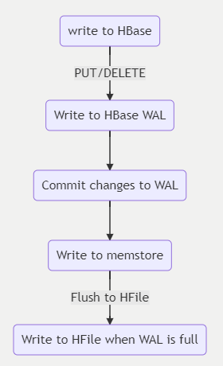

# HBase Architecture and Components

## Overview

[Apache HBase](https://hbase.apache.org/) is a Java-based, NoSQL column-store, distributed application that is built on top of Apache Hadoop Distributed Filesystem (HDFS). It is modelled after Google BigTable paper and brings most of the BigTable capabilities to Hadoop ecosystem.  

In terms of workload profile, it is designed to serve as a datastore for data-intensive applications that require low-latency and near real-time random reads and writes.  

It is a distributed system and from CAP theorem perspective, HBase is designed for Consistency and Partitioning.  

We will discuss components and principles that will play a role in planning and building of a HBase cluster on Azure especially while migrating to Azure HDInsight HBase or HBase on Azure virtual machines. These concepts will also play role when it comes to re-platforming HBase to Cosmos DB migration.  

HBase is a distributed system, and it follows a leader-follower model. A typical HBase deployment consists of nodes with following roles.  

#### **Head nodes or Master nodes** 

[Master server](https://HBase.apache.org/book.html#architecture.master) is responsible for all metadata operations for an HBase cluster. This includes but not limited to creation/deletion of objects; monitoring RegionServers etc. There are usually two Master servers deployed for high availability (HA).

#### **ZooKeeper nodes**

[ZooKeeper (ZK)](https://zookeeper.apache.org/) nodes are required for coordination in a distributed application environment such as HBase.

#### **RegionServers**

[RegionServers](https://HBase.apache.org/book.html#regionserver.arch) are responsible for serving and managing Regions (or partitions). This is where bulk of the processing happens when a client read/write request comes in. In a distributed deployment of HBase RegionServer runs on a Hadoop Data Node.  

### **Core Concepts**

It is important to understand the core concepts of HBase architecture and data model as they will play a role in optimizing performance of a given HBase deployment. 

#### **Data Model**  

- #### **Namespace**  
    Logical grouping of tables. It is like a database within relational world. It is a key-enabler for several features related to multi-tenancy.  

- #### **Tables**  
    HBase tables are a grouping or collection of multiple rows. Tables are stored in Regions (or partitions) spread across Region Servers.  

- #### **Row**  
    A row consists of a row key and a grouping of columns called column family. The rows are sorted and stored based on the row key.  

- #### **Column Family**  
    Columns in HBase are grouped into column families. All columns in a column have the same prefix.  

- #### **Cells**  
    A {row, column, version} tuple represent a cell.  

- #### **Data model operations**  
    There are 4 types of data model operations:  
• **Get** – returns attributes for a specified row.  
• **Put** – either adds new rows to the table or updates existing rows.  
• **Scans** – allows iteration over multiple rows for specified attributes.  
• **Delete** – removes a row from the table. A marker (called tombstone) is placed on record mark for deletion. These are then removed during major compactions.  

#### **Write Path**
HBase uses a combination of data structures that reside in-memory and persistent storage to deliver fast writes. When a write happens, data first gets written to a Write-Ahead Log (WAL), which is a data structure stored on persistent storage. Role of WAL is to track changes so that logs can be replayed in case there’s a server failure. WAL is purely for resiliency purposes.
Once data is committed to WAL, data gets written to MemStore, which is an in-memory data structure. At this stage, a write is completed.  

For long-term data persistence, HBase uses a data structure called HBase file (HFile). HFile is stored on HDFS. Depending on MemStore size and data flush interval, data from MemStore is written to HBase file or [Hfile](https://HBase.apache.org/book.html#_hfile_format_2).  

The picture shows conceptual view of HBase write path.  

To summarise, the components on the write-path are:  
- **Write Ahead Log (WAL)** is a data structure that is stored on persistent storage.
  
- **MemStore** – in-memory data structure. It’s an on-heap data structure.  

- **Hfile** – HBase file used for data persistence and stored on HDFS.

#### **Read Path**

To deliver fast random and sequential reads, HBase uses several data structures. When a read request is sent to HBase, it tries to serve the read request through data cached in BlockCache and failing that, from MemStore. Both are stored on-heap. If the data is not available in cache, then the data is fetched from HFile and caches the data in BlockCache.  

For scenarios where you want low latency on reads, there is an option to persist data in BucketCache which is also an off-heap in-memory data structure.

The picture here shows conceptual view of read path of HBase.  

To summarise, HBase tries to serve a read request using data stored in cache – BlockCache and MemStore. If data is not there, a read request is served using HFile.  

**Note** - There is also option of using [BucketCache](https://hbase.apache.org/book.html#offheap.blockcache) which is an off-heap data structure. When enabled, BucketCache can help in offloading data from BlockCache thereby reducing data stored on heap.

#### **Offheap Read and Write paths**

To reduce read and write latencies, HBase 2.x has introduced a pool of offheap buffers that are used along read and write paths. The workflow for writing and reading data does its best to avoid on-heap memory allocations reducing the amount of work that Garbage Collection (GC) must do to complete reads and writes. These must be fine-tuned and optimized as part of the overall migration because they are heavily dependent on number of Regions and RegionServers; size of memory; and premium storage attached to the HBase cluster on Azure. The reason is that these parameters can change post-migration to Azure.  

### Next step

[Challenges](challenges.md)

### Further Reading

Refer to the below sections to read more about Migration approach for Hbase

[Challenges](challenges.md)

[Considerations](considerations.md)

[Migration Approach](migration-approach.md)

