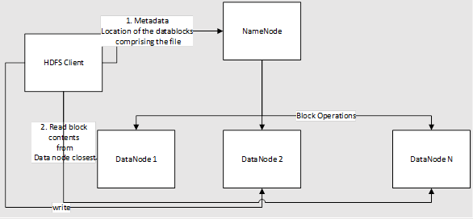

## HDFS Architecture and Components

Hadoop Distributed Filesystem (HDFS) - a Java-based distributed file system that follows the master-slave architecture – with NameNode being the master and DataNode being the slave providing scalable and reliable data storage designed to span large clusters of commodity servers.

 

*    **Namenode**: Is the master node that manages access to files and namespace. It is a hierarchy of directories. 

      - Files and directories are nodes on      the NameNode - has attributes like permissions, modification and access      times, namespace and disk space quotas. 
       - The file is split into      blocks (Default is 128 megabytes , but can be customized for a cluster by making changes to hdfs-site.xml file
       - Each block of the file is      independently replicated at multiple DataNodes. The replication factor is      default 3 but can be customized for every cluster (replication factor can be changed at anytime, which will result in a cluster re-balancing).
       - The NameNode maintains the      namespace tree and the mapping of file blocks to DataNodes (the physical      location of file data).
       - An HDFS client that needs to read a      file - 

          1.   Contacts the NameNode for the locations of data blocks comprising the file

          2.   Read's block contents from the DataNode closest to the client.

 - A HDFS cluster can have thousands      of DataNodes and tens of thousands of HDFS clients per cluster, as each      DataNode can execute multiple application tasks concurrently. 
  - HDFS keeps the entire namespace in      memory i.e. RAM.
  - An end-to-end checksum calculation is performed as part of the HDFS write pipeline while the block is being written to DataNodes

* **DataNode**: is the slave node that performs     read/write operations on the file system as well as block operations like     creation, replication, and deletion.

   - Contains a metadata file that holds      the checksum of the stored files. For each block replica hosted by a DataNode, there is a corresponding metadata file that contains metadata about the replica, including its checksum information. The metadata file will have the same base name as the block file, and it will have an extension of ".meta".
  - Contains the data file that holds      the block’s data
  - On a file read, DataNode fetches      the block locations and replica locations from the NameNode – tries      reading from the location closest to the client

* **HDFS     Client** is     the client used by applications to access the file systems

  - It is a code library that exports the HDFS file system interface.

  - Supports operations to read, write and delete files, and operations to create and delete directories.

  - The steps followed when an application reads a file

  - Get the list of DataNodes and locations that host the blocks – this includes the replicas

  - Gets the blocks from the DataNode directly based on the list received from NameNode

  - HDFS provides an API that exposes the locations of file blocks. This allows applications like the MapReduce framework to schedule a task to where the data are located, thus improving the read performance.

- **Block**: is the unit of storage in HDFS. A     file is comprised of blocks, and different blocks are stored on different     data nodes (ideally, unless the cluster is under-replicated).

## Feature Map

   Core functionality of Hadoop Distributed File System and Azure Data Lake Storage Gen2 comparison map is as follows[[HT11\]](#_msocom_11) -

| **Feature**                               | **ADLS**                                                     | **HDFS**                                                     |
| ----------------------------------------- | ------------------------------------------------------------ | ------------------------------------------------------------ |
| **Access that is compatible with Hadoop** | Can manage and access data just as you would with a Hadoop Distributed File System (HDFS). The Azure Blob File System (ABFS) driver is available within all Apache Hadoop environments, including Azure HDInsight and Azure Databricks. Use ABFS to access data stored in Data Lake Storage Gen2 | MapR cluster can access an external HDFS  cluster with the hdfs:// or webhdfs:// protocols |
| **POSIX permissions**                     | The security model for Data Lake Gen2 supports ACL and POSIX permissions along with some extra granularity specific to Data Lake Storage Gen2. Settings can be configured through admin tools or frameworks like Apache Hive and Apache Spark. | Jobs requiring file system features like strictly atomic directory renames, fine-grained HDFS permissions, or HDFS symlinks can only work on HDFS |
| **Cost effectiveness**                    | Data Lake Storage Gen2 offers low-cost storage capacity and transactions. Azure Blob storage life cycles help lower costs by adjusting billing rates as data moves through its life cycle. |                                                              |
| **Optimized driver**                      | The ABFS driver is optimized specifically for big data analytics. The corresponding REST APIs are surfaced through the distributed file system (DFS) endpoint, dfs.core.windows.net |                                                              |
|                                           |                                                              |                                                              |
| **Block Size**                            | ‘Blocks’, this is equivalent to a single ‘Append’ API invocation (the Append API creates a new block) and is limited to 100MB per invocation. However, the write pattern supports calling Append many times per file (even in parallel) to a maximum of 50,000 and then  calling ‘Flush’ (equivalent of PutBlockList). This is the way the maximum files size of 4.75TB is achieved. | HDFS stores the data in the form of the block  where the size of each data block is 128MB in size which is configurable means you can change it according to your requirement in *hdfs-site.xml* file in your Hadoop directory. |
| **Default ACLS**                          | Files do not have default ACLs and Not enabled by default | Files do not have default ACLs                               |
| **Binary Files**                          | Binary files can be moved to Azure Blob Storage – non HNS .  Objects in Blob storage are accessible via the Azure Storage REST API, Azure PowerShell, Azure CLI, or an Azure Storage client library. Client libraries are available for different languages, including:.NET Java Node.js Python Go PHP Ruby  | Hadoop provides the facility to read/write binary files.  SequenceFile is a flat file consisting of binary key/value pairs. The SequenceFile provides a Writer, Reader and Sorter classes for writing,  reading and sorting respectively. Convert the image/video file into a SequenceFile [[NM15\]](#_msocom_15) and store it into the HDFS then the put command is used.  bin/hadoop fs -put /src_image_file /dst_image_file or the HDFS  SequenceFileReader/Writer methods |
| **Permission inheritance**                | ADLS Gen2 uses the the POSIX-style model and follows the  same as in Hadoop if ACLs are used to control access on an object  Ref : [Access control lists in Azure Data Lake Storage   Gen2 \| Microsoft Docs](https://docs.microsoft.com/en-us/azure/storage/blobs/data-lake-storage-access-control) | Permissions for an item are stored on the item itself. In  other words, permissions for an item cannot be inherited from the parent  items if the permissions are set after the child item has already been  created. Permissions are only inherited if default permissions have  been set on the parent items before the child items have been created. |
| **Data Replication**                      | Data in an Azure Storage account is  replicated three times in the primary region. Zone – redundant storage is the  most recommended replication option that synchronously replicates across three Azure availability zones in  the primary region. | By default a file’s replication factor is  three. For critical files or files which are accessed very often, having a  higher replication factor improves their tolerance against faults and  increase their read bandwidth |
| **Sticky bit**                            | In the context of Data Lake Storage Gen2, it is unlikely  that the sticky bit will be needed. In summary, if the sticky bit is enabled  on a directory, a child item can only be deleted or renamed by the child  item's owning user.  The sticky bit isn't shown in the Azure portal. | The Sticky bit can be set on  directories, preventing anyone except the superuser, directory owner or file owner from deleting or moving the files within the directory.  Setting the sticky bit for a  file has no effect. |
