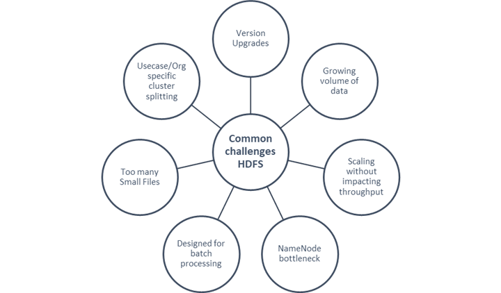

## Common Challenges of an on premise HDFS

- Frequent HDFS version upgrades
- Growing volume of data on HDFS
- Small file problem – when too many small     files are stored , the NameNode loads metadata of all the files in memory     – increasing the pressure on the NameNode . The small files also increase the read     traffic on the name node when clients are reading the files and also     increases the calls when the files are being written.
- Multiple teams in the organization may     require different datasets - splitting the HDFS clusters by use case or     organization is not possible thus increasing costs , data duplication     leading to a decrease in the efficiency.
- It is difficult to scale HDFS cluster     without impacting throughput of the NameNode
- Prior to Hadoop 2.0 ,     since all the metadata is stored in a single NameNode, it becomes a     bottleneck as all client requests to an HDFS cluster must first pass     through the NameNode making it a single point of failure (**SPOF**). Each cluster had a single NameNode, and if NameNode     fails, the cluster as a whole would be out services. The cluster will be     unavailable until the NameNode restarts or brought on a separate machine.
