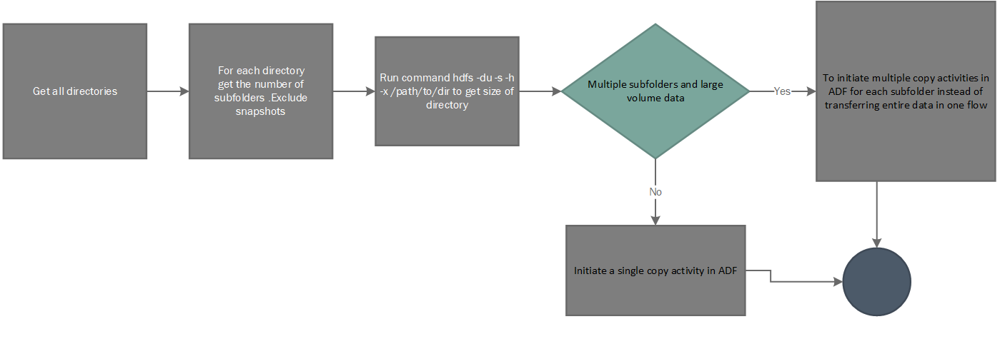

## Migration Considerations

There are some considerations when planning the migration of HDFS to ADLS. Based on our experience with customer engagements the below have been identified -

- Consider aggregating the data in small     files into a single file when storing in ADLS Gen 2 
- List all the directory structure in HDFS and replicate the similar zoning in ADLS Gen 2. Directory structure of HDFS can be obtained using hdfs -ls / command
- Take a list of all the Roles being defined in HDFS cluster to replicate the same in the target environment
- Take a note of the data lifecycle policy of the files stored in HDFS 
- HDFS symlinks - Jobs requiring file     system features like strictly atomic directory renames, fine-grained HDFS     permissions, or HDFS symlinks can only work on HDFS.
- Azure Storage can be geo-replicated.     Although geo-replication gives geographic recovery and data redundancy, a     failover to the geo-replicated location severely impacts the performance,     and it may incur additional costs. The recommendation is to choose the     geo-replication wisely and only if the value of the data is worth the     additional cost.
- If the file     names have common prefixes , the storage treats them as a single partition     and hence if Azure Data Factory is used , all     DMUs write to a single partition.

- If Azure Data factory is     chosen as an approach for data transfer – scan through each directory     excluding snapshots , check the size of each directory using the hdfs du     command. If there are multiple subfolders and large volume of data - initiate multiple copy activities in     ADF – one per subfolder instead of transferring the entire data in a     directory in a single copy activity

- Data platforms are often used for longer term retention of information which may have been removed from systems of record. You should plan take backups or snapshots of the archive data, as well as potentially replicating the archive to a recovery site. Archival of data will generally be either for compliance, or for historical data purposes. Before creating an archive you should have a clear reason for keeping data. Also ensure that you understand when the data will be removed and put in place processes to remove it at that time.Azure Data Lake Storage archive tier can be planned for use that provides an ultra-low cost tier for long term retention of data while keeping your data available for future analytics needs. 

  Refer the link for additional information - https://docs.microsoft.com/azure/storage/blobs/storage-blob-storage-tiers?tabs=azure-portal#archive-access-tier
  
- As part of migration , when interacting with Azure Blob Storage via the Hadoop FileSystem client, there may be instances where the methods may not be supported.  by the AzureNativeFileSystem ie. throws an UnsupportedOperationException. For Eg - append(Path f, int bufferSize, Progressable progress) is an optional operation in AzureNativeFileSystem and is currently is not yet supported
For other issues related to ABFS refer link - https://issues.apache.org/jira/browse/HADOOP-15763

- For requirements where it is needed to connect to ADLS from existing older clusters ( prior to v3.1) backported driver details can be found at the link - https://github.com/Azure/abfs-backport

- In an Azure Virtual Networks environment, the **DistCp** tool doesn't support **Azure ExpressRoute** private peering with an Azure Storage virtual network endpoint.Refer the link for recommendations - https://docs.microsoft.com/azure/data-factory/data-migration-guidance-hdfs-azure-storage
