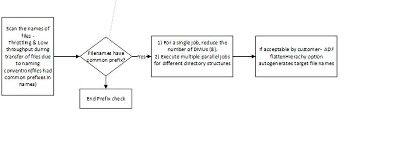
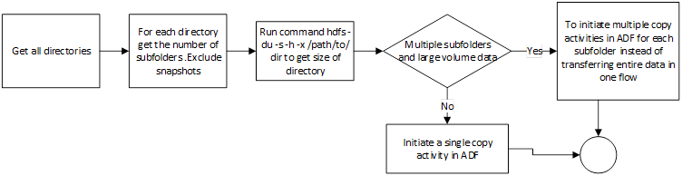

## Migration Considerations

There are some considerations when planning the migration of HDFS to ADLS. Based on our experience with customer engagements the below have been identified -

- Consider aggregating the data in small     files into a single file when storing in ADLS Gen 2 
- List all the directory structure in HDFS and replicate the similar zoning in ADLS Gen 2. Directory structure of HDFS can be obtained using hdfs -ls / command
- Take a list of all the Roles being defined in HDFS cluster to replicate the same in the target environment
- Take a note of the data lifecycle policy of the files stored in HDFS 
- HDFS symlinks - Jobs requiring file     system features like strictly atomic directory renames, fine-grained HDFS     permissions, or HDFS symlinks can only work on HDFS.
- Azure Storage can be geo-replicated.     Although geo-replication gives geographic recovery and data redundancy, a     failover to the geo-replicated location severely impacts the performance,     and it may incur additional costs. The recommendation is to choose the     geo-replication wisely and only if the value of the data is worth the     additional cost.
- If the file     names have common prefixes , the storage treats them as a single partition     and hence if Azure Data Factory is used , all     DMUs write to a single partition.

- If Azure Data factory is     chosen as an approach for data transfer – scan through each directory     excluding snapshots , check the size of each directory using the hdfs du     command. If there are multiple subfolders and large volume of data - initiate multiple copy activities in     ADF – one per subfolder instead of transferring the entire data in a     directory in a single copy activity

