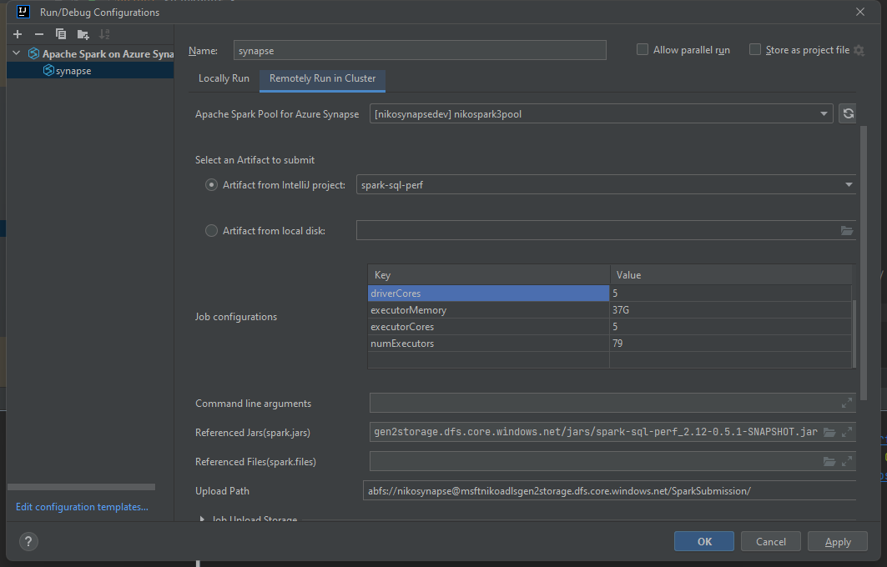

## How to run TPC-DS Performance Benchmark with existing dataset

If you have already had the tpc-ds dataset in storage account, you may need to create the external table for benchmarking. In this section, you will need to run a scala app to create the external table and gather table statistics. 

We suggest to set up an external metadata database, such as azure sql database, to save the metadata setting once we create it.

### Prerequisite

In this section, we will use `Intellij Idea` with `Azure Toolkit` to submit the benchmarking job to Synapse Spark Pool to ease our burden. For more information how to integrate Intellij Idea with Azure Toolkit, please refer to [Create an Apache SPark application with Intellij Idea](https://docs.microsoft.com/en-us/azure/synapse-analytics/spark/intellij-tool-synapse).

### Create Spark Scala Project in Intellij

We could start creating the Spark Scala project after we finished setting up the azure toolkit in Intellij idea. You may see the plugin is well-prepared in the workspace.

Please redirect to [Spark Perf Table Scala Code](codesample/SparkPerfTable.scala) and copy the scala file to your project. In addition, you need to copy the `tpcds_2_4` folder to your classpath under `resource` folder, since the program will refer to the classpath loader to retrieve the sql files to run benchmark.

### Setup configuration to submit job to Synapse Spark Pool
Once you have finished the steps above, create a new `Run/Debug Configuration` in Intellij workspace to submit your Spark job. For more detailed instructions, you may refer to [Create an Apache SPark application with Intellij Idea](https://docs.microsoft.com/en-us/azure/synapse-analytics/spark/intellij-tool-synapse).

In addition, as Synapse Spark Pool has preset runtime with jar dependencies and if your program relies on other jar dependencies, you need to upload the 3rd party jar files to storage account in Azure, then you need to setup the job submission configuration to refer to the jar file in storage account.



As you can see, in section `Reference Jars(spark jars)`, here we direct to the spark-sql-perf jar file we created in the [How to Generate TPC-DS Data](how-to-generate-tpc-ds-data.md) section. Since we need to import `TPCDS` dependencies in `SparkPerf.scala`.

Once you have everything setup, you may change the spark configuration (--num-exectuors, --executor-cores, etc.) in the `Job Configurations` section.

### Submit you Spark Job to Synapse
Once we create the run configuration, we could start the job submission procedure by clicking the run button with spark logo at the right-hand side of `Run/Debug Configuration`.

```aidl

Package and deploy the job to Spark cluster
azuretool: File C:/Users/jiashengfeng/IdeaProjects/synapse-spark-sql-perf/out/artifacts/spark_sql_perf/sample.jar has been uploaded to abfs://nikosynapse@msftnikoadlsgen2storage.dfs.core.windows.net/SparkSubmission/2022/04/28/febf0061-3cec-4a34-a502-68ea77586744/sample.jar.
azuretool: Spark Batch submission Response: status [200], content [OK], headers [Content-Length: 95; Content-Type: application/json; charset=utf-8; Server: Kestrel Microsoft-HTTPAPI/2.0; Strict-Transport-Security: max-age=31536000; includeSubDomains; x-ms-job-submitted-by-name: jiashengfeng@microsoft.com; x-ms-job-submitted-on: 4/28/2022 4:56:32 AM +00:00; x-ms-job-scheduled-on: 1/1/0001 12:00:00 AM +00:00; x-ms-job-ended-on: ; x-ms-job-scheduler-state: Queued; x-ms-job-internal-id: 28; x-ms-job-result: Uncertain; x-ms-job-type: SparkServiceBatch; x-ms-job-queued-on: 1/1/0001 12:00:00 AM +00:00; x-ms-job-clusterrequested-on: 1/1/0001 12:00:00 AM +00:00; x-ms-job-livysubmission-on: 1/1/0001 12:00:00 AM +00:00; x-ms-activity-id: e6df9969-319b-441d-9c4f-ed387e14788c; x-ms-request-id: b9035aae-da7d-4831-98d9-913c1e5aef67; Date: Thu, 28 Apr 2022 04:56:32 GMT], body [{"id":28,"appId":null,"appInfo":null,"state":"not_started","log":null,"registeredSources":null}]
azuretool: The Spark Batch job has been submitted to Apache Spark Pool for Azure Synapse https://nikosynapsedev.dev.azuresynapse.net/livyApi/versions/2019-11-01-preview/sparkPools/nikospark3pool/batches with the following parameters: {"className":"sample.SparkPerf","name":"synapse","file":"abfs://nikosynapse@msftnikoadlsgen2storage.dfs.core.windows.net/SparkSubmission/2022/04/28/febf0061-3cec-4a34-a502-68ea77586744/sample.jar","jars":["abfs://nikosynapse@msftnikoadlsgen2storage.dfs.core.windows.net/jars/spark-sql-perf_2.12-0.5.1-SNAPSHOT.jar"],"driverMemory":"37G","driverCores":5,"numExecutors":79,"executorMemory":"37G","executorCores":5}

```
