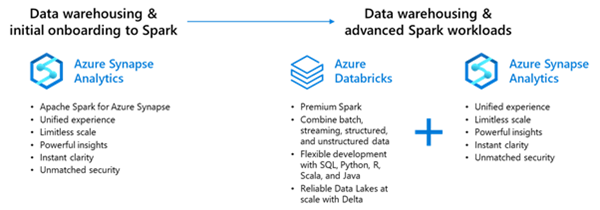

# Migration Approach

## Assessment

## Considerations

**HDInsight Spark:**
Azure HDInsight as "A cloud-based service from Microsoft for big data analytics". It is a cloud-based service from Microsoft for big data analytics that helps organizations process large amounts of streaming or historical data.

**Main features from the HDInsight platform:**
* Fully managed
* Variety of services for multiple porpuses
* Open-source analytics service for entreprise companies

HDInsight is a service that is always up and we have to understand deeply the service to be able to configure and tunned , that make the service complex compare with others.Most of HDInsights features are Apache based. There are several cluster types to choose from depending upon your need.
[Azure HDInsight Runtime for Apache Spark 3.1](https://techcommunity.microsoft.com/t5/analytics-on-azure-blog/spark-3-1-is-now-generally-available-on-hdinsight/ba-p/3253679)

**Synapse Spark:**
Azure Synapse Analytics takes the best of Azure SQL Data Warehouse and modernizes it by providing more functionalities for the SQL developers such as adding querying with serverless SQL pool, adding machine learning support, embedding Apache Spark natively, providing collaborative notebooks, and offering data integration within a single service. In addition to the languages supported by Apache Spark, Synapse Spark also support C#.

**Synapse Spark Primary Use-Cases**

1. Consolidated type of nodes for starters to pick e.g., Small, Medium, Large node types compared to different node types.

2. Ephemeral Jobs: Synapse spark is built for short term processing and hence all the cluster have a TTL (Time to Live) and are automatically terminated to save costs.

3. Support for both reading and writing into Synapse tables.

4. Built in support for .NET for spark application enables existing user skill set to take advantage of Apache Spark distributed data processing.

5. Unified security and monitoring features including Managed VNets throughout all workloads with one Azure Synapse workspace

6. Existing spark user to take advantage of Microsoft proprietary optimizations e.g., Hyperspace: An indexing subsystem for Apache Spark.

**Main features from Azure Synapse:**
* Complete T-SQL based analytics
* Hybrid data integration
* Apache Spark integration
HDInsight and Synapse Spark are using the same version of Apache Spark 3.1, that is a good starting point when we try to performa a migration from different platform.
as we are using the same Spark version code and jars will be able to deploy in Synapse easily.

Synapse is consumption-based, and is easier to configurate.Synapse incorporates many other Azure services and is the main plaform for Analytics and Data Orchestration.
[Azure Synapse Runtime for Apache Spark 3.1](https://docs.microsoft.com/en-us/azure/synapse-analytics/spark/apache-spark-3-runtime)

### Performance Considerations

Refer to [Optimize Spark jobs for performance - Azure Synapse Analytics | Microsoft Docs](https://docs.microsoft.com/azure/synapse-analytics/spark/apache-spark-performance) for considerations.

## Planning

## Migration Approach

Azure has several landing targets for Apache Spark. Depending on requirements and product features, customers can choose between Azure Synapse, Azure Databricks and Azure HDInsight.

# Migration Scenarios

1. Moving from HDInsight Spark to Synapse Spark.

## Creating an Apache Spark Pool

An Apache Spark pool in your Synapse Workspace provides Spark environment to load data, model process and get faster insights.

Reference Link: [QuickStart: Create a serverless Apache Spark pool using the Azure portal - Azure Synapse Analytics | Microsoft Docs](https://docs.microsoft.com/azure/synapse-analytics/quickstart-create-apache-spark-pool-portal)

### Spark Instances

Spark instances are created when you connect to a Spark pool, create a session, and run a job. As multiple users may have access to a single Spark pool, a new Spark instance is created for each user that connects.

Examples on how the spark pools behave are shown below, Spark pools need to be created based on the usage type.

**Example 1**

* You create a Spark pool called SP1; it has a fixed cluster size of 20 nodes.

* You submit a notebook job, J1 that uses 10 nodes, a Spark instance, SI1 is created to process the job.

* You now submit another job, J2, that uses 10 nodes because there is still capacity in the pool and the instance, the J2, is processed by SI1.

* If J2 had asked for 11 nodes, there would not have been capacity in SP1 or SI1. In this case, if J2 comes from a notebook, then the job will be rejected; if J2 comes from a batch job, then it will be queued.

**Example 2**

* You create a Spark pool call SP2; it has an auto scale enabled 10 – 20 nodes.

* You submit a notebook job, J1 that uses 10 nodes, a Spark instance, SI1, is created to process the job.

* You now submit another job, J2, that uses 10 nodes, because there is still capacity in the pool the instance auto grows to 20 nodes and processes J2.

**Example 3**

* You create a Spark pool called SP1; it has a fixed cluster size of 20 nodes.

* You submit a notebook job, J1 that uses 10 nodes, a Spark instance, SI1 is created to process the job.

* Another user, U2, submits a Job, J3, that uses 10 nodes, a new Spark instance, SI2, is created to process the job.
* You now submit another job, J2, that uses 10 nodes because there's still capacity in the pool and the instance, J2, is processed by SI1.

Reference Link: [Apache Spark core concepts - Azure Synapse Analytics | Microsoft Docs](https://docs.microsoft.com/azure/synapse-analytics/spark/apache-spark-concepts#spark-instances)

>[!NOTE] Each Synapse workspace has a default quota limit at the Workspace level and also at the Spark pool level. These requirements need to be captured during the assessment phase (Infrastructure)

## Set up Linked service with external HDInsight Hive Meta Store (HMS)
**Shared Metadata**
Azure Synapse Analytics allows the different workspace computational engines to share databases and Parquet-backed tables between Apache Spark pools and other External Metasotres. More information is available from the below link: 

[External metadata tables - Azure Synapse Analytics | Microsoft Docs](https://docs.microsoft.com/en-us/azure/synapse-analytics/spark/apache-spark-external-metastore)

## Metadata migration from External to Manage Metastore
**Shared Metadata**
Once we have conected to the External HDInsight Metastore moved the external to a Manage tables:
Reference: [Shared metadata tables - Azure Synapse Analytics | Microsoft Docs](https://docs.microsoft.com/azure/synapse-analytics/metadata/table)

## Data Migration:
Synapse Spark supports reading multiple different file formats (ORC, Parquet etc.) so use the same migration strategy as on-premises HDFS migration.

### Migrate HDFS Store to Azure Data Lake Storage Gen2

The key challenge for customers with existing on-premises Hadoop clusters that wish to migrate to Azure (or exist in a hybrid environment) is the movement of the existing dataset. The dataset may be very large, which likely rules out online transfer. Transfer volume can be solved by using Azure Data Box as a physical appliance to 'ship' the data to Azure.

This set of scripts provides specific support for moving big data analytics datasets from an on-premises HDFS cluster to ADLS Gen2 using a variety of Hadoop and custom tooling.

### Selecting a data transfer solution
Answer the following questions to help select a data transfer solution:

* **Is your available network bandwidth limited or non-existent, and you want to transfer large datasets?**

If yes, see: [Scenario 1: Transfer large datasets with no or low network bandwidth.](https://docs.microsoft.com/en-us/azure/storage/common/storage-solution-large-dataset-low-network)

* **Do you want to transfer large datasets over network and you have a moderate to high network bandwidth?**

If yes, see: [Scenario 2: Transfer large datasets with moderate to high network bandwidth.](https://docs.microsoft.com/en-us/azure/storage/common/storage-solution-large-dataset-moderate-high-network)

* **Do you want to occasionally transfer just a few files over the network?**

If yes, see [Scenario 3: Transfer small datasets with limited to moderate network bandwidth.](https://docs.microsoft.com/en-us/azure/storage/common/storage-solution-small-dataset-low-moderate-network)

* **Are you looking for point-in-time data transfer at regular intervals?**

If yes, use the scripted/programmatic options outlined in [Scenario 4: Periodic data transfers.](https://docs.microsoft.com/en-us/azure/storage/common/storage-solution-periodic-data-transfer)

* **Are you looking for on-going, continuous data transfer?**

If yes, use the options in [Scenario 4: Periodic data transfers.](https://docs.microsoft.com/en-us/azure/storage/common/storage-solution-periodic-data-transfer)

More information on the following link : [Data Transfer Solution | Microsoft Docs](https://docs.microsoft.com/en-us/azure/storage/common/storage-choose-data-transfer-solution?toc=/azure/storage/blobs/toc.json) 

### Data Migration Summary:

Spark is a processing framework and does not store any data, once the processing is complete an appropriate sink needs to be chosen.

**AZcopy data from HDFS to ADLS**
You can see more details in the following repository:[Import and Export data between HDInsight HDFS to Synapse ADLS - AZcopy| Microsoft Docs](https://docs.microsoft.com/en-us/azure/storage/common/storage-use-azcopy-v10)

**Distcp data from HDFS to ADLS**
You can see more details in the following repository:[Import and Export data between HDInsight HDFS to Synapse ADLS - Distcp| Microsoft Docs](https://docs.microsoft.com/en-us/azure/storage/blobs/data-lake-storage-use-distcp)

**ADF from HDFS to ADLS**
You can see more details in the following repository:[Import and Export data between HDInsight HDFS to Synapse ADLS - ADF| Microsoft Docs](https://docs.microsoft.com/en-us/azure/data-factory/connector-hdfs?tabs=data-factory)

**Data Movement Library data from HDFS to ADLS**
You can see more details in the following repository:[Import and Export data between HDInsight HDFS to Synapse ADLS - ADF| Microsoft Docs](https://docs.microsoft.com/en-us/azure/storage/common/storage-use-data-movement-library)

**DataBox data from HDFS to ADLS**
You can see more details in the following repository:[Import and Export data between HDInsight HDFS to Synapse ADLS - Data Box| Microsoft Docs](https://github.com/Azure/databox-adls-loader)

### Size vs Bandwith Diagram

### Summary table

| HDInsight         | Synapse               | Scenario               | Tool        |Reference Links|
| ------------------- | -------------------- | -------------------- | --------------  |--------------|
| HDFS      | ADLS       | Small Datasets-Low Bandwith              |      AZcopy           |[Import and Export data between HDInsight HDFS to Synapse ADLS - AZcopy](https://docs.microsoft.com/en-us/azure/storage/common/storage-use-azcopy-v10)|
| HDFS      | ADLS       | Small Datasets-High Bandwith             |      Distcp           |[Import and Export data between HDInsight HDFS to Synapse ADLS - Distcp](https://docs.microsoft.com/en-us/azure/storage/blobs/data-lake-storage-use-distcp)|
| HDFS      | ADLS       | Big Datasets-High Bandwith       |      ADF           |[Import and Export data between HDInsight HDFS to Synapse ADLS - ADF](https://docs.microsoft.com/en-us/azure/data-factory/connector-hdfs?tabs=data-factory)|
| HDFS      | ADLS       | Big Datasets-High Bandwith       |      Data Movement Library           |[Import and Export data between HDInsight HDFS to Synapse ADLS - Data Library Movement](https://docs.microsoft.com/en-us/azure/storage/common/storage-use-data-movement-library)|
| HDFS      | ADLS       | Big Datasets-Low Bandwith       |      DataBox           |[Import and Export data between HDInsight HDFS to Synapse ADLS - DataBox](https://github.com/Azure/databox-adls-loader)|

## Code migration
In order to migrate all the notebooks/code that we have in other environments customers will need to use the import button, when creates a new notbook as we can see in the following picture:

Then depending of the Spark version you should perform the commented changes that this link shows:

[Spark 2.4 to 3.0](https://spark.apache.org/docs/latest/sql-migration-guide.html#upgrading-from-spark-sql-24-to-30)

[Spark 3.0 to 3.1](https://spark.apache.org/docs/latest/sql-migration-guide.html#upgrading-from-spark-sql-30-to-31)

[Spark 3.1 to 3.2](https://spark.apache.org/docs/latest/sql-migration-guide.html#upgrading-from-spark-sql-31-to-32)

## Monitoring

Reference link for monitoring Spark application: [Monitor Apache Spark applications using Synapse Studio - Azure Synapse Analytics | Microsoft Docs](https://docs.microsoft.com/azure/synapse-analytics/monitoring/apache-spark-applications)

## Performance benchmarking approach
[Apache Spark in Azure Synapse - Performance Update](https://techcommunity.microsoft.com/t5/azure-synapse-analytics-blog/apache-spark-in-azure-synapse-performance-update/ba-p/2243534)
## Security

## BC-DR

## Further Reading

[Spark Architecture and Components](readme.md)

[Considerations](considerations.md)

[Databricks Migration](databricks-migration.md)
