# Migration Approach

- [Metadata](#metadata)
- [Sizing](#sizing)
- [Export Hive Metadata](#export-hive-metadata)
- [Decision flow for impala](#Decision-flow-for-impala)
- [Modernization – Databricks](#modernization-databricks)
- [Modernization – Synapse](#modernization-synapse)
- [Lift and Shift – HDInsight](#lift-and-shift---hdinsight)
- [Lift and Shift - IAAS](#lift-and-shift---iaas)
- [Decision Map/Flowchart](#decision-mapflowchart)
- [Migrate Hive SQL Workloads](#migrate-hive-sql-workloads)

## Metadata

### Finding CPU information

Execute the command cat /proc/cpuinfo shell to get complete information( number of CPUs, Memory, Frequency etc..) on server

```shell
[ramreddyy@apacoracle ~]$ cat /proc/cpuinfo
processor       : 0
vendor_id       : GenuineIntel
cpu family      : 6
model           : 85
model name      : Intel(R) Xeon(R) Platinum 8272CL CPU @ 2.60GHz
stepping        : 7
microcode       : 0xffffffff
cpu MHz         : 2593.879
cache size      : 36608 KB
physical id     : 0
siblings        : 16
core id         : 0
cpu cores       : 8
apicid          : 0
initial apicid  : 0
fpu             : yes
fpu_exception   : yes
cpuid level     : 21
wp              : yes
flags           : fpu vme de pse tsc msr pae mce cx8 apic sep mtrr pge mca cmov pat pse36 clflush mmx fxsr sse sse2 ss ht syscall nx pdpe1gb rdtscp lm constant_tsc rep_good nopl xtopology eagerfpu pni pclmulqdq vmx ssse3 fma cx16 pcid sse4_1 sse4_2 movbe popcnt aes xsave avx f16c rdrand hypervisor lahf_lm abm 3dnowprefetch invpcid_single pti tpr_shadow vnmi ept vpid fsgsbase bmi1 hle avx2 smep bmi2 erms invpcid rtm mpx avx512f rdseed adx smap clflushopt avx512cd xsaveopt xsavec
bugs            : cpu_meltdown spectre_v1 spectre_v2
bogomips        : 5187.75
clflush size    : 64
cache_alignment : 64
address sizes   : 46 bits physical, 48 bits virtual
power management:
```

### Finding network interfaces

Execute command ifconfig –a to get network interfaces

```shell
[ramreddyy@apacoracle ~]$ ifconfig -a
eth0: flags=4163<UP,BROADCAST,RUNNING,MULTICAST>  mtu 1500
        inet 10.10.0.4  netmask 255.255.255.0  broadcast 10.10.0.255
        inet6 fe80::20d:3aff:fec8:c553  prefixlen 64  scopeid 0x20<link>
        ether 00:0d:3a:c8:c5:53  txqueuelen 1000  (Ethernet)
        RX packets 34689  bytes 44675389 (42.6 MiB)
        RX errors 0  dropped 0  overruns 0  frame 0
        TX packets 12234  bytes 2713561 (2.5 MiB)
        TX errors 0  dropped 0 overruns 0  carrier 0  collisions 0

lo: flags=73<UP,LOOPBACK,RUNNING>  mtu 65536
        inet 127.0.0.1  netmask 255.0.0.0
        inet6 ::1  prefixlen 128  scopeid 0x10<host>
        loop  txqueuelen 0  (Local Loopback)
        RX packets 0  bytes 0 (0.0 B)
        RX errors 0  dropped 0  overruns 0  frame 0
        TX packets 0  bytes 0 (0.0 B)
        TX errors 0  dropped 0 overruns 0  carrier 0  collisions 0

[ramreddyy@apacoracle ~]$
```

### Finding Impala version

  Execute command at command line impala --version.

```$ impala-shell -i localhost --quiet
Starting Impala Shell without Kerberos authentication
Welcome to the Impala shell. Press TAB twice to see a list of available commands.
...
(Shell
      build version: Impala Shell v3.4.x (hash) built on
      date)
[localhost:21000] > select version();
+-------------------------------------------
| version()
+-------------------------------------------
| impalad version ...
| Built on ...
+------------------------------------------
```

### Finding impala related packages

```shell
rpm -qa|grep impala
```

### Finding Total DB size

```shell
hdfs dfs -du -h /apps/hive/warehouse
```

### Finding number of databases

```sql
select count(DB_ID) from hive.DBS
```

### Finding number of tables

```sql
select count(*) from hive.TBLS;
```

### Executing script to find out the table/DB information

```bash
sh generate_hive_metadata.sh
```

The following set of assessment questions are designed to gain an insight into existing deployment of Hive and establish a set of requirements that must be considered for any type of Hive migration scenario to Azure.

| Layer  | Questions | Background  |
|------- |---|---|
|  **Infrastructure**  | Number of servers for each type of role -   Hive Services; Metadata DB; Processing layer | Understand scale and design of incumbent solution.|
|&nbsp; | Number of cores per server | ```lscpu``` *OR* ```cat /proc/cpuinfo``` commands can be used to list cores per server.|
|&nbsp; | Available memory per server | This is the total memory available per server. On Linux, commands such as ```free -mg``` *OR* ```cat /proc/meminfo``` can be used to report on memory available on each server.|
|&nbsp; | Is the existing environment virtualized or deployed on bare-metal servers? | The information will be used as one of the inputs when it comes to sizing and understanding performance characterstics of on-premises Impala environment.|
|&nbsp; | Network | Understand the network bandwidth each VM can support; and if any special NIC configuration is used to support high bandwidth between Impala servers.   Use the following commands to extract details of VM network configuration ```ifconfig -a``` *OR* ```ethtool <name of the interface>```|
|&nbsp; | Storage | What is the total size of data post-replication? Usually, default configuration of HDFS replicates data 3x.|
|**Operating System** | Version and distro type | The following command will print out details of Linux distro and version in use  ```uname -a```|
|&nbsp; | Kernel parameters | Understand if customer has applied any specific kernel-level parameters to improve the performance of Impala deployment. Hence, we do not recommend changing default parameters straightaway unless it has been recommended by your OS and/or application vendor. In most cases, customers tweak these parameters to address specific workload performance requirements. Whilst it's fairly straight-forward to change config, however customers usually arrive at this decision after carrying out extensive testing.   <br> **Linux memory and block device parameters** <br> ```cat /sys/kernel/mm/transparent_hugepage/enabled``` <br>```cat /sys/kernel/mm/transparent_hugepage/defrag```<br>```cat /sys/block/sda/queue/scheduler```<br>```cat /sys/class/block/sda/queue/rotational```<br>```cat /sys/class/block/sda/queue/read_ahead_kb```<br>```cat /proc/sys/vm/zone_reclaim_mode```<br> **Linux network stack parameters** <br> ```sudo sysctl -a \ grep -i "net.core.rmem_max\|net.core.wmem_max\|net.core.rmem_default\| net.core.wmem_default\|net.core.optmem_max\|net.ipv4.tcp_rmem\|net.ipv4.tcp_wmem"```|
|**Security & administration** | Accessing Impala | How do users access the data in Impala? Is it via APIs or directly via Impala shell?<br> How applications consume data?<br> How is data written to Impala and proximity of these systems? Are they within the same data centre or located outside of DC where Impala is deployed?|
|&nbsp; | User provisioning | How are users authenticated and authorized? <br>•Ranger?<br>•Knox?<br>•Kerberos?|
|&nbsp; | Encryption | Is there a requirement to have data encrypted in transport and/or at-rest? What encryption solutions are currently in-use?|
|&nbsp; | Tokenization | Is there a requirement to tokenize data? If yes, how is data tokenized? Popular applications used for tokenization include (but not limited to) Protegrity; Vormetric etc.|
|&nbsp; | Compliance | Are there any special regulatory requirements applicable to Impala workloads? For example – PCI-DSS; HIPAA etc.|
|&nbsp; | Keys, certificates, and secrets management policies. | If applicable, please describe and what tools/applications are used for this function.|
|**High-Availability and Disaster Recovery** | What is the SLA, RPO and RTO of the source Impala deployment? | This will drive decision on the landing target on Azure and whether to have a hot-standby OR active-active regional deployment on Azure.|
|  | BC and DR strategy for HIve workloads. | Describe BR and DR strategy in detail. Impact of Impala being unavailable.|

### Sizing

Please refer the VM information for the link to choose right instance [VM sizes - Azure Virtual Machines](https://docs.microsoft.com/azure/virtual-machines/sizes)

[VM sizes - Azure Virtual Machines | Microsoft Docs](https://docs.microsoft.com/azure/virtual-machines/sizes)

### Export Hive Metadata

This section describes how to export the Hive/Impala metadata from On-Premises cluster.

Perform the following steps to export Hive/Impala metadata:

  1. Get the target Cluster HDFS Path to update hive_migrate.properties.

      a.   To retrieve the TARGET_HDFS_PATH, login to target Target cluster using SSH/CLI.

      b.   Extract value of key : <fs.DefaultFS> from target cluster core-site.xml file

      ```console
        [root@ram-hadoopsrv-xu1 linuxadmin]# cat /etc/hadoop/conf/core-site.xml | grep -A1 "fs.defaultFS"
    
        <name>fs.defaultFS</name>
    
        <value>hdfs://ram-hadoopsrv-xu0.southeastasia.cloudapp.azure.com:8020</value>
    
        [root@ram-hadoopsrv-xu1 linuxadmin]#
    
      ```

        c.   Note the TARGET_HDFS_PATH.

  2. Update the TARGET_HDFS_PATH and TARGET_OBJECTSTORE_PATH in hive_migrate.properties script to the location where HIVE tables data will be typically available post migration. Please note that you need not escape the forward slashes in the path.

      ```xml
      #!/bin/bash
        #
        # This file will be sourced by the generate_target_ddl_from_source.sh
        # to customize/overide properties
        # SRC_HDFS_PATH and SRC_OBJECTSTORE_PATH will be derived automatically from the cluster.
        # You will be customizing
        #     RUNDIR , TARGET_HDFS_PATH, TARGET_OBJECTSTORE_PATH
        # 
        #     --------------------------------------------------------    ---- 
        # Location to hold intermediate and final scripts to be generated.
        # You must have write privileges on this directory
        export RUNDIR=/tmp/hivemigrate
    
    
        #         ------------------------------------------------------------ 
        # Modify expected target BDS hdfs path in your hive DDL script
        #
        export TARGET_HDFS_PATH=hdfs://ram-ambarisrv-xu.    southeastasia.cloudapp.azure.com:8020/tmp/hivemigrate/export
    
    
        # ------------------------------------------------------------ 
        # Modify expected target BDS Object Store path in your hive DDL script
        #
        export TARGET_OBJECTSTORE_PATH=hdfs://ram-ambarisrv-xu.southeastasia.cloudapp.azure.com:8020/tmp/hivemigrate/export
    
      ```

  3. Connect to the target cluster via ssh as root user. See Connect to a Cluster Node Through Secure Shell (SSH) in Using Source Cluster configure the metstore DB with following steps:
  
        ```Shell
        a) Install a MySQL or PostgreSQL database. Start the database if it is not started after installation.
        b) Download the MySQL connector or the PostgreSQL connector and place it in the /usr/share/java/ directory.
        c) Use the appropriate command line tool for your database to create the metastore database.
        d) Use the appropriate command line tool for your database to grant privileges for the metastore database to the hive user.
        e) Modify hive-site.xml to include information matching your particular database: its URL, username, and password. Copy the hive-site.xml file to the Impala Configuration Directory later in the Impala installation process.
        ```

  4. Create a script named generate_target_ddl_from_source.sh in the root home directory with the attached code. This script generates the DDL statements that you can run on the target cluster to create the hive metadata.

  5. As a root user, run the generate_target_ddl_from_source.sh script.

      ```sql
           1 . CREATE_TARGET_DB.hql
        
           2 . CREATE_TARGET_TABLE.hql
        
           3 . ADD_TARGET_PARTITION.hql
        ```

> [!TIP]
Other options to migrate Hive metastore are based upon underlying Databases and its utilities like export import, replication, log shipping etc.

## Decision flow for impala

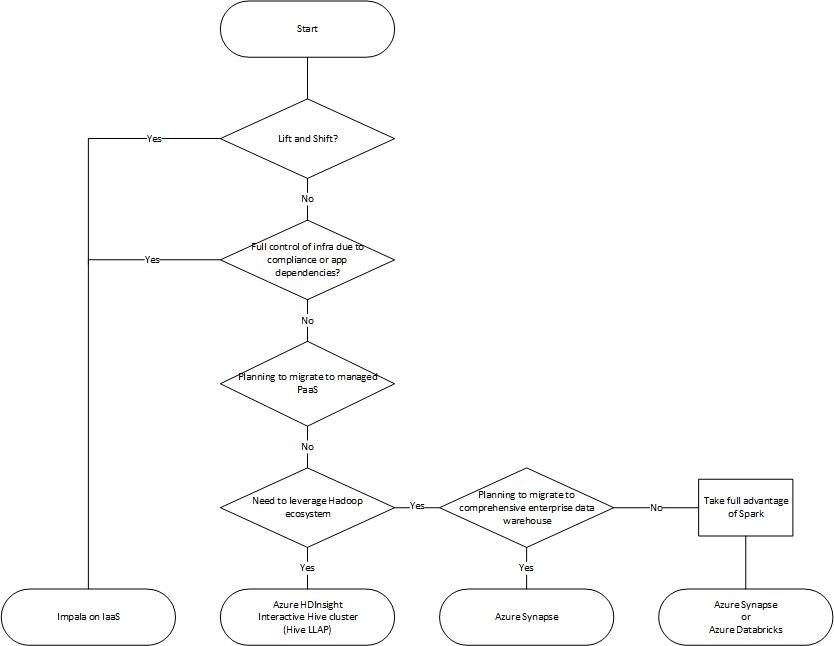

## Modernization Databricks

Azure Databricks is structured to enable secure cross-functional team collaboration while keeping a significant amount of backend services managed by Azure Databricks so you can stay focused on your data science, data analytics, and data engineering tasks.
Although architectures can vary depending on custom configurations (such as when you’ve deployed a Azure Databricks workspace to your own virtual network, also known as VNet injection), the following architecture diagram represents the most common structure and flow of data for Azure Databricks.

### Modernization Synapse

Azure Synapse Analytics is a limitless analytics service that brings together data integration, enterprise data warehousing, and big data analytics. Azure synapse analytics provides one the freedom to query data either using serverless or dedicated resources—at scale. Azure Synapse brings these worlds together with a unified experience to ingest, explore, prepare, manage, and serve data for immediate BI and machine learning needs.

Following document provides guidance on migrating Impala cluster running on Hadoop to Azure Synapse Analytics service

### MPP Architecture

[Synapse Architecture](https://docs.microsoft.com/azure/synapse-analytics/sql/overview-architecture)

## Target Architecture

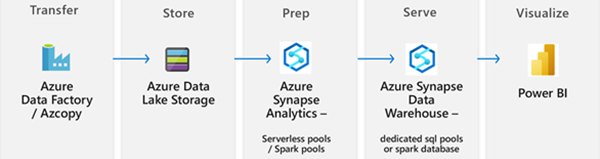

## Migration approach

There are 2 possible approaches when one considers migrating hive database to synapse. They are

- Live migration – when the source (environment running Impala cluster ) can connect to azure

- Offline migration – when the source environment is disconnected from azure

### Live migration

Following are the high-level steps involved in migrating Apache Impala cluster running in on-premise environment

High level decision flow diagram while performing live migration:

#### Scenario 1: Live migration with Hadoop cluster directly connecting to Azure without Self hosted integration runtime

1. Create the destination synapse database and open synapse studio as shown below. For example, a synapase database called “hiveimport” has been created in a synapse dedicated sql pool

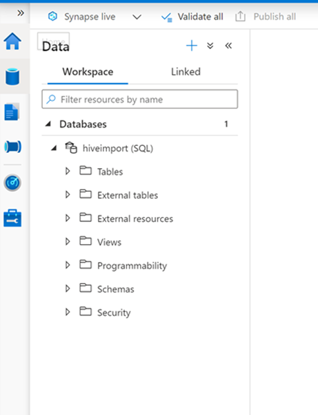

1. Create a linked service to “Impala” cluster as shown below:

Click  on “linked services”. Click on “New”

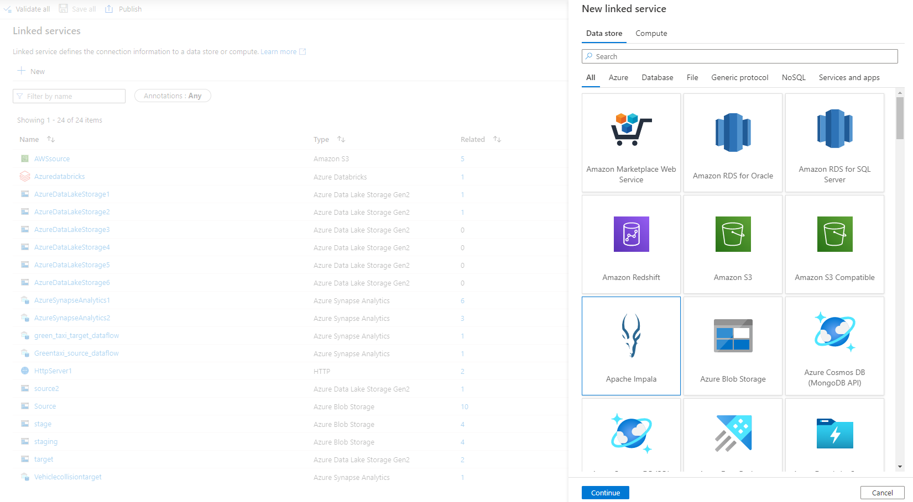

Search for “Impala” and click continue:

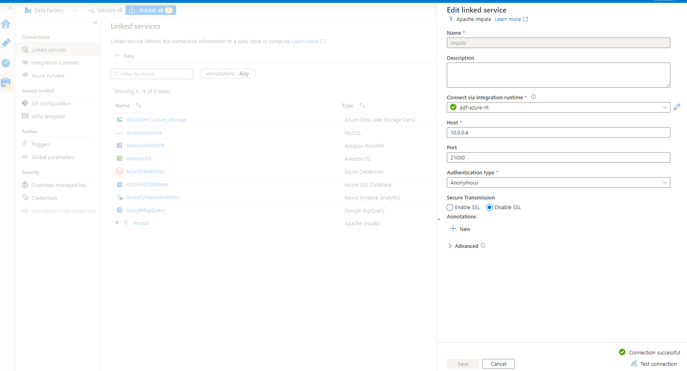

Provide the relevant details as shown below:

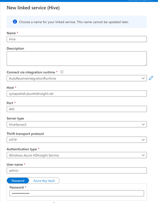

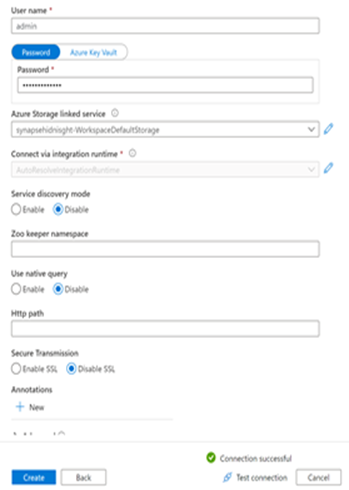

Test the connection and create the linked service.

1. Create the copy activity

Click on the integrate button on synapse studio. Click on the “+” button to add new pipeline. Search for the “Copy” activity and add the copy activity to the pipeline:

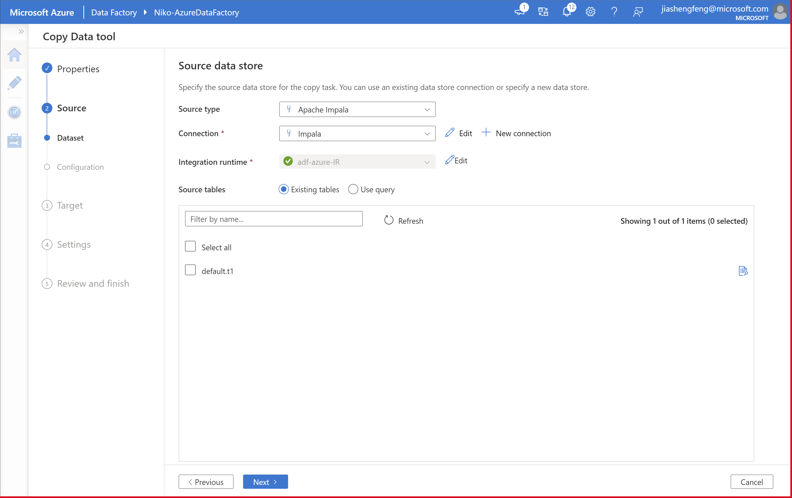

Click on the copy activity. Rename the activity from “Copy data1” to “ImpalatoSynapse” as shown below

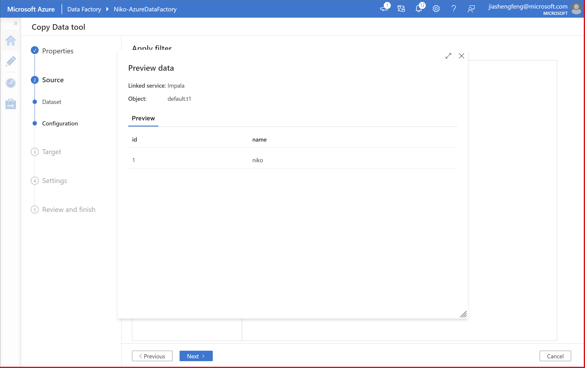

Click on “New Dataset”

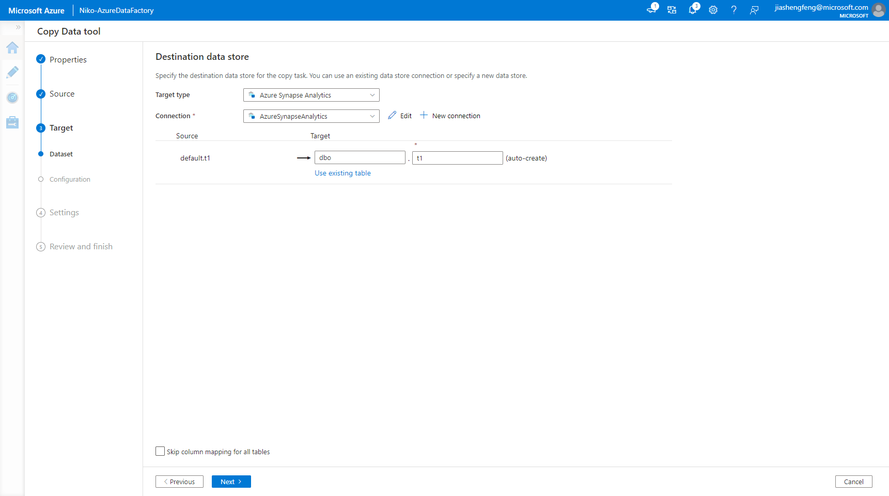

Search for “Impala” and the add the dataset. Click on the “open” button to open the dataset.Map the dataset to linked service created earlier as shown below. Pick the Impala table to be transferred.

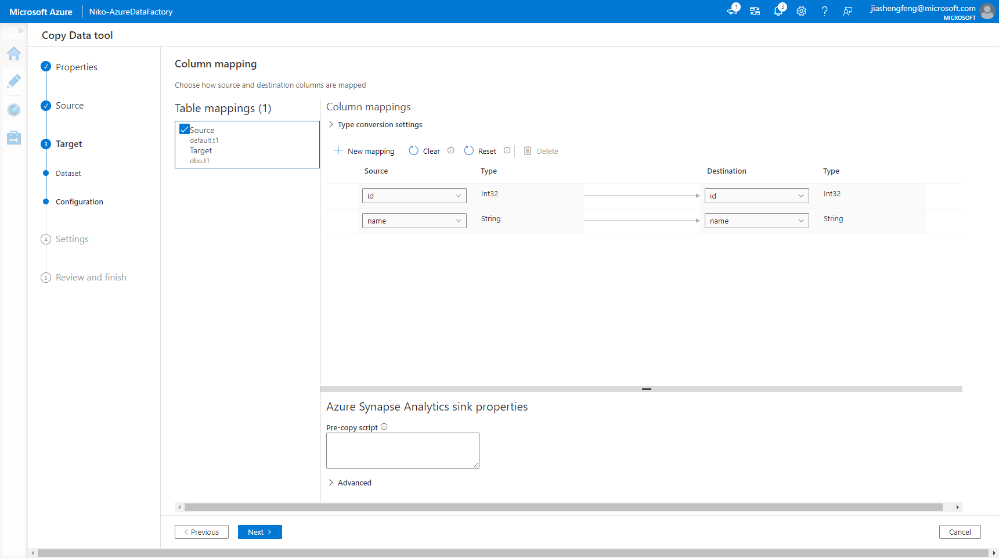

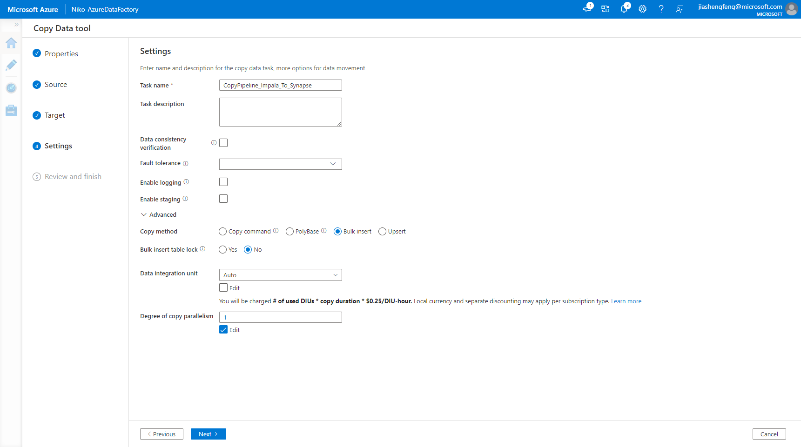

Switch the tab and return to the copy activity. Click on the “sink” tab and click on “+ New” button to create a dataset for “Synapse” destination table. Search for synapse in dataset creation and pick “azure synapse dedicated pool”

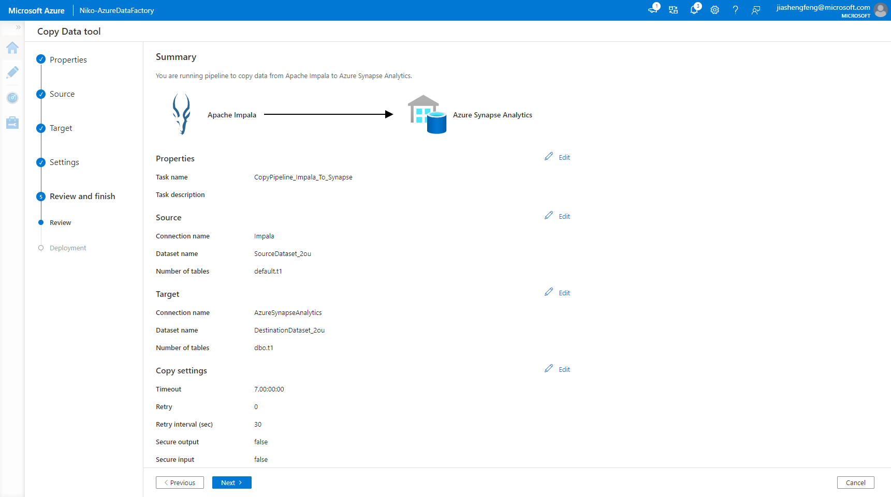

Provide a name which can identify the table being transferred. Pick the dedicated pool to which data is to be imported to. Click on the edit button and provide the destination table name, manually. Set “Import Schema” to “None”

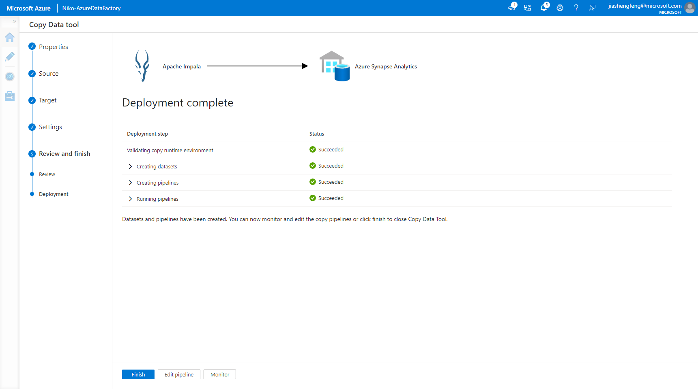


Upon successful completion of the run, verify if the new table has been created and the data has been successfully transferred by clicking on the data section of synapse studio and querying the table as shown below.


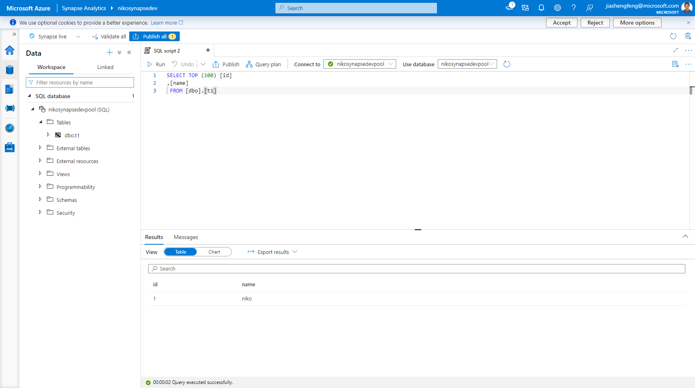

Please refer the MS Docs for futher details  here [Copy data from Impala using Azure Data Factory or Synapse Analytics ](https://docs.microsoft.com/azure/data-factory/connector-impala?tabs=data-factory)
#### Scenario 2: Live migration with Hadoop cluster directly Via self hosted IR

- Install Self hosted Integration runtime in a on-premise server which can access azure. Refer [Create a self-hosted integration runtime - Azure Data Factory | Microsoft Docs](https://docs.microsoft.com/azure/data-factory/create-self-hosted-integration-runtime#setting-up-a-self-hosted-integration-runtime)

- Create a linked service to hive data source using the integration run time. Example linked service connecting to SQL database via Integration time provided here - [Copy data from SQL Server to Blob storage using Azure portal - Azure Data Factory | Microsoft Docs](https://docs.microsoft.com/azure/data-factory/tutorial-hybrid-copy-portal). Similar steps can be followed to create linked service for hive database via integration runtime

- Use copy activity task as done in previous scenario to move the tables to synapse

#### Scenario 3: Live migration with Hadoop “kerberized” cluster in on premise environment

- Install Self hosted Integration runtime in a on-premise server which can access azure. Refer [Create a self-hosted integration runtime - Azure Data Factory | Microsoft Docs](https://docs.microsoft.com/azure/data-factory/create-self-hosted-integration-runtime#setting-up-a-self-hosted-integration-runtime)

- Install odbc driver in self hosted IR - [Cloudera ODBC Driver for Apache Impala Installation and Configuration Guide](https://docs.cloudera.com/documentation/other/connectors/impala-odbc/latest/Cloudera-ODBC-Driver-for-Impala-Install-Guide.pdf)

- Setup kerberos authentication in self hosted integration runtime as explained [here](http://simba.wpengine.com/products/Impala/doc/ODBC_InstallGuide/win/content/odbc/hi/kerberos.htm)

- After the setup, create the linked service using use Azure Data Factory odbc connector to connect to the hive cluster

- Use copy activity and copy the tables as mentioned in previous scenario

#### Considerations

- Complex types such as arrays, maps, structs, and unions are not supported for read via Azure Data Factory.

#### Impala object mapping to Azure Synapse

| Hive object                     | Synapse object                                               | High level migration method                                  |
| ------------------------------- | ------------------------------------------------------------ | ------------------------------------------------------------ |
| Impala internal tables            | Table in Azure Synapse dedicated pool                        | Azure Data Factory                                           |
| Impala external tables            | Synapse external tables using polybase. Data  resides as files in ADL Gen 2 | ·      Azure Data Factory / azcopy to move  HDFS files to ADL Gen 2  ·      DDL Scripts to create external tables |
| Impala partitions                 | Synapse tables with distribution option                      | ·      DDL Scripts                                           |
| Impala table / object permissions | Synapse access controls at the database layer                | ·      DDL Scripts                                           |

## Offline migration

If the on-premise Hive cluster cannot be connected to Azure, then one may perform an offline / disconnected migration. Following are the high level steps. < Details to be added>

- Script out all the DDL scripts for the external and internal tables in Hive Metadata. Use above provided Sample script to extract DDL statements.

- Export the internal tables as csv files to local HDFS storage

- Move the HDFS storage to Azure Data Lake using Azcopy / distcp / databox as described in [Copy data from HDFS by using Azure Data Factory - Azure Data Factory | Microsoft Docs](https://docs.microsoft.com/azure/data-factory/connector-hdfs)

- Create Azure Synapse instance and use serverless pools and create the external tables connecting to Azure data lake gen 2. Use serverless pools ( SQL or spark ) to explore the data

- Perform any processing of data via notebooks or SQL Scripts and ingest the prepared data into Synapse SQL dedicated pools or Synapse spark database

- Import the impala internal table to azure synapse dedicated SQL Pool or spark database via T-SQL scripts.

### Migrate - Impala to HDInsight Hive

Steps in migrating the Impala to HDInsight Hive

- Compare the differences between Hive and Impala
  - SQL Differences between Hive and Impala [Differences between Hive and Impala](https://docs.cloudera.com/documentation/enterprise/6/6.3/topics/impala_langref_unsupported.html)
  - SQL Differences between Hive and Impala [Differences between Hive and Impala](https://docs.cloudera.com/documentation/enterprise/6/6.3/topics/impala_langref_unsupported.html)
- Migrate metadata (HDInsight supports only Azure SQL Db for Metadata)
  - Migrating PostgresSQL to Azure SQLDB [Migrating PostgresSQL to Azure SQLDB](https://docs.microsoft.com/azure/dms/tutorial-postgresql-azure-postgresql-online)
  - Migrating MySQL to Azure SQLDB [Migrating MySQL to Azure SQLDB](https://docs.microsoft.com/azure/dms/tutorial-mysql-azure-mysql-offline-portal)
- Create and export DDLs for Tables in Impala with above mentioned Scripts
- Execute DDLs in already deployed HDInsight Hive
  

### Lift and Shift - IAAS

Other options to migrate Impala Tables

An Impala has following type of workloads:

- Managed Tables

- External tables

- User defined functions

For migrating data between HDFS and ADLS please refer the HDFS migration part.

### Migrating table data

#### Migrating table data for every managed table**

##### Step 1

Execute below command at source cluster to copy the data to transit folder

```shell
 hdfs dfs -copyToLocal /apps/hive/warehouse/\*.\* /tmp**
```

##### Step 2

Copy all the data to the folder of /hive/warehouse/managed target cluster by using azcopy command. Refer the HDFS migration section for this

##### Step 3

Execute the DDL scripts provided in metadata migration step to create the tables on the new cluster.

#### Migrating table data for specific managed table

##### Step A

List out the tables in database to choose the specific table to migrate. Use SHOW TABLES query

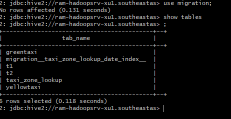

##### Step B

Get the DDL for the specific table to migrate. Use SHOW CREATE TABLE query to get DDL of the table.

```sql
SHOW CREATE TABLE t1

CREATE TABLE `t1`(
   `x` int,  
  `y` string)
ROW FORMAT SERDE 
  'org.apache.hadoop.hive.serde2.lazy.LazySimpleSerDe' 
STORED AS INPUTFORMAT 
  'org.apache.hadoop.mapred.TextInputFormat' 
OUTPUTFORMAT 
  'org.apache.hadoop.hive.ql.io.HiveIgnoreKeyTextOutputFormat'
LOCATION
  'hdfs://ram-hadoopsrv-xu0.southeastasia.cloudapp.azure.com:8020/apps/hive/warehouse/migration.db/t1'
TBLPROPERTIES (
   'COLUMN_STATS_ACCURATE'='{\"BASIC_STATS\":\"true\"}',  
   'numFiles'='0',  
   'numRows'='0',  
   'rawDataSize'='0',  
   'totalSize'='0',  
  'transient_lastDdlTime'='1610415855')
```

##### Step C

Execute below command at source cluster to copy the data to transit folder.

```shell
hdfs dfs -copyToLocal /apps/hive/warehouse/\* /tmp**
```

##### Step D

Copy specific table data to the folder of /apps/hive/warehouse/managed target cluster by using azcopy command. Refer the HDFS migration section for this

##### Step E

 Execute the DDL scripts provided in metadata migration step to create the specific tables on the new cluster.

#### Migrating table data for external tables

##### Step a

External tables data is not stored in /apps/hive/warehouse

We can find the location using show create table query

```sql
SHOW CREATE TABLE t1

CREATE TABLE `t1`(
   `x` int,  
  `y` string)
ROW FORMAT SERDE 
  'org.apache.hadoop.hive.serde2.lazy.LazySimpleSerDe' 
STORED AS INPUTFORMAT 
  'org.apache.hadoop.mapred.TextInputFormat' 
OUTPUTFORMAT 
  'org.apache.hadoop.hive.ql.io.HiveIgnoreKeyTextOutputFormat'
LOCATION
  'hdfs://ram-hadoopsrv-xu0.southeastasia.cloudapp.azure.com:8020/apps/hive/warehouse/migration.db/t1'
TBLPROPERTIES (
   'COLUMN_STATS_ACCURATE'='{\"BASIC_STATS\":\"true\"}',  
   'numFiles'='0',  
   'numRows'='0',  
   'rawDataSize'='0',  
   'totalSize'='0',  
  'transient_lastDdlTime'='1610415855')
```

##### Step b

Retrieve the table data from the Migrated using HDFS commands.

##### Step c

Use the AZcopy command to copy the data identified to the target cluster.

##### Step d

Create the external tables using the DDL generated in Metastore migration step.

### Other approaches to migrate the Hive data

#### Use hive export import with distcp /azcopy option.**

##### Step 1)

Exporting the table data to transient folder.

```sql
export table t1 to '/temp';
```

##### Step 2)

Copy the exported data using distcp.

```shell
distcp hdfs://source:8020/source/first hdfs://target:8020/source/second hdfs://nn2:8020/target
```

##### Step 3)

Import table data from transient folder on target cluster.

```sql
import table t1 from '/temp/t1';
```

