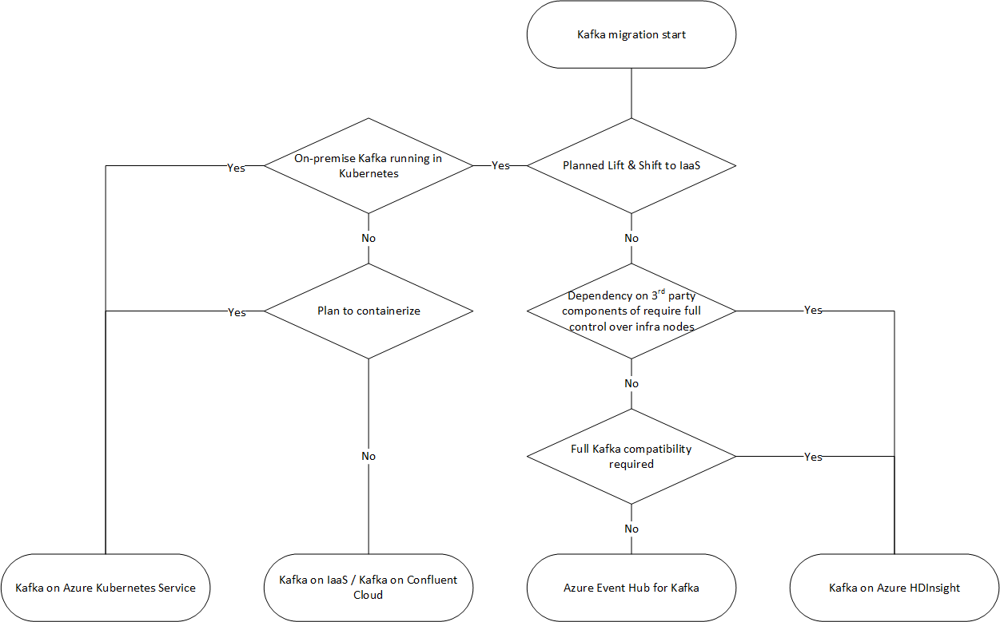

[Apache Kafka](https://kafka.apache.org/) is a highly scalable fault tolerant distributed messaging system that is built based on a publish-subscribe architecture. Kafka is used as an ingestion layer in real time streaming scenarios (like IoT, real time log monitoring systems etc), but is also gaining momentum as the immutable append only data store in Kappa architectures

Kafka on Azure IaaS:
https://github.com/Azure/azure-quickstart-templates/tree/master/application-workloads/kafka/kafka-ubuntu-multidisks

Azure EventHub for Kafka
Event Hubs provides an endpoint compatible with the Apache Kafka® producer and consumer APIs that can be used by most existing Apache Kafka client applications as an alternative to running your own Apache Kafka cluster. Event Hubs supports Apache Kafka's producer and consumer APIs clients at version 1.0 and above.

**Apache Kafka and Event Hub feature differences:**

|**Event Hubs and Kafka similar?** |**How are Event Hubs and Kafka different?**|
|-------------------------------|----------------------------------------
| Both use partitioned consumer | PaaS vs. Software differences         |
|Partitions are independent       |Partitioning differences	        |
|Both use a client side cursor concept |API differences                 |
|Both can scale to very high workloads	|Runtime differences            |
|Conceptually they are nearly the same	|Protocol differences
|Both does not use HTTP protocol for receive  |Durability differences	|
|                                           |  Security differences     |
|					      |Throttling differences   |

**Kafka & Event Hub – Partitioning Differences:**
|**Kafka	     **                    |**Event Hubs**                            |
|-----------------------------------|-------------------------------------------------|
|Scale is managed by partition count |Scale is managed by throughput units            |
|You must load balance partitions across machines|Automatic load balancing            |
|You must manually re-shard via split & merge	| No repartitioning required	      |
	

**Kafka & Event Hub – Other Differences:**
|**Kafka **	                            | **Event Hubs **                           |
|-----------------------------------|--------------------------------------------------|
|Does not throttle                  |Throttling is supported                            |
|Uses proprietary protocol          |Uses AMQP 1.0 Protocol                             |
|Does not use HTTP for send	    |Uses HTTP Send and Batch Send                      |

**Kafka & Event Hub – Durability Differences:**

|**Kafka**	                   |**Event Hubs**                                    |
|----------------------------------|--------------------------------------------------|
|Volatile by default               |    Always durable                                |
|Replicated after ACK              |     Replicated before ACK                        |
|Depends on disk & quorum	   |	 Provided by storage                           |
	

**Kafka & Event Hub – Security Differences:**

|**Kafka**       	           |**Event Hubs**                                     |
|----------------------------------|---------------------------------------------------|
|SSL & SASL                        |SAS & SASL/PLAIN RFC 4618                          |
|File like ACLs                    |Policy                                             |
|Optional transport encryption	   |Mandatory TLS                                      |
|User based                        |Token based (unlimited)                            |

Migrate to Azure Event Hubs for Apache Kafka - Azure Event Hubs | Microsoft Docs
https://docs.microsoft.com/en-us/azure/event-hubs/apache-kafka-migration-guide

Kafka on Azure HDInsight
An introduction to Apache Kafka on HDInsight - Azure | Microsoft Docs
https://docs.microsoft.com/en-us/azure/hdinsight/kafka/apache-kafka-introduction

Kafka on AKS
Use Azure Kubernetes Service with Kafka on HDInsight | Microsoft Docs
https://docs.microsoft.com/en-us/azure/hdinsight/kafka/apache-kafka-azure-container-services

Kafka Data Migration
[The MirrorMaker tool](https://docs.microsoft.com/azure/hdinsight/kafka/apache-kafka-mirroring) can leverage on the Apache Kafka's mirroring feature topics from one cluster to another. It can help to perform the Kafka data migration after the new Kafka cluster is provisioned. 
Migration Option: Move producers first and follow by consumers.
By firstly migrating the business producers to the new Kafka instance, the original Kafka will not have new message produced. After all messages of the original Kafka instance are consumed, the topic consumers can be migrated to the new Kafka instance, and then consume the topics from the new Kafka instance.
1.	Change the Kafka connection address of the producer client to pointing to the new Kafka instance. 
2.	Restart the producer business services and send new messages to the new Kafka instance. 
3.	Observe the consumer progress of each consumer group in the original Kafka instance until the data in the original Kafka has been consumed.
4.	Change the Kafka connection address of the consumer client to the the new Kafka instance. 
5.	Restart the consumer business services to consume messages from the new Kafka instance. 
6.	Monitor and verify whether consumers can get data from the new Kafka instance correctly.
Further Reference: Mirror Apache Kafka topics - Azure HDInsight | Microsoft Docs

Monitor Kafka Cluster
Use Azure monitor to analyse your Kafka logs.
https://docs.microsoft.com/en-us/azure/hdinsight/kafka/apache-kafka-log-analytics-operations-management

Kafka Streams: 
Kafka stream library enables processing data in near real-time with the ability to join and aggregate. 
More Info: Introducing Kafka Streams: Stream Processing Made Simple - Confluent
	https://www.confluent.io/blog/introducing-kafka-streams-stream-processing-made-simple/

Confluent Partnership:
Confluent( Kafka founding company) has a strategic alliance with Microsoft.
Link: [Confluent and Microsoft Announce Strategic Alliance](https://www.confluent.io/ja-jp/press-release/confluent-strategic-alliance-with-microsoft/) and [Introducing seamless integration between Microsoft Azure and Confluent Cloud](https://azure.microsoft.com/de-de/blog/introducing-seamless-integration-between-microsoft-azure-and-confluent-cloud/)
