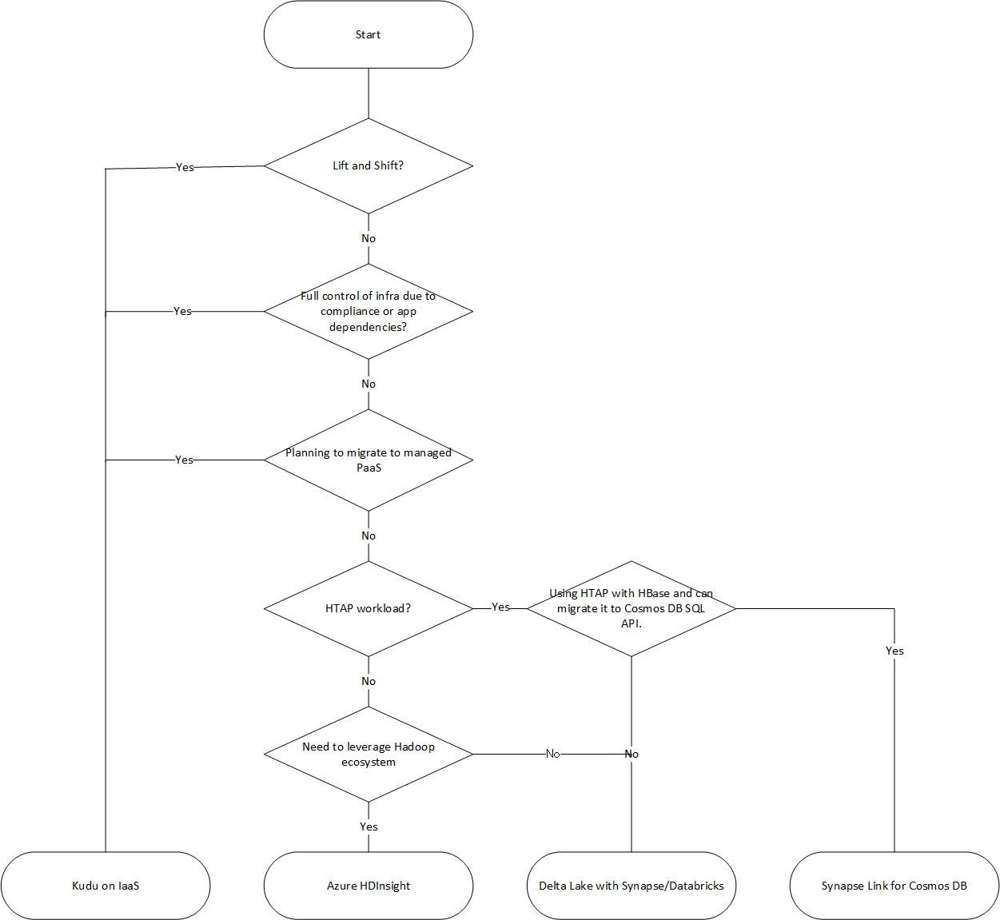

# Migration Approach

Azure has several landing targets for Apache Kudu. Depending on requirements and product features, customers can choose between Azure IaaS, HDInsight, Synapse or Azure Databricks.  

Landing Targets for Apache Kudu on Azure



- [Lift and shift migration to Azure IaaS](#lift-and-shift-migration-to-azure-iaas)
- [Migration to Azure HDInsight](#migration-to-hdinsight-interactive-hive-cluster)
- [Migration to Azure Synapse/Databricks with Delta Lake](#migration-to-synapsedatabricks-with-delta-lake)
- [Migration to Azure Cosmos DB and Azure Synapse + Synapse Link for Azure Cosmos DB](#migration-to-azure-cosmos-db-and-azure-synapse-synapse-link-for-azure-cosmos-db)

## Lift and shift migration to Azure IaaS
If you're migrating your workload to Azure IaaS with Lift and shift, you can keep Kudu up and running. To run Cloudera workloads on Azure, refer to Cloudera's [Reference Architecture guide](https://docs.cloudera.com/documentation/other/reference-architecture/topics/ra_azure_deployment.html) and design your target system.

Visit https://azure.com/cloudera for Microsoft information about Cloudera on Azure.

## Migration to Azure HDInsight
HDInsight does not support running Apache Kudu Cluster. Use supported storage (Blob or ADLS) and choose the appropriate file format (Parquet, ORC, etc) for your workload.
See [Guide to Migrating Big Data Workloads to Azure HDInsight](https://azure.microsoft.com/resources/migrating-big-data-workloads-hdinsight/), a comprehensive migration guide for HDInsight for more information.

## Migration to Synapse/Databricks with Delta Lake
### Introduction of Delta Lake with synapse documentation
Delta Lake is an open source storage layer software that enables fast, reliable reading and writing. Delta Lake enables integration of ACID transactions, versioning, batch and streaming. Delta Lake is fully compatible with existing Spark implementations, allowing developers to use Delta Lake in their existing data pipelines with minimal changes. 
See [Azure Synapse Analytics - What is Delta Lake](https://docs.microsoft.com/azure/synapse-analytics/spark/apache-spark-what-is-delta-lake) and [Azure Databricks - Delta Lake and Delta Engine guide](https://docs.microsoft.com/azure/databricks/delta/) for more detail.

### Migration from Kudu to Delta Lake

- Export Kudu to Parquet
To migrate Kudu data to Delta Lake, back up your Kudu data and output it in Parquet format. Then copy that data to Data Lake Storage Gen2. Kudu backups can be done using Apache Spark. See the [Backup and Restore section](https://kudu.apache.org/docs/administration.html#backup) in the official Kudu documentation for more information.

- Convert Parquet to Delta Lake
Parquet format backup data copied to Data Lake Storage Gen2 can be converted to Delta Lake format.
Azure Synapse Analytics can use Spark Pool to convert Parquet format data to Delta Lake format.

- Example

```python
%%pyspark
from delta.tables import *
deltaTable = DeltaTable.convertToDelta(spark, "parquet.`abfss://{ContainerName}@{StorageAccountName}.dfs.core.windows.net/folder`")
```

See [Query Delta Lake files using serverless SQL pool in Azure Synapse Analytics](https://docs.microsoft.com/azure/synapse-analytics/sql/query-delta-lake-format) for more details.

You can convert the file format in Azure Databricks as well. See [Migrate workloads to Delta Lake](https://docs.microsoft.com/en-us/azure/databricks/delta/porting) for a sample code.

## Migration to Azure Cosmos DB and Azure Synapse + Synapse Link for Azure Cosmos DB
f you are using HBase and Kudu to achieve HTAP workloads, you can consider migrating them to Cosmos DB and implementing HTAP with Azure Synapse Link for Azure Cosmos DB.

### Introduction of Synapse Link for Cosmos DB
Azure Synapse Link for Azure Cosmos DB is a feature that allows you to perform transactions and analytics in a hybrid manner. Azure Synapse Link creates a seamless integration between Cosmos DB and Synapse Analytics that allows you to perform analytics on your Cosmos DB's operational data. See [What is Azure Synapse Link for Azure Cosmos DB?](https://docs.microsoft.com/azure/cosmos-db/synapse-link) for more details.

Azure Synapse Link allows you to perform analysis processing on operational data by using the analytical store of Azure Cosmos DB. See [What is Azure Cosmos DB analytical store?](https://docs.microsoft.com/azure/cosmos-db/analytical-store-introduction) for the Azure Cosmos DB analytics store.

### Migrate HBase to Azure Cosmos DB SQL API
To migrate HBase workloads to Cosmos DB SQL API, please refer to [Migrate data from Apache HBase to Azure Cosmos DB SQL API account](https://docs.microsoft.com/azure/cosmos-db/sql/migrate-hbase-to-cosmos-db).

### Enable HTAP scenarios using Azure Synapse Link for Azure Cosmos DB 
After migrating your HBase workload to the Cosmos DB SQL API, it's time to configure Azure Synapse Link for Azure Cosmos DB. Please refer to [Configure and use Azure Synapse Link for Azure Cosmos DB](https://docs.microsoft.com/azure/cosmos-db/configure-synapse-link) for the detailed configuration.

## Further Reading

[Architecture and Components](readme.md)

[Challenges](challenges.md)

[Considerations](considerations.md)
