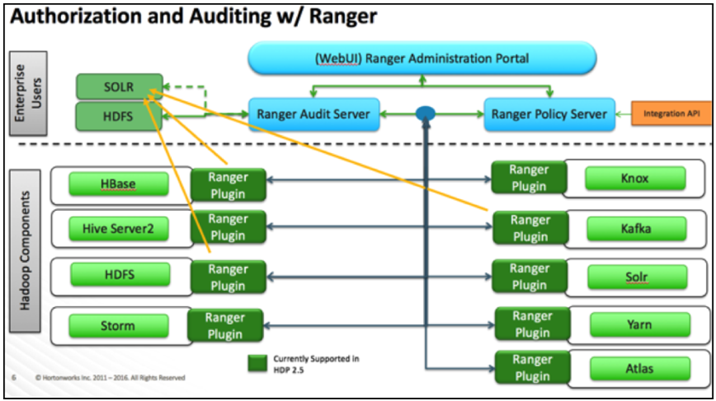

## Apache Ranger Architecture and Components

Apache Ranger is a framework to enable, monitor and manage comprehensive data security across the Hadoop platform.

The vision with Ranger is to provide comprehensive security across the Apache Hadoop ecosystem. With the advent of Apache YARN, the Hadoop platform can now support a true data lake architecture. Enterprises can potentially run multiple workloads, in a multi-tenant environment. Data security within Hadoop needs to evolve to support multiple use cases for data access, while also providing a framework for central administration of security policies and monitoring of user access.

 

Image source: Ranger Architecture - Hortonworks Data Platform (cloudera.com)

The Apache Ranger has a decentralized architecture with the following internal components:

| **Component**       | **Description**                                              |
| ------------------- | ------------------------------------------------------------ |
| Ranger admin portal | The Ranger Admin portal is the central  interface for security administration. Users can create and update policies,  which are then stored in a policy database. Plugins within each component  poll these policies at regular intervals. The portal also consists of an  audit server that sends audit data collected from the plugins for storage in  HDFS or in a relational database. |
| Ranger plugins      | Plugins are lightweight Java programs which are embedded within processes of each cluster component. For example, the Apache  Ranger plugin for Apache Hive is embedded within Hiveserver2. These plugins  pull in policies from a central server and store them locally in a file. When  a user request comes through the component, these plugins intercept the  request and evaluate it against the security policy. Plugins also collect  data from the user request and follow a separate thread to send this data  back to the audit server. |
| User group sync     | Apache Ranger provides a user  synchronization utility to pull users and groups from Unix or from LDAP or  Active Directory. The user or group information is stored within Ranger  portal and used for policy definition. |

*Information source: Apache Ranger | Cloudera*

On a high level below is the list of features that Ranger provides:

*    Centralized policy administration

*    Centralized auditing

*    Dynamic row filtering

*    Dynamic data masking

*    Tag based authorisation

*    Rich and extendable policy enforcement engine

*    Key Management System

*    Security Zone (New feature)
