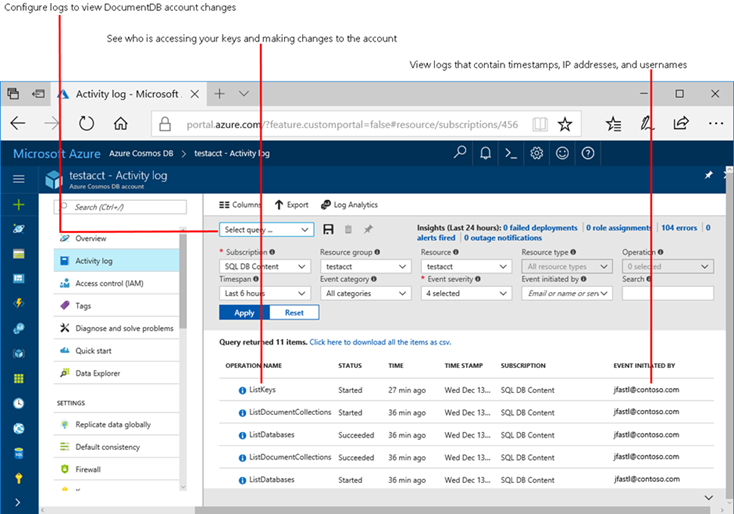
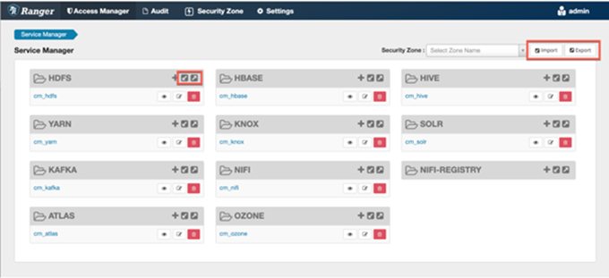
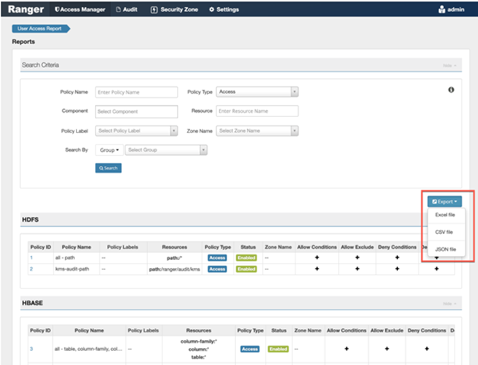
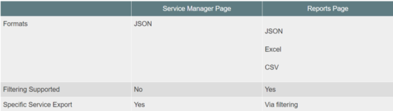

# Migration Approach - Ranger

## Replatforming to Azure PAAS Services

When moving from On-premises Hadoop to hosting Big Data Environments on cloud, there can be a few different options architecture can be designed around based on needs, e.g Using **Azure Cosmos DB** while moving from Hbase and/or Hosting data and leveraging **Azure Synapse analytics** for Hive workload. As you will read in the upcoming sections **Databricks** can be heavily leveraged for multiple data sources such as, Hive jobs can usually be run out of the box on Spark, Spark SQL supports vast majority of Hive query features. Storm is legacy technology and can be replaced with Spark Streaming or serverless processing. Impala: in Databricks’s own published benchmarks, Databricks outperforms Impala also MapReduce is legacy technology and can be replaced with Spark.

### Databricks

All user authentication to the Azure Databricks Workspace is done via Entra ID single sign-on functionality. Additionally, Entra ID conditional access can be leveraged for fine-grain access control to the Databricks workspace.

Authorization is achieved using a combination of Entra ID and Databricks Access Control Lists (ACLs). Users and groups defined within Entra ID can be imported to the Databricks workspace via SCIM. Access to data residing in ADLS gen1&2 (at the file or folder levels) can be orchestrated using Entra ID credential passthrough. Access to the Databricks workspace objects are governed by ACLs. Row-level and column-level permissions and [data masking](https://docs.microsoft.com/azure/databricks/security/access-control/table-acls/object-privileges#data-masking) for table data is managed using Databricks dynamic views.

Advanced security features can be implemented using 3rd party partner solutions, Privacera and Immuta.

### Cosmos DB

Security on Cosmos DB can be achieved with combination of various features available and other Azure security services. For more information head to *<https://docs.microsoft.com/azure/cosmos-db/database-security>*

| Security requirement                      | Azure Cosmos DB's security approach                          |
| ----------------------------------------- | ------------------------------------------------------------ |
| Network security                          | Using an IP firewall is the first layer of  protection to secure your database. |
| Authorization                             | Azure Cosmos DB uses hash-based message  authentication code (HMAC) for authorization. |
| Users and permissions                     | Users and permissionsUsing the primary key for  the account, you can create user resources and permission resources per  database. A resource token is associated with a permission in a database and  determines whether the user has access (read-write, read-only, or no access)  to an application resource in the database. |
| Entra ID integration (Azure RBAC) | You can also provide or restrict access to the  Cosmos account, database, container, and offers (throughput) using Access  control (IAM) in the Azure portal. IAM provides role-based access control and  integrates with Entra ID. |
| Protect and isolate sensitive  data       | All data in the regions listed in What's new?  is now encrypted at rest.       Personal data and other  confidential data can be isolated to specific container and read-write, or  read-only access can be limited to specific users. |
| Encryption at rest                        | All data stored into Azure Cosmos DB is  encrypted at rest. Learn more in Azure Cosmos  DB encryption at rest |

The following screenshot shows how you can use audit logging and activity logs to monitor your account:

**Image source: Microsoft Docs

### Synapse Analytics

Security in Azure Synapse Analytics can be achieved by using below methods:

| Security requirement            | Azure Synapse Analytics Security approach                    |
| ------------------------------- | ------------------------------------------------------------ |
| Assess control                  | Regulatory Compliance in Azure Policy provides  Microsoft created and managed initiative definitions, known as built-ins, for  the compliance domains and security controls related to different compliance  standards. This page lists the compliance domains and security controls for  Azure App Configuration. You can assign the built-ins for a security control  individually to help make your Azure resources compliant with the specific  standard. |
| Encryption at rest              | Azure Synapse Analytics offers a second layer  of encryption for the data in your workspace with a customer-managed key.  This key is safeguarded in your Azure Key Vault, which allows you to take  ownership of key management and rotation.     The first layer of encryption for Azure  services is enabled with platform-managed keys. By default, Azure Disks, and  data in Azure Storage accounts are automatically encrypted at rest. |
| KMS                             | The Azure Synapse encryption model with  customer-managed keys involves the workspace accessing the keys in Azure Key  Vault to encrypt and decrypt as needed. The keys are made accessible to the  workspace either through an access policy or Azure Key Vault RBAC access. |
| Network Security                | ·      Azure Synapse Analytics IP firewall  rules  ·      Azure Synapse Analytics Managed Virtual  Network  ·      Synapse Managed private endpoints  ·      Data exfiltration protection for Azure  Synapse Analytics workspaces  ·      Connect to Azure Synapse Studio using  Azure Private Link Hubs  ·      Connect to a secure Azure storage  account from your Synapse workspace |
| Authentication and pass-through | With Entra ID authentication, you can centrally  manage user identities that have access to Azure Synapse to simplify  permission management.  Use Multi-factor Entra ID authentication with  Synapse SQL (SSMS support for MFA)  Optionally one may also choose to use SQL  Authentication to gain user access to the data. |
| Access Control                  | Entry-level                                                  |

To read more about Security in Synapse Analytics please follow *<https://docs.microsoft.com/azure/synapse-analytics/security-controls-policy>*

## Lift and Shift

### HDInsight

HDInsight is a Hortonworks-derived distribution provided as a first party service on Azure. It supports the most common Big Data engines, including MapReduce, Hive on Tez, Hive LLAP, Spark, HBase, Storm, Kafka, and Microsoft R Server. It is aimed to provide a developer self-managed experience with optimized developer tooling and monitoring capabilities.

Its Enterprise features include:

* Ranger support (Kerberos based Security)

* Log Analytics via OMS

* Orchestration via Azure Data Factory

## Secure and govern cluster with Enterprise Security Package

The Enterprise Security Package (ESP) supports Entra ID-based authentication, multiuser support, and role-based access control. With the ESP option chosen, HDInsight cluster is joined to the Entra ID domain and the enterprise admin can configure role-based access control (RBAC) for Apache Hive security by using Apache Ranger. The admin can also audit the data access by employees and any changes done to access control policies.

ESP is available on the following cluster types: Apache Hadoop, Apache Spark, Apache HBase, Apache Kafka, and Interactive Query (Hive LLAP).

## Importing and exporting resource-based policies

You can export and import policies from the Ranger Admin UI for migration and cluster resiliency (backups), during recovery operations, or when moving policies from test clusters to production clusters. You can export/import a specific subset of policies (such as those that pertain to specific resources or user/groups) or clone the entire repository (or multiple repositories) via Ranger Admin UI.

## Interfaces

You can import and export policies from the Service Manager page:

 

You can also export policies from the Reports page:

 

 

## Filtering

When exporting from the Reports page, you can apply filters before saving the file.

## Export Formats

You can export policies in the following formats:

* Excel

* JSON

* CSV

> [!NOTE] CSV format is not supported for importing policies.

When you export policies from the Service Manager page, the policies are automatically downloaded in JSON format. If you wish to export in Excel or CSV format, export the policies from the Reports page dropdown menu.
**Required User Roles**

The Ranger admin user can import and export only Resource & Tag based policies. The credentials for this user are set in Ranger **Configs > Advanced ranger-env** in the fields labeled **admin_username** (default: *admin*/*admin*).

The Ranger KMS keyadmin user can import and export only KMS policies. The default credentials for this user are *keyadmin*/*keyadmin*.

## Limitations

To successfully import policies, use the following database versions:

* MariaDB: 10.1.16

* MySQL: 5.6.x

* Oracle: 11gR2+

* PostgreSQL: 8.4+

* MS SQL: 2008 R2+

Partial import is not supported.

## IAAS (INFRASTRUCTURE AS A SERVICE)

Cloudera Data Hub is a distribution of Hadoop running on Azure Virtual Machines. It can be deployed through the Azure marketplace.

Cloudera Data Hub is designed to build a unified enterprise data platform. Its Enterprise features include:

* Full hybrid support & parity with on-premises Cloudera deployments

* Ranger support (Kerberos-based Security) and fine-grained authorization (Sentry)

* Widest portfolio of Hadoop technologies

* Single platform serving multiple applications seamlessly on-premises and on-cloud.

For more information please follow : *<https://docs.cloudera.com/documentation/other/reference-architecture/topics/ra_azure_deployment.html>*

[Previous](considerations.md)
