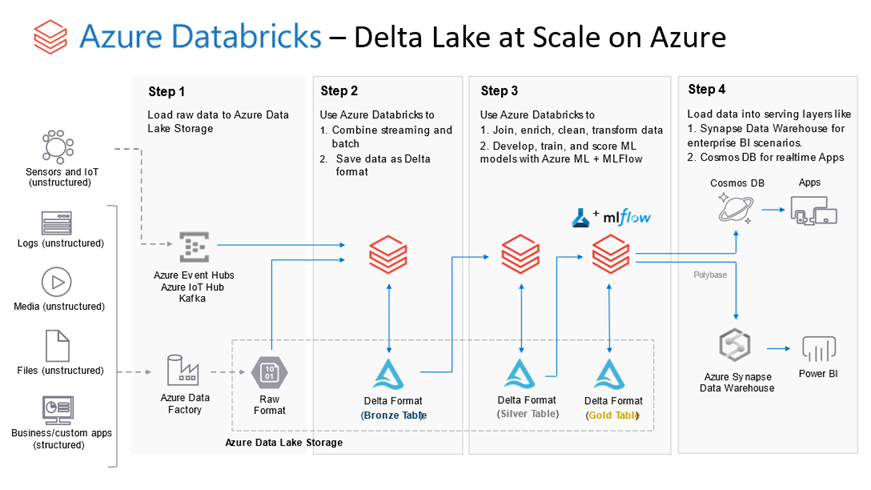

# Databricks – Migration

## Considerations & Feature Map

| **Enterprise Feature** | **Hadoop**                                                   | **Databricks**                                               |
| ---------------------- | ------------------------------------------------------------ | ------------------------------------------------------------ |
| User  Management       | No  out of the box integration with AAD  Complex  user provisioning with AAD Domain Services | Out  of the box AAD Integration  Supports  Industry standard SCIM API for user  and group sync |
| User Experience        | Mix of Hue, Ambari Views, Zeppelin &  Jupyter Notebooks  No integrated multi-user workspace  experience for team collaboration  No integration with Azure Teams or Git | Rich multi-user experience with personal  and shared workspaces  Industry leading notebook with support  for visualization, comments, version management & out of the box Git  integration |
| Security               | Designed  for on-prem long running clusters.   Offers Ranger/Sentry for data authorization. Ranger/Sentry are proprietary lock-in that  limit choice of analytic tools (Hadoop only), offer low data bandwidth and  limited API (primarily SQL) | Designed  out of the box with Cloud Native Security.   Works transparently with ADLS and AKV ACLs. No proprietary lock-in or single point of  bottleneck. Supports data access via  object, dataframe and SQL API |
| Clusters               | Designed for “Always-On” cluster. High Cluster startup time  Cluster setup requires elevated  subscription privileges. | Designed for “Ephemeral” clusters. Low cluster startup time  End user can create / decommission  clusters without need for elevated subscription level privileges |
| Scale                  | Cluster  size is fixed. Requires manual  adjustment          | Clusters  auto-scale based on “usage” and include auto-termination during periods of  inactivity |
| Administration         | High administrative cost with need to  manage multiple services that bring little/no value in cloud (YARN, HDFS,  MapReduce, Pig, Oozie, Zookeeper) | Zero administration. Fully managed with  guaranteed 99.99% uptime. |
| API                    | Limited  REST API support for programmatic interaction       | Extensive  support for REST API & CLI for programmatic interactions  Native  integration with Azure DevOps |

## Technology Mapping

| **Hadoop**      | **Description**                                              | **Equivalent  Cloud Native Service**                         | **Advantages  of Cloud Native Service**                      |
| --------------- | ------------------------------------------------------------ | ------------------------------------------------------------ | ------------------------------------------------------------ |
| YARN            | Resource  manager for allocation & orchestration of multi-user workloads on an  “Always-On” Cluster | Azure  Resource Manager + ”On-Demand” Azure Virtual Machines | “Always-On”  is an anti-pattern in cloud. Azure  offers the capability to create and decommission clusters of Virtual Machines  per workload with improved resource isolation and performance guarantees |
| HDFS            | Distributed File System to pool disks  across multiple hosts into a single namespace. Valid for “Always-On” cluster with co-located  Storage & Compute | Azure Data Lake Storage (ADLS) Gen2                          | Co-located compute and storage is an  anti-pattern in cloud. ADLS Gen2  offers disaggregated & infinitely scalable storage that’s independent of  compute. |
| Hive            | SQL  engine for Big Data                                     | Azure  Databricks                                            | Azure  Databricks Delta with in-memory architecture is 10-100x faster than Hive  while offering capabilities that go beyond SQL to include streaming, machine  learning and data science |
| Spark           | Unified Analytics engine for Stream Processing,  ETL, SQL & ML | Azure Databricks                                             | Azure Databricks Delta offers  performance, reliability & throughput improvements of up to 5-10x Apache  Spark. With support for Transactions,  Schema management, Secondary indexes and Granular Security, Delta is enterprise  ready version of Spark by the creators of Apache Spark |
| Storm           | Distributed  Stream Processing framework                     | Azure  Databricks & Azure Stream Analytics                   | Stream  Analytics & Azure Databricks Structured Streaming offer higher  resiliency, improved throughput and lower management cost. |
| Kafka           | Pub & Sub system for streams of  records                     | Azure Events Hub & IOT Hub                                   | Kafka is the only service in Hadoop that  offers differentiated capability over cloud native service. As an example, Kafka can support higher  throughput. On the contrary, both  Events Hub and IOT Hub offer simplicity of management & elasticity  unavailable in Kafka. |
| HBase           | Columnar  NoSQL Database with strong consistency guarantees  | Cosmos  DB                                                   | Cosmos  DB combines best of document & columnar database with geo-redundancy for  modern high scale web applications |
| Ranger / Sentry | Data Authorization & Audit                                   | ADLS Gen2 ACL & Azure Monitor                                | ADLS Gen2 ACL & Azure monitor offer  consistent cloud native data security and monitoring that’s enforced across  all data access engines. Ranger/Sentry  only protects data access via Hadoop while resulting in administration  overhead and duplicate access management |
| Oozie           | Workflow  orchestration engine                               | Azure  Data Factory                                          | Azure  Data Factory offers rich and extensive GUI based workflow orchestration  capabilities unavailable in Oozie. |

## Migrations Patterns

There are different approaches to migration of workloads from Hadoop on Azure Databricks. One common approach is to migrate use-cases individually. Here, all the relevant resources (data, scripts, pipelines, user permissions) are migration to Azure Databricks in separate phases. This allows for an steady and organized approach to migrating to the cloud with simplicity in mind.

Another approach is to move workloads associated to the various teams within the organization. For example, all the data and scripts used by the Data Science team could be migrated first, followed by all the resourced needed by the Data Engineering team. This approach takes on more of a bulk migration approach, but can be implemented independently and parallel by the various teams involved.

Data migration can be accomplished by copying on-prem data onto an Azure storage solution, like Azure Data Lake Gen2. This copying can be accomplished via Azure Data Factory, involving potential data conversions to optimized formats like [Parquet](https://docs.microsoft.com/azure/data-factory/format-parquet) and [Delta](https://docs.microsoft.com/azure/data-factory/format-delta).

