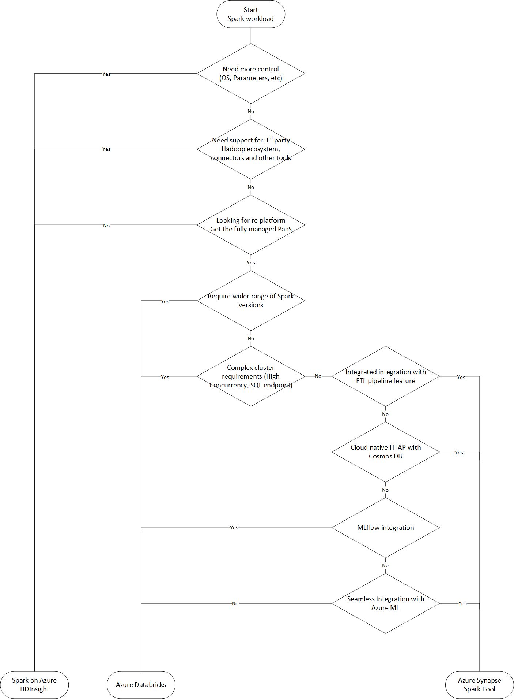
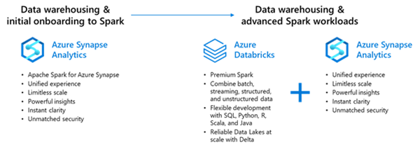

# Migration Approach:

Azure has several landing targets for Apache Spark. Depending on requirements and product features, customers can choose between Azure Synapse, Azure Databricks and Azure HDInsight.



## Modernization – Synapse

### Shared Metadata: 

Azure Synapse Analytics allows the different workspace computational engines to share databases and Parquet-backed tables between its Apache Spark pools and serverless SQL pool. More information is available from the below link 
 
  Reference: [Shared metadata tables - Azure Synapse Analytics | Microsoft Docs](https://docs.microsoft.com/en-us/azure/synapse-analytics/metadata/table)

### Synapse Spark Primary Use-Cases

1.   Individual users who want to use Apache Spark to perform ad-hoc analytics. Not meant for high concurrency workloads. Every user gets their own cluster.

2.   Consolidated type of nodes for starters to pick e.g., Small, Medium, Large node types compared to different node types.

3.   Ephemeral Jobs: Synapse spark is built for short term processing and hence all the cluster have a TTL (Time to Live) and are automatically terminated to save costs.

4.   Support for both reading and writing into Synapse tables.

5.   Built in support for .NET for spark application enables existing user skill set to take advantage of Apache Spark distributed data processing.

6.   Unified security and monitoring features including Managed VNets throughout all workloads with one Azure Synapse workspace

7.   Existing spark user to take advantage of Microsoft proprietary optimizations e.g., Hyperspace: An indexing subsystem for Apache Spark.

8.   Strict compliance requirement that might allow to use Azure Databricks (e.g., JEDI compliance requirements)

### Field Guidance:

Synapse Spark is a good entry point when on-boarding a customer with Synapse and they are mature for complex use case Azure Databricks based Spark is recommended.



### Migration Scenarios:

1.   Moving from On-premises Hadoop -> Use Synapse migration as the primary migration strategy and Synapse Spark for ad-hoc queries and processing.

2.   Moving from On-premises Data Warehouse (Teradata, Netezza etc.) to Synapse Spark -> Follow Synapse migration path

| Layer          | Questions                                                    | Comments                                         |
| -------------- | ------------------------------------------------------------ | ------------------------------------------------ |
| Infrastructure | Type of Worker nodes required e.g., memory profile or number of cores |                                                  |
|                | Job performance and SLA e.g., long running                   |                                                  |
| Application    | Spark version currently in use                               | Currently Synapse Spark support version 2.4 only |
|                | Python, Java, Scala, R version in use                        |                                                  |
| Security and administration | How to enforce data security policy e.g., column level masking |      |


### Creating an Apache Spark Pool

An Apache Spark pool in your Synapse Workspace provides Spark environment to load data, model process and get faster insights.

Reference Link: [QuickStart: Create a serverless Apache Spark pool using the Azure portal - Azure Synapse Analytics | Microsoft Docs](https://docs.microsoft.com/en-us/azure/synapse-analytics/quickstart-create-apache-spark-pool-portal)

### Spark Instances:

Spark instances are created when you connect to a Spark pool, create a session, and run a job. As multiple users may have access to a single Spark pool, a new Spark instance is created for each user that connects.

Examples on how the spark pools behave are shown below, Spark pools need to be created based on the usage type.

**Example 1**

*    You create a Spark pool called SP1; it has a fixed cluster size of 20 nodes.

*    You submit a notebook job, J1 that uses 10 nodes, a Spark instance, SI1 is created to process the job.

*    You now submit another job, J2, that uses 10 nodes because there is still capacity in the pool and the instance, the J2, is processed by SI1.

*    If J2 had asked for 11 nodes, there would not have been capacity in SP1 or SI1. In this case, if J2 comes from a notebook, then the job will be rejected; if J2 comes from a batch job, then it will be queued.

**Example 2**

*    You create a Spark pool call SP2; it has an auto scale enabled 10 – 20 nodes.

*    You submit a notebook job, J1 that uses 10 nodes, a Spark instance, SI1, is created to process the job.

*    You now submit another job, J2, that uses 10 nodes, because there is still capacity in the pool the instance auto grows to 20 nodes and processes J2.

**Example 3**

*    You create a Spark pool called SP1; it has a fixed cluster size of 20 nodes.

*    You submit a notebook job, J1 that uses 10 nodes, a Spark instance, SI1 is created to process the job.

*    Another user, U2, submits a Job, J3, that uses 10 nodes, a new Spark instance, SI2, is created to process the job.
*    You now submit another job, J2, that uses 10 nodes because there's still capacity in the pool and the instance, J2, is processed by SI1.

Reference Link: [Apache Spark core concepts - Azure Synapse Analytics | Microsoft Docs](https://docs.microsoft.com/en-us/azure/synapse-analytics/spark/apache-spark-concepts#spark-instances)

>[!NOTE] Each Synapse workspace has a default quota limit at the Workspace level and also at the Spark pool level. These requirements need to be captured during the assessment phase (Infrastructure)

### Performance Considerations

Refer to [Optimize Spark jobs for performance - Azure Synapse Analytics | Microsoft Docs](https://docs.microsoft.com/en-us/azure/synapse-analytics/spark/apache-spark-performance) for considerations.

### Data Storage:

Spark is a processing framework and does not store any data, once the processing is complete an appropriate sink needs to be chosen. 

| Use case            | Sink                 | Comment        |Reference Links|
| ------------------- | -------------------- | --------------  |--------------|
| Data Warehouse      | Synapse table        |                 |[Import and Export data between serverless Apache Spark pools and SQL pool](https://docs.microsoft.com/en-us/azure/synapse-analytics/spark/synapse-spark-sql-pool-import-export)               |
| API and fast access | Cosmos DB            |                 |[Configuration references · Azure/azure-cosmosdb-spark Wiki](https://docs.microsoft.com/en-us/azure/cosmos-db/synapse-link)               |
| Historical Analysis | ADLS Gen2 (Datalake) |                 |[Introduction to Microsoft Spark utilities - Azure Synapse Analytics](https://docs.microsoft.com/en-us/azure/synapse-analytics/spark/microsoft-spark-utilities?pivots=programming-language-csharp)                |
| Integration         | EventHub             | Kafka protocol        |[Azure/azure-event-hubs-spark](https://github.com/Azure/azure-event-hubs-spark)|

### Data Migration:

Synapse Spark supports reading multiple different file formats (ORC, Parquet etc.) so use the same migration strategy as on-premises HDFS migration.

Internal migration from Synapse SQL Pool to Synapse Spark Pool is documented in detail at [Import and Export data between serverless Apache Spark pools and SQL pools - Azure Synapse Analytics | Microsoft Docs](https://docs.microsoft.com/en-us/azure/synapse-analytics/spark/synapse-spark-sql-pool-import-export)

### Ingesting SQL pool data into a Spark database

1.   Create Notebook (default language is pyspark)

2.   If we need to read table create in Synapse (sqlpool001.dbo.TaxiTrip)

```sql
%%spark

spark.sql ("CREATE DATABASE IF NOT EXISTS sparknyc")

val df = spark. read. sqlanalytics("sqlpool001.dbo.TaxiTrip")

df. write. mode("overwrite").saveAsTable("sparknyc.taxitrip")
```

3.   Now you can use the regular dataframe operation to perform transformations.

### Ingesting Spark table data into an SQL pool table

1.   Create Notebook (default language is pyspark)

2.   to create a synapse table, execute as below.

```sql
%%spark

val df = spark.sql ("SELECT * FROM sparknyc. passengerstats")

df. write. sqlanalytics("sqlpool001.dbo.PassengerStats",Constants.INTERNAL)
```
3.   Now you can use the regular dataframe operation to perform transformations.

### Integrating with Pipelines

Reference link for pipeline and data flow: [QuickStart: to load data into dedicated SQL pool using the copy activity - Azure Synapse Analytics | Microsoft Docs](https://docs.microsoft.com/en-us/azure/synapse-analytics/quickstart-copy-activity-load-sql-pool)

### Monitoring

Reference link for monitoring Spark application: [Monitor Apache Spark applications using Synapse Studio - Azure Synapse Analytics | Microsoft Docs](https://docs.microsoft.com/en-us/azure/synapse-analytics/monitoring/apache-spark-applications)


## Modernization – Databricks

[Azure Databricks](https://azure.microsoft.com/en-us/services/databricks/) is a fast, easy, and collaborative Apache Spark based analytics service. Engineered by the original creators of Apace Spark, Azure Databricks provides the latest versions of Apache Spark and allows you to seamlessly integrate with open-source libraries. You can spin up clusters and build quickly in a fully managed Apache Spark environment with the global scale and availability of Azure. Clusters are set up, configured, and fine-tuned to ensure reliability and performance without the need for monitoring. Take advantage of autoscaling and auto-termination to improve total cost of ownership (TCO).

On top of Apache Spark, Azure Databricks offers additional capabilities:

-    [Photon Engine](https://techcommunity.microsoft.com/t5/analytics-on-azure/turbocharge-azure-databricks-with-photon-powered-delta-engine/ba-p/1694929) - a vectorized query engine that leverages modern CPU architecture to enhance Apache Spark 3.0’s performance by up to 20x.

-    [DBIO Cache](https://docs.microsoft.com/en-us/azure/databricks/delta/optimizations/delta-cache) - Transparent caching of Parquet data on worker local disk

-    [Skew Join Optimization](https://docs.microsoft.com/en-us/azure/databricks/delta/join-performance/skew-join)

-    [Managed Delta Lake](https://docs.microsoft.com/en-us/azure/databricks/delta/)

-    [Managed MLflow](https://docs.microsoft.com/en-us/azure/databricks/applications/mlflow/)

The migration of Spark jobs onto Azure Databricks is trivial, and requires minimal, if any, modifications to scripts. Job scripts can be imported into Azure Databricks in bulk using the [Workspace CLI](https://docs.microsoft.com/en-us/azure/databricks/dev-tools/cli/workspace-cli).

