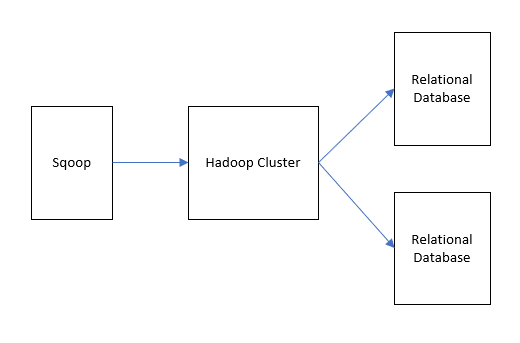
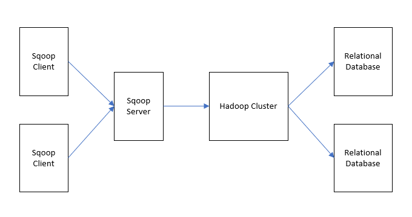

# Brief introduction to Apache Sqoop

## Overview
Apache Sqoop は、Apache Hadoopクラスターとリレーショナルデータベースの間でデータを転送するためのコマンドラインインターフェースのツールです。

このツールを使用して、MySQL、PostgreSQL, Oracle, SQL Server などのRDBMSからHDFSにデータをインポートしたり、HDFSのデータをRDBMS へエクスポートできます。SqoopではMapReduceやApache Hive を使用してHadoop上でデータを変換することもできます。また、Sqoopは並列で動作し、高速なデータ転送を実現します。

また、高度な機能として、インクリメンタルなロード、SQLを使用してフォーマットを変換したロード、既存データセットの更新などもサポートされています。

### **バージョン**

Apache SqoopにはSqoop1とSqoop2の2つのシリーズが存在します。それらはコマンドライン含む使用方法が異なります。Sqoop1はシンプルなクライアントツールであるのに対して、Sqoop2はクライアントとサーバが協調して動作するアーキテクチャになっています。

#### **Sqoop1のアーキテクチャ**

##### **Sqoop1のimport/exportの概念**

- **import**  
  RDBMSからデータを読み込んでHDFSにデータを出力します。RDBMSのテーブルの各レコードは、HDFS内では一行として出力されます。HDFS上に出力されるファイルフォーマットはText、SequenceFiles、Avroがサポートされています。

- **export**  
  HDFS上のデータを読み込んでRDBMSに転送します。ターゲットのRDBMSではInsertまたはUpdateがサポートされます。

#### **Sqoop2のアーキテクチャ**

##### **Sqoop2のServerとClientの概念**
- **Server**  
  Sqoopクライアントのエントリーポイントになりサービスを提供する

- **Client**  
  必要なノードにインストールし、Sqoopサーバとやりとりする。クライアントはサーバと通信するだけでよいため、MapReduceなどの設定が不要。

