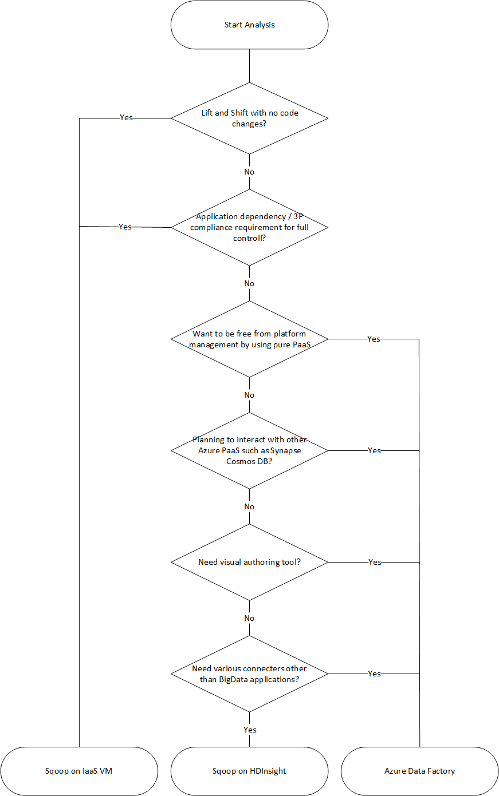

# Migration Approach

Azure has several landing targets for Apache Sqoop. Depending on requirements and product features, customers can choose between Azure IaaS, HDInsight or Data Factory.  

Landing Targets for Apache Sqoop on Azure



- [Lift and shift migration to Azure IaaS](#lift-and-shift-migration-to-azure-iaas)
- [Migration to HDInsight](#migration-to-hdinsight)
- [Migration to Data Factory](#migration-to-data-factory)

## Lift and shift migration to Azure IaaS  
If you choose Azure IaaS virtual machines as your migration destination for Sqoop running on-premises, you can use the exact same version of Sqoop to create a completely controllable environment. Therefore, a method is available that does not make any changes to the Sqoop software itself. Sqoop works with Hadoop Cluster and is usually migrated with Hadoop Cluster.
The following is available as a guide for migrating Hadoop Cluster as Lift and Shift. Please refer to it according to the service to be migrated. 

- [Apache Hive](https://github.com/Azure/Hadoop-Migrations/blob/main/docs/hive/migration-approach.md#lift-and-shift---iaas)
- [Apache Ranger](https://github.com/Azure/Hadoop-Migrations/blob/main/docs/ranger/migration-approach.md#lift-and-shift--iaas-infrastructure-as-a-service)
- [Apache HBase](https://github.com/Azure/Hadoop-Migrations/blob/main/docs/hbase/migration-approach.md#lift-and-shift-migration-to-azure-iaas)


### Preparation before migration 

#### Planning
Gather the following information in advance as a preparation before migrating your existing Sqoop. These will help you determine the size of the destination virtual machine and plan the software components and network configurations to prepare. 

|Item|Background|
|----|----------|
|Current host size|Get information about the CPU, Memory, Disk, etc. of the host or virtual machine on which the Sqoop client or server is running. This allows you to estimate the base size required for your Azure virtual machine.|
|Host and application metrics |Next, get the metric information (CPU, Memory, Disk, etc.) of the machine running the Sqoop client and estimate the resources actually used. If you are actually using less resources than the size allocated to your host, you may be able to downsize when migrating to Azure. After identifying the required amount of resources, select the type of virtual machine to migrate to by referring to [Azure virtual machine size](https://docs.microsoft.com/azure/virtual-machines/sizes).|
|Sqoop version|Check the existing Sqoop version to determine which version of Sqoop to install in the new Azure virtual machine. If you are using a distribution such as Cloudera or Hortonworks, the version of the component will depend on the version of that distribution.|
|Running jobs and scripts|Identify the Sqoop job that is running. What kind of job is running? Identify how it is written and how the job is scheduled. The scripts, scheduling, and processes that depend on those jobs can be considered for migration.|
|Databases to connect|You need to identify all the Databases to which you are connected as specified in Import / Export of the Sqoop job. Once you've identified them, you need to see if you can connect to those databases after migrating Sqoop to your Azure virtual machines. If some of the databases you connect to are still on-premises, you'll need a network connection between on-premises and Azure. See the [Network Connections]() section for topics related to network connections. |
|Plugins|If you are using a custom Sqoop plugin, you need to identify that plugin. They could be eligible for migration. |
|HA, BC and DR|If you have some kind of troubleshooting measures for running Sqoop, you need to check whether it will be realized on Azure. For example, if you have an Active/Stand-by configuration on two nodes, prepare two Azure virtual machines for Sqoop clients and have the same configuration. The same applies when configuring DR.|


#### Network connection

If some of the databases you connect to are still on-premises, you'll need a network connection between on-premises and Azure. Make a network plan before migrating.
There are two main options for connecting on-premises and Azure on a private network:

- VPN
  You can use Azure VPN Gateway to send encrypted traffic between your Azure virtual network and your on-premises location over the public Internet. This has the advantage of being inexpensive and easy to set up. However, due to the encrypted connection over the public Internet, the bandwidth of the communication itself is not guaranteed. If you need to guarantee bandwidth, you should choose the following ExpressRoute: If you use a VPN, check the [VPN Design Documentation](https://docs.microsoft.com/azure/vpn-gateway/design) and consider the required configuration. 
- ExpressRoute  
  ExpressRoute allows you to connect your on-premises network to Azure or Microsoft 365 through a private connection provided by your connectivity provider. ExpressRoute does not go through the public Internet, so it is more secure, reliable, and has more stable latency than connections over the Internet. In addition, the bandwidth options of the line you purchase can guarantee stable traffic. See the [ExpressRoute documentation](https://docs.microsoft.com/azure/expressroute/expressroute-introduction) for more information. 

Please refer to the [Planning Table](https://docs.microsoft.com/azure/vpn-gateway/vpn-gateway-about-vpngateways#configuring) here for the differences between VPN options and ExpressRoute. 

If for some reason (for example, corporate network policies) you can't configure these private connections, consider Azure Data Factory as a migration destination. Azure Data Factory's Self-hosted Integration Runtime allows you to securely transfer data from on-premises to Azure without having to configure a private network. 

### Sqoop Migration

The data and settings to be migrated when migrating on-premises Sqoop to Azure virtual machines are shown below. 

### What to migrate

- config files  
  Identify Sqoop config files and include them in your migration. Depending on the environment, there are mainly the following files. 
  - sqoop-site.xml
  - sqoop-env.xml
  - password-file
  - oraoop-site.xml -- If you use Oraoop

- Saved Jobs
  If you have saved "Saved Jobs" in Sqoop metastore with the `sqoop job --create` command, you need to migrate them. Since the save destination of metastore is defined in sqoop-site.xml, please refer to the setting and specify the location. If the shared metastore is not set, they may be stored in the `.sqoop` directory of the user's home directory running metastore. 

You can use the following command to check the information of the job that is actually saved. 

Get the saved job list

```console
sqoop job --list
```

View parameters for saved jobs

```console
sqoop job --show <job-id>
```

- Scripts  
  If you have script files that run Sqoop, you need to migrate these files. Identify and migrate all the files you need.

- Scheduler  
  If you are scheduling the execution of Sqoop, you need to identify its scheduler. For example, are you scheduling with a Linux cron job, or are you using some kind of job management tool? Once you've identified a scheduler, you need to consider whether that scheduler can also be migrated to Azure. 

- plug-ins  
  If you are using Sqoop's custom plugins, for example a connector to an external database, you need to migrate them. If you have created a patch file, apply the patch to Sqoop installed on your Azure VM. 


## Migration to HDInsight

Instead of migrating Sqoop itself to Azure, it typically migrates to Azure, a Big Data workload that includes Sqoop. Therefore, please refer to the guide below to migrate your Big Data workloads to HDInsight.
https://azure.microsoft.com/resources/migrating-big-data-workloads-hdinsight/

See below for the component versions available in HDInsight. 
- [HDInsight 4.0 component versions](https://docs.microsoft.com/azure/hdinsight/hdinsight-40-component-versioning)
- [HDInsight 3.6 component versions](https://docs.microsoft.com/azure/hdinsight/hdinsight-36-component-versioning)

See the Lift and Shift migration to Azure IaaS section for migration.

## Migration to Data Factory

Azure Data Factory is a PaaS type ETL service. Data Factory is a serverless, fully managed service. Users do not need to manage the infrastructure. It is a model that can be scaled on demand according to the volume of data, etc., and the amount used is charged. It has a GUI for intuitive editing, and can be developed using Python, .NET, and ARM as needed.


### Connection to data sources

Click here for the connector that Apache Sqoop has as standard. See the documentation for the version you are using. 
[Sqoop1](https://sqoop.apache.org/docs/1.4.7/SqoopUserGuide.html#connectors)
[Sqoop2](https://sqoop.apache.org/docs/1.99.7/user/Connectors.html)

Data Factory has a large number of connectors. See [Azure Data Factory connector overview](https://docs.microsoft.com/azure/data-factory/connector-overview) for details.

Here, as an example, based on Sqoop1 1.4.7 and Sqoop2 1.99.7, the mapping with the connector supported by Data Factory is shown in the table below. Be sure to always refer to the new documentation as the versions may be updated and the supported connectors may change.

|Sqoop1 - 1.4.7|Sqoop2 - 1.99.7|Data Factory|Considerations|
|--------------|---------------|------------|--------------|
|MySQL JDBC Connector|Generic JDBC Connector|MySQL/Azure Database for MySQL||
|MySQL Direct Connector|N/A|N/A|Direct Connector uses mysqldump to input and output data without going through JDBC. The method is different in Data Factory, but the MySQL connector can be used instead.|
|Microsoft SQL Connector|Generic JDBC Connector|SQL Server/Azure SQL Database/Azure SQL Managed Instance||
|PostgreSQL Connector|PostgreSQL/Generic JDBC Connector|Azure Database for PostgreSQL||
|PostgreSQL Direct Connector|N/A|N/A|Direct Connector does not go through JDBC and uses the "COPY" command to input and output data. The method is different in Data Factory, but the PostgreSQL connector can be used instead.|
|pg_bulkload connector|N/A|N/A|Load into PostgreSQL using pg_bulkload. The method is different in Data Factory, but the PostgreSQL connector can be used instead. |
|Netezza Connector|Generic JDBC Connector|Netteza||
|Data Connector for Oracle and Hadoop|Generic JDBC Connector|Oracle||
|N/A|FTP Connector|FTP||
|N/A|SFTP Connector|SFTP||
|N/A|Kafka Connector|N/A|Data Factory cannot connect to Kafka directly, but consider using Spark Streaming such as Azure Databricks or HDInsight to connect to Kafka.|
|N/A|Kite Connector|N/A|Data Factory cannot connect directly to Kite.|
|HDFS|HDFS|*HDFS|*Data Factory supports HDFS as a Source, but not HDFS as a Sink. |


### Connect to Databases on premise
If you still need to copy data between a data store in your on-premises network and Azure after migrating Sqoop to Data Factory, consider using [Self-hosted IR](https://docs.microsoft.com/azure/data-factory/concepts-integration-runtime#self-hosted-integration-runtime). If you are trying to securely perform data integration in a private network environment where there is no direct communication path from the public cloud environment, install Self-hosted IR in the on-premises environment in the internal firewall or in the virtual private network, and Self-hosted IR Makes an HTTPS-based outbound connection to Azure to establish a secure connection for data movement. Self-hosted IR is currently only supported on Windows OS. You can also achieve scalability and high availability by installing and associating Self-hosted IRs on multiple machines. Self-hosted IR is also responsible for dispatching data transformation activities to resources that are not on-premises or in Azure's Virtual Network.
For information on how to set up Self-hosted IR and communication requirements, see [Create and configure a self-hosted integration runtime](https://docs.microsoft.com/azure/data-factory/create-self-hosted-integration-runtime). 

### Network options
Data Factory has two network options: Managed Virtual Network and Private Link. Both enable the process of data integration to be carried out securely by building a private network. Both of these options can be used at the same time, either one or none. Select an option according to your security policy.

#### Managed Virtual Network
You can deploy the Azure Integration Runtime, which is the Data Factory Runtime, within the Managed Virtual Network. By deploying a private endpoint such as a data store that connects to the Managed Virtual Network, data integration can be safely achieved within a closed private network.


See “Azure Data Factory Managed Virtual Network”(https://docs.microsoft.com/azure/data-factory/managed-virtual-network-private-endpoint).

#### Private Link
You can use [Private Link](https://docs.microsoft.com/azure/private-link/) in Data Factory to create a Data Factory private endpoint in your customer's virtual network and enable a private connection to your Data Factory instance.


See “Azure Private Link for Azure Data Factory”(https://docs.microsoft.com/azure/data-factory/data-factory-private-link).


### Performance of data copy
Sqoop improves data transfer performance by using MapReduce for parallel processing. Data Factory can also adjust performance and scalability for scenarios that perform large-scale data migrations.

Data factory can adjust up to 256 units of performance called Data Integration Units (DIU) for copy activities that use the Azure Integration Runtime. DIU is a combination of CPU, memory, and network resource allocation. Please refer to [Data Integration Units](https://docs.microsoft.com/azure/data-factory/copy-activity-performance#data-integration-units) for details. 

If you use Self-hosted IR, you can improve performance by scaling up or out of the machine hosting Self-hosted IR. The maximum scale-out limit is 4 nodes. 

Refer to the [Copy activity performance and scalability guide](https://docs.microsoft.com/azure/data-factory/copy-activity-performance) and make adjustments to achieve your desired performance. 

### Applying SQL
Sqoop has the ability to import the result set of a SQL query as shown in the example below.

```
$ sqoop import \
  --query 'SELECT a.*, b.* FROM a JOIN b on (a.id == b.id) WHERE $CONDITIONS' \
  --split-by a.id --target-dir /user/foo/joinresults
```

Data Factory can also query the database and copy the result set.


As an example, see [Data Factory Properties](https://docs.microsoft.com/azure/data-factory/connector-mysql#copy-activity-properties) for getting the result set of a query using MySQL as the data source. 


### Data Transformation
A unique feature of Data Factory is the variety of data transformation activities. Data Factory native data transformation activities include Data Flow and Data Wrangling. Both define data transformations in a visual UI and run fast in the Spark engine. As an external engine, you can take advantage of the activities of various Hadoop components of HDInsight, Databricks, stored procedures, and other custom activities. Consider using these activities when migrating Sqoop and want to include data transformations in the process.
See [Transform data in Azure Data Factory](https://docs.microsoft.com/azure/data-factory/transform-data) for more information. 

### File format
Sqoop supports Text, SequenceFile and Avro as file formats when importing data into HDFS. Data Factory does not support HDFS as Sink, but it does use Azure Data Lake Storage gen2 or Azure Blob Storage as file storage. For more information on HDFS migration, please refer to [HDFS Migration Guide](https://github.com/Azure/Hadoop-Migrations/blob/main/docs/hdfs/migration-approach.md). The supported formats for Data Factory to write to file storage are Text, Binary, Avro, JSON, ORC, Parquet. Data Factory does not support the SequenceFile format, so if necessary, use an activity such as Spark to convert it to SequenceFile with `saveAsSequenceFile`. 

Example of exporting Sequence File with Spark

```java
data.saveAsSequenceFile(path)
```

### Scheduling jobs
Sqoop itself doesn't have scheduler functionality, but if you're running Sqoop jobs on some scheduler, you'll need to migrate that functionality to Data Factory. Data Factory has the ability to trigger to schedule the execution of the data pipeline. Choose a Data Factory trigger according to your existing scheduling configuration. There are the following types of triggers.

- Schedule trigger  
  Schedule triggers run the pipeline on a wall-clock schedule. You can specify the execution timing using the calendar or the method of executing it regularly. 
- Tumbling window trigger  
  A tumbling window trigger is a type of trigger that runs periodically from a specified start time while maintaining its state.
- Event-based trigger  
  Run the pipeline in response to the event. There are two types of Event-based triggers: 
  - Storage event trigger  
    Run the pipeline in response to events such as when a file is written to the specified Azure Blob Storage or when a file is deleted. 
  - custom event trigger  
    Trigger to handle [Custom Topics](https://docs.microsoft.com/azure/event-grid/custom-topics) of [Event Grid](https://docs.microsoft.com/azure/event-grid/overview). 

For more information on triggers, see [Pipeline execution and triggers](https://docs.microsoft.com/azure/data-factory/concepts-pipeline-execution-triggers) in Azure Data Factory. 
