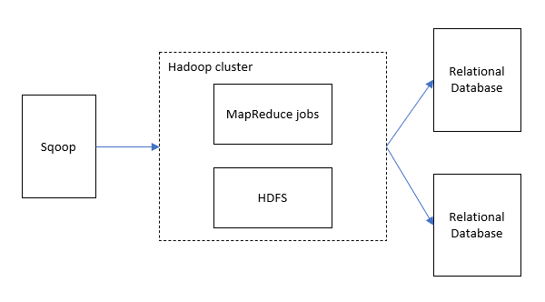
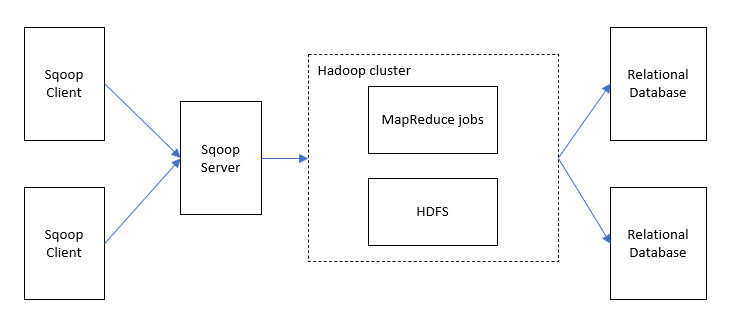

# Apache Sqoop Architecture and Components 

## Overview
[Apache Sqoop](https://sqoop.apache.org/) is a command line interface tool for transferring data between Apache Hadoop clusters and relational databases.

You can use this tool to import data from Relational Databases such as MySQL, PostgreSQL, Oracle, SQL Server to HDFS, or export HDFS data to Relational Databases. Sqoop can also use MapReduce and Apache Hive to convert data on Hadoop. In addition, Sqoop operates in parallel to achieve high-speed data transfer.

Advanced features include incremental loading, formatting converted using SQL, updating existing datasets, and more.

### **Version**

There are two series of Apache Sqoop, Sqoop1 and Sqoop2. They differ in usage, including the command line. Sqoop1 is a simple client tool, while Sqoop2 has an architecture in which the client and server work together.

#### **Sqoop1 architecture**

##### **Sqoop1 import/export concept**

- **import**  
  Reads data from Relational Databases and outputs data to HDFS. Each record in the Relational Databases table is output as a single row in HDFS. Text, SequenceFiles, and Avro are supported as the file formats output on HDFS. 

- **export**  
  Read the data on HDFS and transfer it to Relational Databases. The target Relational Databases support Insert or Update. 

#### **Sqoop2 architecture**

##### **Sqoop2 Server and Client concept**
- **Server**  
  Serve as an entry point for Sqoop clients 

- **Client**  
  Install it on the required node and interact with the Sqoop server. Since the client only needs to communicate with the server, there is no need to make settings such as MapReduce.
  

## Further Reading

[Challenges](challenges.md)

[Considerations](considerations.md)

[Migration Approach](migration-approach.md)

