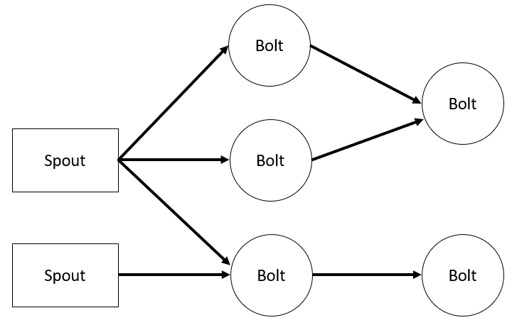
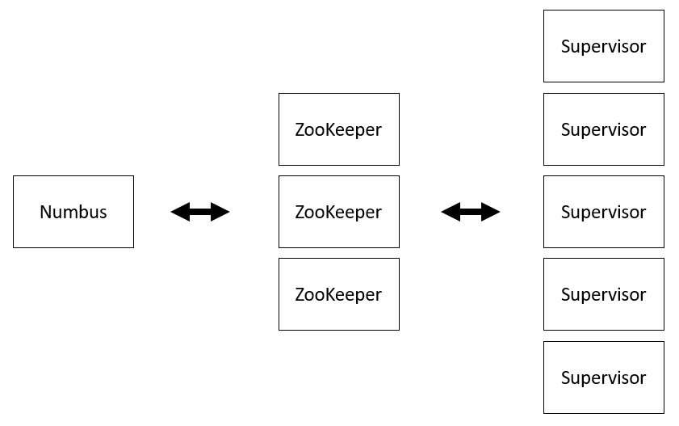

# Brief introduction to Apache Storm

## Overview
[Apache Storm](https://storm.apache.org/) is an open source distributed real-time computing system. Storm ensures that you can process streams of data in real time. Storm has use cases such as real-time analytics, online machine learning, and ETL. It's scalable, fault tolerant, and guarantees data processing.

### **Storm architecture and components**

#### Topology components of Storm

A storm topology consists of multiple components placed in a directed acyclic graph (DAG). Data flows between the components in the graph. Each component consumes one or more data streams and can optionally send one or more streams.
Spout components bring data into the topology. They emit one or more streams into the topology.
Bolt components consume streams emitted from spouts or other bolts. Bolts may optionally emit a stream to the topology. Bolts is also responsible for writing data to external services or storage such as HDFS, Kafka, HBase.

- **Topology** - A package of real-time application logic. Topology is a graph with Spout and Bolt connected.
- **Spout** - Bring data into the topology. Output one or more streams to this topology.
- **Bolt** - Use the stream output from the spout or other bolt. Bolt can output a stream to the topology as needed. It also writes data to external services or storage such as HDFS, Kafka, HBase.

#### Daemons

The daemon configuration for Storm clusters is similar to Hadoop clusters. There are two types of nodes in a Storm cluster, a master node and a worker node. The master node runs a daemon called "Nimbus", assigns tasks to the cluster, and monitors execution. This is similar to Hadoop's JobTracker. The worker node runs a daemon called "Supervisor". Executes a worker process based on the task assigned by Nimbus. ZooKeeper then makes the adjustments between Nimbus and Supervisor. Keep the status of Nimbus and Supervisor in ZooKeeper and monitor the status of the cluster. 

- **Nimbus** - It plays the role of a master node. Assign tasks to other nodes in the cluster and monitor their execution through Apache ZooKeeper. 
- **ZooKeeper** - It provides coordination to the cluster and assists in communication between the Nimbus and the supervisor processing of the worker node. 
- **Supervisor** - Listens for work assigned to its machine and starts and stops worker processes based on directives from Nimbus. Each worker process executes a subset of a topology. User’s application logic (Spouts and Bolt) run here. It can be restarted quickly and fails over quickly.

