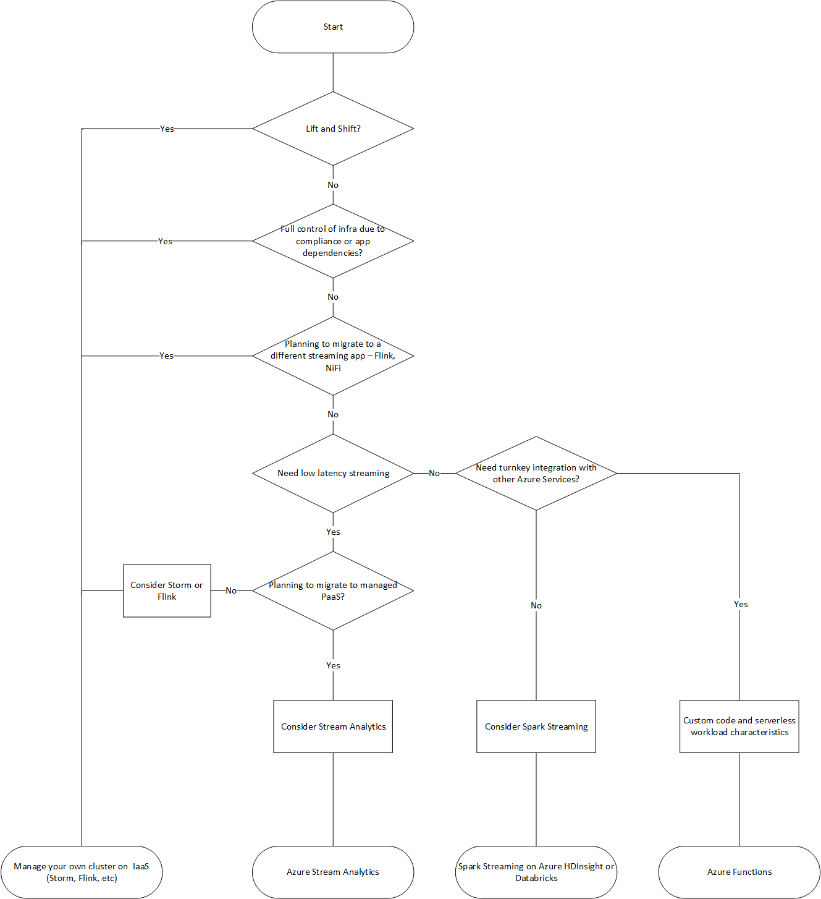

# Migration Approach

Azure has several landing targets for Apache Storm. Depending on requirements and product features, customers can choose between Azure IaaS, Azure HDInsight, Azure Stream Analytics or Azure Fuctions.

Landing Targets for Apache Storm on Azure



- [Lift and shift migration to Azure IaaS](#lift-and-shift-migration-to-azure-iaas)
- [Migration to Spark Streaming on Azure HDInsight or Azure Databricks](#migration-to-spark-streaming-on-azure-hdinsight-or-azure-databricks)
- [Migration to Azure Stream Analytics](#migration-to-azure-stream-analytics)
- [Migration to Azure Functions](#migration-to-azure-functions)

See [Azure Architecture Center](https://docs.microsoft.com/en-us/azure/architecture/data-guide/technology-choices/stream-processing) for a detailed comparison of stream processing technology in Azure. 

## Lift and shift migration to Azure IaaS  

### Planning

## Migration to Spark Streaming on Azure HDInsight or Azure Databricks

### Planning

### Migration

## Migration to Azure Stream Analytics

Azure Stream Analytics is a real-time analytics and complex event processing engine for large amounts of streaming data. Stream Analytics consists of inputs, queries, and outputs. With just a few clicks, you can connect to an input source for streaming data, enter a query, and connect to an output destination to create an end-to-end pipeline. Queries can easily filter, sort, aggregate, and join streaming data over a period of time using SQL-based queries. The SQL language can also be extended with JavaScript and C # user-defined functions (UDFs). 

When choosing Stream Analytics, also see [Cases where Stream Analytics is suitable and cases where other technologies are used](https://docs.microsoft.com/en-us/azure/stream-analytics/streaming-technologies). 


### Difference between Storm and Stream Analytics 

#### Storm Topology and Stream Analytics

|Storm Topoloby|Stream Analytics|
|--------------|----------------|
|Tuple|Event|
|Spout|Input|
|Bolt|Query, Output|


#### Connectors
The following is a comparison of Storm's typical connector and Stream Analytics Input / Output. 

Storm Spout and Stream Analytics Input
|Storm Spout|Stream Analytics Input|Description|
|--|--|--|
|Kafka|N/A|Can connect to Apache Kafka for Event Hubs.|
|HDFS|N/A|Stream Analytics cannot consume HDFS data directly. Configure the Blob Storage or Data Lake Storage Gen2 to contain the required data. |
|Azure Event Hub|Azure Event Hub||
|N/A|Azure IoT Hub||
|N/A|Azure Blob Storage||
|N/A|Azure Data Lake Storage Gen2||

Storm Bolt and Stream Analytics Output
|Storm Bolt|Stream Analytics Output|Description|
|--|--|--|
|Kafka|N/A|Can connect to Apache Kafka for Event Hubs.|
|HDFS|N/A|Stream Analytics cannot output data directly to HDFS. Design to output to Blob Storage or Data Lake Storage Gen2. Or output to HDFS with custom code via Azure Functions etc.|
|HBase|N/A|Can be output to HBase with custom code via Azure Functions.|
|Hive|N/A|Can be output to Hive table with custom code via Azure Functions. |
|Cassandra|N/A|Can be output to Cassandra with custom code via Azure Functions.|
|Solr|N/A|Can be output to Solr with custom code via Azure Functions.|
|MongoDB|N/A|Can be output to MongoDB with custom code via Azure Functions.|
|Elasticsearch|N/A|Can be output to Elasticsearch with custom code via Azure Functions.|
|N/A|Azure Data Lake Storage Gen1||
|N/A|Azure SQL Database||
|N/A|Azure Synapse Analytics||
|N/A|Azure Blob Storage||
|Azure Event Hubs|Azure Event Hubs||
|N/A|Power BI||
|N/A|Azure Table storage||
|N/A|Azure Service Bus queues||
|N/A|Azure Service Bus topics||
|N/A|Azure Cosmos DB||
|N/A|Azure Functions||

**Lookup table**

### Architecture

For more information on Apache Storm architecture and components, see [Storm architecture and components](./architecture-and-conponents). 

Stream Analytics is a PaaS type service, so users do not need to be aware of internal components or infrastructure. As shown in the figure below, it can be configured by arranging it for analysis and conversion processing in the pipeline of streaming data and defining Input / Query / Output. 


Image source : https://docs.microsoft.com/en-us/azure/stream-analytics/stream-analytics-introduction

Storm provides a fail-fast, fault-tolerant system with Numbus, ZooKeeper, and Supervisor configurations. Stream Analytics is a fully managed service that implements ingenuity to improve the fault tolerance of internal components. As a result, users can check their availability based on SLAs. See [SLA for Azure Stream Analytics](https://azure.microsoft.com/en-us/support/legal/sla/stream-analytics/v1_0/) for more information. 

### Event delivery guarantee 
#### Storm
The basic abstraction of Apache Storm provides At-least-once processing guarantee. This is the same guarantee as when using a queuing system. The message will only be played in the event of a failure. Exactly-once can be achieved with the higher abstraction Trident API.

#### Stream Analytics
Stream Analytics guarantees Exactly-once processing. And, depending on the output destination, it guarantees Exactly-once delivery or At-least-once delivery. Exactly-once delivery is guaranteed when you use the following as the output destination. This is because the Stream Analytics output adapter writes output events transactionally.

- Cosmos DB
- SQL
- Azure Table

From the above, you can see that when it comes to event handling and delivery assurance, migrating from Storm to Stream Analytics will provide the same or better level. However, please note that At-least-once tends to have better performance than Exactly-once.

詳細は[Event Delivery Guarantees](https://docs.microsoft.com/en-us/stream-analytics-query/event-delivery-guarantees-azure-stream-analytics)を参照してください。

### Real-time vs Micro-batch

Storm provides a model to handle each event. All records received are processed as soon as they arrive. Stream Analytics applications must wait momentarily to collect each micro-batch of an event before sending it for processing. In contrast, the real-time application used by Storm Core handles each event immediately. However, Stream Analytics has a streaming latency of less than a few seconds. The advantage of the microbatch approach is the streamlining of data processing and aggregation calculations.


Storm is based on real-time event processing and at-least-once processing. By using Trident, microbatch processing and exactly once processing can be guaranteed. Because you can use different levels of message processing on Storm, carefully review the business requirements for stream processing to determine what level of assurance you need.

### Distribition
#### Storm
Storm stream grouping defines how that stream should be partitioned among the bolt's tasks.
It is mainly used to determine how to distribute the processing for the purpose of improving performance. The following built-in Stream grouping is available for Storm.

- **Shuffle grouping** - Tuples are randomly distributed throughout the Bolt task. It is guaranteed that each Bolt will get the same number of tuples. 
- **Fields grouping** - It will be divided into groups according to the specified fields. 
- **Partial Key grouping** - Grouping by specified fields in the same way as Field grouping, but with load balancing between the two bolts to deal with data skew. 
- **All grouping** - The stream is replicated across all Bolt tasks.
- **Global grouping** - All tuples in the stream are routed to one task and the task with the lowest task ID value is selected. 
- **None grouping** - This grouping specifies that you don't care how the stream is grouped.
- **Direct grouping** - A stream grouped this way that the producer of the tuple decides which task of the consumer will receive this tuple.
- **Local or shuffle grouping** - If the target volt has more than one task in the same worker process, the tuple will be shuffled only to those in-process tasks.

#### Stream Analytics
Stream Analytics partitions the data into subsets and scales out the query. When a query is partitioned, it will be distributed across multiple nodes. As a result, the amount of events processed by each node may be reduced and performance may be improved.
The more input partitions you have, the more resources your job will consume. Optimize job performance by adjusting the number of streaming units and partitions described below. Partitioning is similar to Storm's Fields grouping. 

Below is an image of the input partitioning. If the input, such as Event Hubs, is partitioned by Partition ID, Stream Analytics recommends partitioning with this Partition Key.


If the input stream does not seem to be partitioned, Stream Analytics can subpartition or reshuffle the partitions. 

Example of subpartitioning the input partition 

```sql
WITH RepartitionedInput AS 
( 
SELECT * 
FROM input PARTITION BY DeviceID
)

SELECT DeviceID, AVG(Reading) as AvgNormalReading  
INTO output
FROM RepartitionedInput  
GROUP BY DeviceId, TumblingWindow(minute, 1)
```

### Performance consideration
Storm performance is basically improved by scaling up or out of hardware, tuning memory, adjusting the number of worker threads, etc., but Stream Analytics is done by adjusting the streaming unit (SU). SU is an abstraction unit of CPU and memory resources allocated to Stream Analytics. Stream Analytics can handle approximately 1MB/s of input per SU. Stream Analytics jobs do all the work in memory. If you run out of memory, the job will fail. Therefore, you need to ensure that enough resources are allocated for Stream Analytics jobs. 

#### SU sizing
Choosing the number of SUs required for a particular job depends on the partitioning configuration of the input and the queries defined in the job. In general, it is best practice to start with 6 SUs for queries that do not use PARTITION BY. After that, the SU usage rate is monitored by passing data equivalent to the actual flow amount, and as a result of trial and error, the appropriate optimum number is examined. Please refer to [Understand and ajust Streaming Units](https://docs.microsoft.com/en-us/azure/stream-analytics/stream-analytics-streaming-unit-consumption) for details of SU and how to set it. 
The maximum number of SUs that a Stream Analytics job can use depends on the number of query steps defined in the job and the number of partitions in each step. For more information on restrictions, see [this article](https://docs.microsoft.com/en-us/azure/stream-analytics/stream-analytics-parallelization#calculate-the-maximum-streaming-units-of-a-job). 

In general, the factors that increase the usage rate of SU are as follows.
- Jobs with complex query logic --This is because if the query is complex, it is more likely to keep the state in memory.
- Stateful query logic --Stateful processing such as window aggregation, joins, and analytic functions.
- Number of input partitions --The more input partitions, the more buffers you have and the more resources your job consumes.
- Reference data --Loaded into memory for fast retrieval of reference data. This will consume SU.
- Using UDFs --Adding UDFs loads the JavaScript runtime into memory. This will consume SU. 


#### Stream Analytics Cluster
A single-tenant environment for complex and demanding scenarios is provided as a Stream Analytics Cluster. Full scale in this environment can process faster than 200MB/s. If you need more processing power than the regular version of Stream Analytics as a result of sizing, consider using Stream Analytics Cluster. Stream Analytics Cluster can also use Private Endpoint to connect to a Private virtual network.
For more information on Stream Anlytics Cluster, see [Overview of Azure Stream Analytics Cluster](https://docs.microsoft.com/en-us/azure/stream-analytics/cluster-overview). 

### Language
Storm applications are developed in Java etc. Stream Analytics uses SQL-based queries to describe the process.
For more information on Stream Analytics query language, see [this Reference here](https://docs.microsoft.com/en-us/stream-analytics-query/stream-analytics-query-language-reference).
You can also increase flexibility through custom functions that are called in your query. Custom functions can be written in JavaScript or C #. See [User-defined functions in Azure Stream Analytics](https://docs.microsoft.com/en-us/azure/stream-analytics/functions-overview) for more information on UDF / UDA. 

### Windowing
Storm CoreとStream AnalyticsのWindowingに関する違いをいかに示します。Storm CoreがサポートしているSliding windowingおよびTumbling Windowingに該当する機能はStream Analyticsでサポートされていますので、事前テストの上これらを移行することができます。また、Stream Analyticsはその他のWindowingもサポートしているため要求事項に応じてそれらの利用も検討してください。
Here's how the difference between Storm Core and Stream Analytics in Windowing. The features that Storm Core supports for Sliding windowing and Tumbling Windowing are supported by Stream Analytics, so you can migrate them after pre-testing. Stream Analytics also supports other windows, so consider using them as required.

|Storm Core|Stream Analytics|Description|
|----------|----------------|-----------|
|Sliding|Hopping|Storm's Sliding Windowing is equivalent to Stream Analytics' Hopping Windowing. Set the window length and interval, and the set window-based processing starts at each interval. Events can belong to multiple Sliding Window.|
|Tumbling|Tumbling|The stream is divided into the set time segments and the process is executed. There are no duplicate windows.|
|N/A|Sliding|Stream Analytics Sliding Windowing behaves differently than Storm's. Stream Analytics Sliding Windowing works depending on the occurrence of the event. Processes events between the time the event occurred and the specified time ago.|
|N/A|Session|If the event continues to occur within the specified timeout period, the session window will continue to grow until the maximum period is reached. The maximum period check interval is set to the same size as the specified maximum period. If no event occurs within the timeout period, the window will be closed at the timeout.|
|N/A|Snapshot|Snapshot | Events with the same timestamp are grouped together. You can apply a snapshot window by adding System.Timestamp() to the GROUP BY clause.|

### Disaster Recovery
If you have Disaster Recovery configured in Storm, you may want to configure Disaster Recovery as well when migrating to Stream Analytics. Stream Analytics does not provide automatic geo-failover, but it can be achieved by deploying the same Stream Analytics job in multiple Azure regions and configuring Input and Output. The application that generates the event can ensure data redundancy by sending data to both regions.
See [Achieve geo-redundancy for Azure Stream Analytics jobs](https://docs.microsoft.com/en-us/azure/stream-analytics/geo-redundancy) for more information.

### Security

Data security is a shared responsibility of the customer and the service provider. For on-premises solutions, customers have to provide everything from endpoint protection to physical hardware security, which is not an easy task. If you choose a PaaS cloud service provider, customer involvement will be significantly reduced. For Microsoft's security shared responsibility model, see [Security Baselines](https://docs.microsoft.com/ja-jp/security/benchmark/azure/baselines/stream-analytics-security-baseline?toc=/azure/stream-analytics/TOC.json) for Cloud Computing. Stream Analytics runs on the Azure platform, so it can be enhanced in a different way than Storm. Stream Analytics does not require any additional components to be installed for security. We recommend that you consider migrating your stream processing system security implementation using the following checklist :

||Storm|Stream Analytics|
|---|---|---|
|Network Security|Control traffic using security functions such as network devices.|Stream Analytics jobs establish outbound connections to I/O resources, process data in real time, and produce results. The Stream Analytics service runs from networks that normally cannot be included directly in network rules. When using Stram Analytics Cluster, you can use Private Endpoint to create Stream Analytics endpoints within a customer-defined virtual network to communicate with private addresses. See [Connect Stream Analytics jobs to resources in an Azure Virtual Network (VNet)](https://docs.microsoft.com/en-us/azure/stream-analytics/connect-job-to-vnet) for more information.|
|Identity and Access Control|Storm offers pluggable authentication support through thrift and SASL. It also has an authorization mechanism for access control for jobs.|Authenticate with Azure AD and control access using RBAC.|
|Data Protection|Storm itself does not have encryption capabilities.|Stream Analytics holds query definitions, user-defined custom functions, checkpoint data, reference data snapshots, and input and output connection information. Stream Analytics has [Data encryption function](https://docs.microsoft.com/en-us/azure/stream-analytics/data-protection) to protect the security of data.|
|Regulatory Compliance controls|You can set policies using security components such as Apache Ranger.|Regulatory compliance in Azure Policy provides an initiative definition created and managed by Microsoft called "embedded" for compliance domains and security controls associated with various compliance standards. Please refer to [this document](https://docs.microsoft.com/en-us/azure/stream-analytics/security-controls-policy) for details.|
|Data Recovery|There is no backup feature. You need to implement data backup yourself.|Stream Analytics allows you to [copy or back up](https://docs.microsoft.com/en-us/azure/stream-analytics/copy-job) a job.|


## Migration

### Asssessment
Before migrating your existing Storm to Stream Analytics, collect the following information: These will help you plan your actual migration.

|Item|Description|
|---|---|
|Stream jobs|Identify all streaming jobs running on Storm. You can see the currently running jobs on the Storm UI. Also make sure to identify jobs that are not running from your inventory, code repository, etc. |
|Source and Sink in Topology|Identify all the data sources and Sinks in the Topology of each Storm streaming job. And ensure that you can remap the data sources and Sink migration destinations and services that you migrate with when you migrate Storm to Stream Analytics. In other words, it maps to the Input and Output supported by Stream Analytics listed in [Connectors](#connectors). If this is not possible, consider other migration targets instead of Stream Analytics.|
|Applications that sends data to Source|Identify the application that sends the data to Storm's Source. Migrating the Storm Source to the Stream Analytics Input needs to be done as a set, so that migration should also be planned.|
|Applications that use Sink data|Identify applications that utilize Storm's Sink data. Migrating Storm's Sink to Stream Analytics Output needs to be done as a set, so that migration should also be planned.|
|Processing logic|Identify all the processing logic in the Topology of each Storm streaming job. |
|Current sizing|Get information about the CPU, Memory, Disk, number of nodes, etc. of the host or virtual machine on which the Sqoop client or server is running. This allows you to estimate the base size required for your Azure virtual machine.|
|HA, BC and DR|If you have some kind of troubleshooting measures for running Storm, you need to check whether it will be realized on Azure. For example, if you have a disaster recovery configuration on two separated data centers, you need to consider [geo-redundancy deployment](https://docs.microsoft.com/en-us/azure/stream-analytics/geo-redundancy).|

### Planning

For successful migration, it is important to understand the characteristics of the business that uses the Stream processing and decide how to do it. Select offline migration if you can completely shut down the system, perform migration, and restart the system at the destination. Also, if your system is always busy and you can't afford a long outage, consider migrating online.

Also, if you don't want to migrate all your dependent applications to Azure, they need to be able to communicate between on-premises and Azure. Design by selecting the connection method from communication via the Internet using Public endpoints, VPN connection via the Internet, closed network connection using ExpressRoute, etc. according to the policy and requirements of the corporate network. 

### Migration
Migrating Storm to Stream Analytics is highly dependent on the surrounding systems to which it connects. Migrating Storm's Source and Sink to Azure services must be done as a set. And that involves changing the application that sends the data to the Source system and the application that uses the data stored in Sink. Consider preparing, migrating, and switching in the following flow.

#### Preparation and migration
1. Prepare to send data to [Stream Analytics Input](#connectors) in the applications that are the source of data using the test environment.
2. Use the test environment to prepare the applications that use the data of Sink of the data to connect to [Output of Stream Analytics](#connectors) and run the service.
3. Deploy and set up Input and Output resources and Stream Analytics in Azure.
4. Set Input and Output, and migrate Storm Topologies to Stream Analytics jobs.
5. Use the test environment to send data from the application to test a series of streaming processes.
6. Adjust configurations and applications to ensure that the sequence of processes works without problems in terms of business and system requirements. 

#### Switching system
1. Launch a migrated Stream Analytics job
2. Connect the applications that use the data of Sink in the production environment to [Output of Stream Analytics](#connectors) and switch them to be able to work.
3. Switch the applications that are the source of the production environment so that they can be sent to [Input of Stream Analytics](#connectors).
4. Monitor how it works. 

If possible, plan to run Storm and Stream Analytics in parallel by sending data from the applications that are the source of the data to the existing one and then to Azure at the same time. This allows you to quickly switch back to a working Storm if something goes wrong, making your migration safer. If you haven't had any problems running your Stream Analytics for a while, you can remove a set of hardware related to Storm.

#### Job migration examples

Stream Analytics Input and Output can be easily connected with a turnkey, so no code is required for the connection as described in Storm's Spout or Bolt. Here is a brief sample of the differences with some data transformations. Java is used for Storm's code samples here, and these sample codes are based on those described in [Storm's official documentation](https://storm.apache.org/releases/2.2.0/Stream-API.html). 

##### Simple filter

Storm

```java
Stream<String> errors = logs.filter(line -> line.contains("ERROR"));
```

Stream Analytics

```sql
SELECT * INTO erroroutput FROM input WHERE status = "ERROR"
```

##### Map

Storm

```java
Stream<Integer> wordLengths = words.map(String::length);
```

Stream Analytics

Select the function according to the processing used by Storm. Here is an example of using the `LEN` function. 

```sql
SELECT LEN (word) INTO lengthoutput FROM input
```

##### Aggregation

Storm

```java
// aggregate the numbers and produce a stream of last 10 sec sums.
Stream<Long> sums = numbers.window(TumblingWindows.of(Duration.seconds(10)).aggregate(new Sum());

// the last 10 sec sums computed using reduce
Stream<Long> sums = numbers.window(...).reduce((x, y) -> x + y);
```

Stream Analytics

```sql
SELECT SUM (number) INTO numberoutput
FROM input TIMESTAMP BY EntryTime  
GROUP BY TumblingWindow(seconds,10)  
```

## Migration to Azure Functions

### Planning

### Migration
