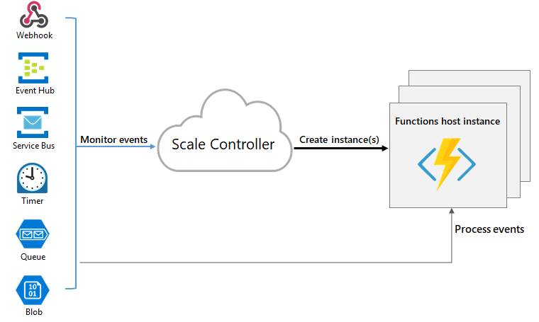

# Migration Approach

Azure has several landing targets for Apache Storm. Depending on requirements and product features, customers can choose between Azure IaaS, Azure HDInsight, Azure Stream Analytics or Azure Fuctions.

Landing Targets for Apache Storm on Azure


- [Lift and shift migration to Azure IaaS](#lift-and-shift-migration-to-azure-iaas)
- [Migration to Spark Streaming on Azure HDInsight or Azure Databricks](#migration-to-spark-streaming-on-azure-hdinsight-or-azure-databricks)
- [Migration to Azure Stream Analytics](#migration-to-azure-stream-analytics)
- [Migration to Azure Functions](#migration-to-azure-functions)

See [Azure Architecture Center](https://docs.microsoft.com/en-us/azure/architecture/data-guide/technology-choices/stream-processing) for a detailed comparison of stream processing technology in Azure. 

## Lift and shift migration to Azure IaaS  

### Planning

### Migration

#### Prerequisites

- Create and deploy a cluster on Azure IaaS

- An SSH client.

#### Create the topology
Connect to your Storm cluster. Edit the command below by replacing CLUSTERNAME with the name of your Storm cluster, and then enter the command:

ssh sshuser@CLUSTERNAME-ssh.clusterdomian.net

The WordCount example is included on your HDInsight cluster at /usr/hdp/current/storm-client/contrib/storm-starter/. The topology generates random sentences and counts how many times words occur. Use the following command to start the wordcount topology on the cluster:

storm jar /usr/hdp/current/storm-client/contrib/storm-starter/storm-starter-topologies-*.jar org.apache.storm.starter.WordCountTopology wordcount

#### Monitor the Topology

Storm provides a web interface for working with running topologies, and is included on your HDInsight cluster.

Use the following steps to monitor the topology using the Storm UI:

1. To display the Storm UI, open a web browser to https://CLUSTERNAME.azurehdinsight.net/stormui. Replace CLUSTERNAME with the name of your cluster.

2. Under Topology Summary, select the wordcount entry in the Name column. Information about the topology is displayed.


The new page provides the following information:

Property	Description
Topology stats	Basic information on the topology performance, organized into time windows. Selecting a specific time window changes the time window for information displayed in other sections of the page.
Spouts	Basic information about spouts, including the last error returned by each spout.
Bolts	Basic information about bolts.
Topology configuration	Detailed information about the topology configuration.
Activate	Resumes processing of a deactivated topology.
Deactivate	Pauses a running topology.
Rebalance	Adjusts the parallelism of the topology. You should rebalance running topologies after you have changed the number of nodes in the cluster. Rebalancing adjusts parallelism to compensate for the increased/decreased number of nodes in the cluster. For more information, see Understanding the parallelism of an Apache Storm topology.
Kill	Terminates a Storm topology after the specified timeout.

[Migration Storm to IaaS](https://docs.microsoft.com/en-us/azure/hdinsight/storm/apache-storm-quickstart)

## Migration to Spark Streaming on Azure HDInsight or Azure Databricks

Spark provides primitives for in-memory cluster computing. A Spark job can load and cache data into memory and query it repeatedly. In-memory computing is much faster than disk-based applications, such as Hadoop, which shares data through Hadoop distributed file system (HDFS). Spark also integrates into the Scala programming language to let you manipulate distributed data sets like local collections. There's no need to structure everything as map and reduce operations.


### Migration From Storm to Spark

To migrate your application from Storm to one of the Spark streaming APIs, do the following:

1. Deploy a new cluster. Deploy a new Spark cluster in the same virtual network and deploy your Spark Streaming or Spark Structured Streaming application on it and test it thoroughly.


2. Stop consuming on the old Storm cluster. In the existing Storm, stop consuming data from the streaming data source and wait it for the data to finish writing to the target sink.


3. Start consuming on the new Spark cluster. Start streaming data from a newly deployed HDInsight 4.0 Spark cluster. At this time, the process is taken over by consuming from the latest Kafka offset.


4. Remove the old cluster as needed. Once the switch is complete and working properly, Storm cluster as needed.


See reference documentation: [Migration Storm to Spark](https://docs.microsoft.com/en-us/azure/hdinsight/storm/migrate-storm-to-spark)

### Migration From Spark to Databricks

This section provides the steps for moving your production jobs to Azure Databricks.

1. Create an autoscaling pool. This is equivalent to creating an autoscaling cluster in other Spark platforms. On other platforms, if instances in the autoscaling cluster are idle for a few minutes or hours, you pay for them. Azure Databricks manages the instance pool for you for free. That is, you don’t pay Azure Databricks if these machines are not in use; you pay only the cloud provider. Azure Databricks charges only when jobs are run on the instances.


Key configurations:

- **Min Idle:** Number of standby instances, not in use by jobs, that the pool maintains. You can set this to 0.
- **Max Capacity:** This is an optional field. If you already have cloud provider instance limits set, you can leave this field empty. If you want to set additional max limits, set a high value so that a large number of jobs can share the pool.
- **Idle Instance Auto Termination:** The instances over Min Idle are released back to the cloud provider if they are idle for the specified period. The higher the value, the more the instances are kept ready and thereby your jobs will start faster.

2. Run a job on a pool

You can run a job on a pool using the Jobs API or the UI. You must run each job by providing a cluster spec. When a job is about to start, Azure Databricks automatically creates a new cluster from the pool. The cluster is automatically terminated when the job finishes. You are charged exactly for the amount of time your job was run. This is the most cost-effective way to run jobs on Azure Databricks. Each new cluster has:

- One associated SparkContext, which is equivalent to a Spark application on other Spark platforms.
- A driver node and a specified number of workers. For a single job, you can specify a worker range. Azure Databricks autoscales a single Spark job based on the resources needed for that job. Azure Databricks benchmarks show that this can save you up to 30% on cloud costs, depending on the nature of your job.

There are three ways to run jobs on a pool: API/CLI, Airflow, UI.

### API / CLI

1. Download and configure the Databricks CLI.

2. Run the following command to submit your code one time. The API returns a URL that you can use to track the progress of the job run.

```Bash
databricks runs submit --json

{
  "run_name": "my spark job",
  "new_cluster": {
    "spark_version": "7.3.x-scala2.12",

    "instance_pool_id": "0313-121005-test123-pool-ABCD1234",
    "num_workers": 10
    },
    "libraries": [
    {
    "jar": "dbfs:/my-jar.jar"
    }

    ],
    "timeout_seconds": 3600,
    "spark_jar_task": {
    "main_class_name": "com.databricks.ComputeModels"
  }
}
```
3. To schedule a job, use the following example. Jobs created through this mechanism are displayed in the jobs list page. The return value is a job_id that you can use to look at the status of all the runs.

```Bash
databricks jobs create --json

{
  "name": "Nightly model training",
  "new_cluster": {
     "spark_version": "7.3.x-scala2.12",
     ...
     "instance_pool_id": "0313-121005-test123-pool-ABCD1234",
     "num_workers": 10
   },
   "libraries": [
     {
     "jar": "dbfs:/my-jar.jar"
     }
   ],
   "email_notifications": {
     "on_start": ["john@foo.com"],
     "on_success": ["sally@foo.com"],
     "on_failure": ["bob@foo.com"]
   },
   "timeout_seconds": 3600,
   "max_retries": 2,
   "schedule": {
   "quartz_cron_expression": "0 15 22 ? \* \*",
   "timezone_id": "America/Los_Angeles"
   },
   "spark_jar_task": {
     "main_class_name": "com.databricks.ComputeModels"
  }
}
```
If you use spark-submit to submit Spark jobs, the following table shows how spark-submit parameters map to different arguments in the Jobs Create API.

### Airflow
Azure Databricks offers an Airflow operator if you want to use Airflow to submit jobs in Azure Databricks. The Databricks Airflow operator calls the Jobs Run API to submit jobs to Azure Databricks. [See Apache Airflow](https://docs.microsoft.com/en-us/azure/databricks/dev-tools/data-pipelines#airflow).

### UI
Azure Databricks provides a simple and intuitive easy-to-use UI to submit and schedule jobs. To create and submit jobs from the UI, follow the [step-by-step guide](https://docs.microsoft.com/en-us/azure/databricks/jobs#job-create).


3. Troubleshoot jobs
Azure Databricks provides lots of tools to help you troubleshoot your jobs.

#### Access logs and Spark UI
Azure Databricks maintains a fully managed Spark history server to allow you to access all the Spark logs and Spark UI for each job run. They can be accessed from the job details page as well as the job run page:


#### Forward logs
You can also forward cluster logs to your cloud storage location. To send logs to your location of choice, use the cluster_log_conf parameter in the NewCluster spec.


#### View metrics
While the job is running, you can go to the cluster page and look at the live Ganglia metrics in the Metrics tab. Azure Databricks also snapshots these metrics every 15 minutes and stores them, so you can look at these metrics even after your job is completed. To send metrics to your metrics server, you can install custom agents in the cluster. See [Monitor performance](https://docs.microsoft.com/en-us/azure/databricks/clusters/clusters-manage#cluster-performance).


See reference documentation: [Migration Spark to Databricks](https://docs.microsoft.com/en-us/azure/databricks/migration/production)

## Migration to Azure Stream Analytics

Azure Stream Analytics is a real-time analytics and complex event processing engine for large amounts of streaming data. Stream Analytics consists of inputs, queries, and outputs. With just a few clicks, you can connect to an input source for streaming data, enter a query, and connect to an output destination to create an end-to-end pipeline. Queries can easily filter, sort, aggregate, and join streaming data over a period of time using SQL-based queries. The SQL language can also be extended with JavaScript and C # user-defined functions (UDFs). 

When choosing Stream Analytics, also see [Cases where Stream Analytics is suitable and cases where other technologies are used](https://docs.microsoft.com/en-us/azure/stream-analytics/streaming-technologies). 


### Difference between Storm and Stream Analytics 

#### Storm Topology and Stream Analytics

|Storm Topoloby|Stream Analytics|
|--------------|----------------|
|Tuple|Event|
|Spout|Input|
|Bolt|Query, Output|


#### Connectors
Following tables describe correspondences between Storm Spout / Bolt, which are its typical connectors, 
and Stream Analytics’ input sources / output destinations.

Storm Spout and Stream Analytics Input
|Storm Spout|Stream Analytics Input|Description|
|--|--|--|
|Kafka|N/A|You can use an endpoint of Azure Event Hubs compatible with the Apache Kafka.|
|HDFS|N/A|You need to configure Blob Storage or Data Lake Storage Gen2 instead because Stream Analytics cannot
deal with HDFS directly.|
|Azure Event Hub|Azure Event Hub||
|N/A|Azure IoT Hub||
|N/A|Azure Blob Storage||
|N/A|Azure Data Lake Storage Gen2||

Storm Bolt and Stream Analytics Output
|Storm Bolt|Stream Analytics Output|Description|
|--|--|--|
|Kafka|N/A|Can connect to Apache Kafka for Event Hubs.|
|HDFS|N/A|Stream Analytics cannot output data directly to HDFS. Design to output to Blob Storage or Data Lake Storage Gen2. Or output to HDFS with custom code via Azure Functions etc.|
|HBase|N/A|Stream Analytics can output data to HBase indirectly via Azure Functions writing a custom code.|
|Hive|N/A|Stream Analytics can output data to Hive table indirectly via Azure Functions writing a custom code.|
|Cassandra|N/A|Stream Analytics can output data to Cassandra indirectly via Azure Functions writing a custom code.|
|Solr|N/A|Stream Analytics can output data to Solr indirectly via Azure Functions writing a custom code.|
|MongoDB|N/A|Stream Analytics can output data to MongoDB indirectly via Azure Functions writing a custom code.|
|Elasticsearch|N/A|Stream Analytics can output data to Elasticsearch indirectly via Azure Functions writing a custom code.|
|N/A|Azure Data Lake Storage Gen1||
|N/A|Azure SQL Database||
|N/A|Azure Synapse Analytics||
|N/A|Azure Blob Storage||
|Azure Event Hubs|Azure Event Hubs||
|N/A|Power BI||
|N/A|Azure Table storage||
|N/A|Azure Service Bus queues||
|N/A|Azure Service Bus topics||
|N/A|Azure Cosmos DB||
|N/A|Azure Functions||

#### Lookup table

If you migrate existing Storm with Topology which references external table(s) using phrases specifically joins,  filters, etc. to Stream Analytics, you will also need to migrate the external table(s) into SQL Database, which can be referenced from Stream Analytics.

A sample query in a Stream Analytics job that references an external table is as follows.

```sql
With Step1 as (
    --JOIN input stream with reference data to get 'Desc'
    SELECT streamInput.*, refData1.Desc as Desc
    FROM    streamInput
    JOIN    refData1 ON refData1.key = streamInput.key 
)
--Now Join Step1 with second reference data
SELECT *
INTO    output 
FROM    Step1
JOIN    refData2 ON refData2.Desc = Step1.Desc
```

See [Using reference data for lookups in Stream Analytics](https://docs.microsoft.com/en-us/azure/stream-analytics/stream-analytics-use-reference-data) for more information. 


#### Architecture

For more information on Apache Storm architecture and components, see [Storm architecture and components](./architecture-and-conponents). 

Stream Analytics is a PaaS type service, so users do not need to be aware of internal components or infrastructure. As shown in the figure below, you can configure it by defining Input / Query / Output and arranging the streaming data in its pipelines for data transformation and analytics. 


Image source : https://docs.microsoft.com/en-us/azure/stream-analytics/stream-analytics-introduction

Storm provides a fail-fast, fault-tolerant system with Numbus, ZooKeeper, and Supervisor configurations. In contrast, Stream Analytics is a fully managed service that implements ingenuity to improve the fault tolerance of internal components. Therefore, users can check their availability based on SLAs. See [SLA for Azure Stream Analytics](https://azure.microsoft.com/en-us/support/legal/sla/stream-analytics/v1_0/) for more information. 

#### Event delivery guarantee 
##### Storm
The basic abstraction of Apache Storm provides at-least-once processing guarantee. This is the same guarantee as when using a queuing system. The message will only be replayed in the event of a failure. exactly-once can be achieved with the higher abstraction of Trident API.

##### Stream Analytics
Stream Analytics can guarantees exactly-once or at-least-once processing, depending on the output destination, exactly-once delivery is guaranteed when you use the following as the output destination. This is because the Stream Analytics output adapter writes output events transactionally.

- Cosmos DB
- SQL
- Azure Table

From the above, you can see that when it comes to event handling and delivery assurance, migrating from Storm to Stream Analytics can provide the same or better level. However, please note that at-least-once demonstrates better performance than exactly-once in typical cases.

See [Event Delivery Guarantees](https://docs.microsoft.com/en-us/stream-analytics-query/event-delivery-guarantees-azure-stream-analytics) for more information. 

#### Real-time vs Micro-batch

Storm provides a model to handle each event. All records received are processed as soon as they arrive. Stream Analytics applications must wait momentarily to collect each micro-batch of an event before sending it for processing. In contrast, the real-time application used by Storm Core handles each event immediately. However, Stream Analytics has a streaming latency of less than a few seconds. The advantage of the microbatch approach is the streamlining of data processing and aggregation calculations.


Storm is based on real-time event processing and at-least-once processing. As mentioned, by using Trident, microbatch processing and exactly-once processing can be guaranteed. Because you can use different levels of message processing on Storm, carefully review the business requirements for stream processing to determine what level of assurance you need.

#### Distribition
##### Storm
Storm stream grouping defines how that stream should be partitioned among the bolt's tasks.
It is mainly used to determine how to distribute the processing for the purpose of improving performance. The following built-in Stream grouping is available for Storm.

- **Shuffle grouping** - Tuples are randomly distributed throughout the Bolt task. It is guaranteed that each Bolt will get the same number of tuples. 
- **Fields grouping** - It will be divided into groups according to the specified fields. 
- **Partial Key grouping** - Grouping by specified fields in the same way as Field grouping, but with load balancing between the two bolts to deal with data skew. 
- **All grouping** - The stream is replicated across all Bolt tasks.
- **Global grouping** - All tuples in the stream are routed to one task and the task with the lowest task ID value is selected. 
- **None grouping** - This grouping specifies that you don't care how the stream is grouped.
- **Direct grouping** - A stream grouped this way that the producer of the tuple decides which task of the consumer will receive this tuple.
- **Local or shuffle grouping** - If the target volt has more than one task in the same worker process, the tuple will be shuffled only to those in-process tasks.

##### Stream Analytics
Stream Analytics partitions the data into subsets to scale out query processing like Storm’s Fields grouping. Queries are distributed across multiple nodes so that the amount of events processed on each node may be reduced, therefore the total performance may be improved.
The more input partitions you have, the more computation resources your job will consume. Optimize job performance by adjusting the number of streaming units and partitions described below. Partitioning is similar to Storm's Fields grouping. 

Below is an image of the input partitioning. If the input, such as Event Hubs, is partitioned by Partition ID, Stream Analytics recommends partitioning with this Partition Key.


When no partitions are available in the input stream, Stream Analytics can make the stream partitioned and/or shuffle them again, using repartitioning/reshuffling functionalities.

Example query of subpartitioning the input partition 

```sql
WITH RepartitionedInput AS 
( 
SELECT * 
FROM input PARTITION BY DeviceID
)

SELECT DeviceID, AVG(Reading) as AvgNormalReading  
INTO output
FROM RepartitionedInput  
GROUP BY DeviceId, TumblingWindow(minute, 1)
```

#### Performance consideration
There are various ways to improve performance on Storm, specifically scaling up/out, tuning memory usage, adjusting the number of worker threads, etc. Onthe other hand, Stream Analytics provides simply a single way, adjusting the allocation of streaming unit (SU), which is an abstracted unit of a pair of CPU and memory. Stream Analytics can handle approximately 1MB/s of input per SU. Stream Analytics jobs do all the work in memory. If you run out of memory, the job will fail. To avoid the failure, you need to ensure that enough resources are allocated for Stream Analytics jobs. 

**SU sizing**
Choosing the number of SUs required for a particular job depends on the partitioning configuration of the input and the queries defined in the job. In general, it is best practice to start with 6 SUs for queries that do not use PARTITION BY. And then, it is the best way for you to examine the optimum number of SUs step-by-step seeing monitored SU usage rate with the actual data flow. Please refer to [Understand and ajust Streaming Units](https://docs.microsoft.com/en-us/azure/stream-analytics/stream-analytics-streaming-unit-consumption) for details of SU and how to set it. 
The maximum number of SUs depend on both the number of query steps defined in the job and the number of partitions in each step. For more information on restrictions, see [this article](https://docs.microsoft.com/en-us/azure/stream-analytics/stream-analytics-parallelization#calculate-the-maximum-streaming-units-of-a-job). 

In general, the factors that increase the usage rate of SU are as follows.
- Jobs with complex query logic --This is because if the query is complex, it is more likely to keep the state in memory.
- Stateful query logic --Stateful processing such as window aggregation, joins, and analytic functions.
- Number of input partitions --The more input partitions, the more buffers you have and the more resources your job consumes.
- Reference data --Loaded into memory for fast retrieval of reference data. This will consume SU.
- Using UDFs --Adding UDFs loads the JavaScript runtime into memory. This will consume SU. 


**Stream Analytics Cluster**
A single-tenant environment for complex and demanding scenarios is provided as a Stream Analytics Cluster. Fully scaled cluster environment can process data no less than 200MB/s. If you need more processing power than the regular version of Stream Analytics as a result of sizing, consider using Stream Analytics Cluster. Stream Analytics Cluster can also use Private Endpoint to connect to a Private virtual network.
For more information on Stream Anlytics Cluster, see [Overview of Azure Stream Analytics Cluster](https://docs.microsoft.com/en-us/azure/stream-analytics/cluster-overview). 

#### Language
Storm applications are developed in Java etc. Stream Analytics uses SQL-based queries to describe the process.
For more information on Stream Analytics query language, see [this Reference here](https://docs.microsoft.com/en-us/stream-analytics-query/stream-analytics-query-language-reference).
You can also increase flexibility through custom functions that are called in your query. Custom functions can be written in JavaScript or C #. See [User-defined functions in Azure Stream Analytics](https://docs.microsoft.com/en-us/azure/stream-analytics/functions-overview) for more information on UDF / UDA. 

#### Windowing

Here's how the difference between Storm Core and Stream Analytics in Windowing. The features that Storm Core supports for Sliding windowing and Tumbling Windowing are supported by Stream Analytics, so you can migrate them after pre-testing. Stream Analytics also supports other windows, so consider using them as required.

|Storm Core|Stream Analytics|Description|
|----------|----------------|-----------|
|Sliding|Hopping|Storm's Sliding Windowing is equivalent to Stream Analytics' Hopping Windowing. Set the window length and interval, and the set window-based processing starts at each interval. Events can belong to multiple Sliding Window.|
|Tumbling|Tumbling|The stream is divided into the set time segments and the process is executed. There are no duplicate windows.|
|N/A|Sliding|Stream Analytics Sliding Windowing behaves differently than Storm's. Stream Analytics Sliding Windowing works depending on the occurrence of the event. Processes events between the time the event occurred and the specified time ago.|
|N/A|Session|If the event continues to occur within the specified timeout period, the session window will continue to grow until the maximum period is reached. The maximum period check interval is set to the same size as the specified maximum period. If no event occurs within the timeout period, the window will be closed at the timeout.|
|N/A|Snapshot|Snapshot | Events with the same timestamp are grouped together. You can apply a snapshot window by adding System.Timestamp() to the GROUP BY clause.|

#### Disaster Recovery
If you have Disaster Recovery configured in Storm, you may want to configure Disaster Recovery as well when migrating to Stream Analytics. Stream Analytics does not provide automatic geo-failover, but it can be achieved by deploying the same Stream Analytics job in multiple Azure regions and configuring Input and Output. The application that generates the event can ensure data redundancy by sending data to both regions.
See [Achieve geo-redundancy for Azure Stream Analytics jobs](https://docs.microsoft.com/en-us/azure/stream-analytics/geo-redundancy) for more information.

#### Security

Data security is a shared responsibility of the customer and the service provider. For on-premises solutions, customers have to provide everything from endpoint protection to physical hardware security, which is not an easy task. If you choose a PaaS cloud service provider, customer involvement will be significantly reduced. For Microsoft's security shared responsibility model, see [Security Baselines](https://docs.microsoft.com/ja-jp/security/benchmark/azure/baselines/stream-analytics-security-baseline?toc=/azure/stream-analytics/TOC.json) for Cloud Computing. Stream Analytics runs on the Azure platform, so it can be enhanced in a different way than Storm. Stream Analytics does not require any additional components to be installed for security. We recommend that you consider migrating your stream processing system security implementation using the following checklist :

||Storm|Stream Analytics|
|---|---|---|
|Network Security|Control traffic using security functions such as network devices.|Stream Analytics jobs establish outbound connections to I/O resources, process data in real time, and produce results. The Stream Analytics service runs from networks that normally cannot be included directly in network rules. When using Stram Analytics Cluster, you can use Private Endpoint to create Stream Analytics endpoints within a customer-defined virtual network to communicate with private addresses. See [Connect Stream Analytics jobs to resources in an Azure Virtual Network (VNet)](https://docs.microsoft.com/en-us/azure/stream-analytics/connect-job-to-vnet) for more information.|
|Identity and Access Control|Storm offers pluggable authentication support through thrift and SASL. It also has an authorization mechanism for access control for jobs.|Authenticate with Azure AD and control access using RBAC.|
|Data Protection|Storm itself does not have encryption capabilities.|Stream Analytics holds query definitions, user-defined custom functions, checkpoint data, reference data snapshots, and input and output connection information. Stream Analytics has [Data encryption function](https://docs.microsoft.com/en-us/azure/stream-analytics/data-protection) to protect the security of data.|
|Regulatory Compliance controls|You can set policies using security components such as Apache Ranger.|Regulatory compliance in Azure Policy provides an initiative definition created and managed by Microsoft called "embedded" for compliance domains and security controls associated with various compliance standards. Please refer to [this document](https://docs.microsoft.com/en-us/azure/stream-analytics/security-controls-policy) for details.|
|Data Recovery|There is no backup feature. You need to implement data backup yourself.|Stream Analytics allows you to [copy or back up](https://docs.microsoft.com/en-us/azure/stream-analytics/copy-job) a job.|


### Migration

#### Asssessment
Before migrating your existing Storm to Stream Analytics, collect the following information: These will help you plan your actual migration.

|Item|Description|
|---|---|
|Stream jobs|Identify all streaming jobs running on Storm. You can see the currently running jobs on the Storm UI. Also make sure to identify jobs that are not running from your inventory, code repository, etc. |
|Source and Sink in Topology|Identify all the data sources and Sinks in the Topology of each Storm streaming job. And ensure that you can remap the data sources and Sink migration destinations and services that you migrate with when you migrate Storm to Stream Analytics. In other words, it maps to the Input and Output supported by Stream Analytics listed in [Connectors](#connectors). If this is not possible, consider other migration targets instead of Stream Analytics.|
|Applications that sends data to Source|Identify the application that sends the data to Storm's Source. Migrating the Storm Source to the Stream Analytics Input needs to be done as a set, so that migration should also be planned.|
|Lookup table|If your Storm job references external data as a Lookup table, identify that data source as well. Stream Analytics uses Azure Blob Storage or SQL Database as reference data. Include them in your plan to migrate them to Azure as reference data. |
|Applications that use Sink data|Identify applications that utilize Storm's Sink data. Migrating Storm's Sink to Stream Analytics Output needs to be done as a set, so that migration should also be planned.|
|Processing logic|Identify all the processing logic in the Topology of each Storm streaming job. |
|Current sizing|Get information about the CPU, Memory, Disk, number of nodes, etc. of the host or virtual machine on which the Sqoop client or server is running. This allows you to estimate the base size required for your Azure virtual machine.|
|HA, BC and DR|If you have some kind of troubleshooting measures for running Storm, you need to check whether it will be realized on Azure. For example, if you have a disaster recovery configuration on two separated data centers, you need to consider [geo-redundancy deployment](https://docs.microsoft.com/en-us/azure/stream-analytics/geo-redundancy).|

#### Planning

For successful migration, it is important to understand the characteristics of the business that uses the Stream processing and decide how to do it. Select offline migration if you can completely shut down the system, perform migration, and restart the system at the destination. Also, if your system is always busy and you can't afford a long outage, consider migrating online.

Also, if you don't want to migrate all your dependent applications to Azure, they need to be able to communicate between on-premises and Azure. Design by selecting the connection method from communication via the Internet using Public endpoints, VPN connection via the Internet, closed network connection using ExpressRoute, etc. according to the policy and requirements of the corporate network. 

#### Migration
Migrating Storm to Stream Analytics is highly dependent on the surrounding systems to which it connects. Migrating Storm's Source and Sink to Azure services must be done as a set. And that involves changing the application that sends the data to the Source system and the application that uses the data stored in Sink. Consider preparing, migrating, and switching in the following flow.

##### Preparation and migration
1. Prepare to send data to [Stream Analytics Input](#connectors) in the applications that are the source of data using the test environment.
2. Use the test environment to prepare the applications that use the data of Sink of the data to connect to [Output of Stream Analytics](#connectors) and run the service.
3. Deploy and set up Input and Output resources and Stream Analytics in Azure. If you have lookup tables for Storm jobs, create Azure Blob Storage or SQL Database as well.
4. Set Input and Output, data store for lookup table and migrate Storm Topologies to Stream Analytics jobs.
5. Use the test environment to send data from the application to test a series of streaming processes.
6. Adjust configurations and applications to ensure that the sequence of processes works without problems in terms of business and system requirements. 

##### Switching system
1. Launch a migrated Stream Analytics job
2. Connect the applications that use the data of Sink in the production environment to [Output of Stream Analytics](#connectors) and switch them to be able to work.
3. Switch the applications that are the source of the production environment so that they can be sent to [Input of Stream Analytics](#connectors).
4. Monitor how it works. 

If possible, plan to run Storm and Stream Analytics in parallel by sending data from the applications that are the source of the data to the existing one and then to Azure at the same time. This allows you to quickly switch back to a working Storm if something goes wrong, making your migration safer. If you haven't had any problems running your Stream Analytics for a while, you can remove a set of hardware related to Storm.

##### Job migration examples

Stream Analytics Input and Output can be easily connected with a turnkey, so no code is required for the connection as described in Storm's Spout or Bolt. Here is a brief sample of the differences with some data transformations. Java is used for Storm's code samples here, and these sample codes are based on those described in [Storm's official documentation](https://storm.apache.org/releases/2.2.0/Stream-API.html). 

**Simple filter**

Storm

```java
Stream<String> errors = logs.filter(line -> line.contains("ERROR"));
```

**Stream Analytics**

```sql
SELECT * INTO erroroutput FROM input WHERE status = "ERROR"
```

**Map**

Storm

```java
Stream<Integer> wordLengths = words.map(String::length);
```

Stream Analytics

Select the function according to the processing used by Storm. Here is an example of using the `LEN` function. 

```sql
SELECT LEN (word) INTO lengthoutput FROM input
```

**Aggregation**

Storm

```java
// aggregate the numbers and produce a stream of last 10 sec sums.
Stream<Long> sums = numbers.window(TumblingWindows.of(Duration.seconds(10)).aggregate(new Sum());

// the last 10 sec sums computed using reduce
Stream<Long> sums = numbers.window(...).reduce((x, y) -> x + y);
```

Stream Analytics

```sql
SELECT SUM (number) INTO numberoutput
FROM input TIMESTAMP BY EntryTime  
GROUP BY TumblingWindow(seconds,10)  
```

## Migration to Azure Functions

[Azure Functions](https://docs.microsoft.com/en-us/azure/azure-functions/) is a serverless solution with less control over the platform. Users don't have to worry about deploying or managing servers because they manage and provide the resources needed to run applications on the Azure side. There are [various scenarios](https://docs.microsoft.com/en-us/azure/azure-functions/functions-overview) for Azure Functions, but in the context of migrating from Apache Storm to Azure Functions, real-time data processing scenarios fit.
Azure Functions, like Stream Analytics, is a serverless PaaS that allows you to easily connect to various Azure services. In addition, it is highly flexible because it is processed by custom code as the basis for executing the function.
Unlike other migration targets, Azure Functions is not a service dedicated to streaming processing, so there are significant functional differences. Familiarize yourself with the differences between Storm and Functions in the next section before planning your migration. 

### Difference between Storm and Functions 
#### Storm Topology and Functions

|Storm Topology|Functions|
|---|---|
|Tuple|Event|
|Spout|Input|
|Bolt|Output|

#### Connectors
The following is a comparison of Storm's typical connector and Stream Analytics Input / Output. 
Please note that these do not show all Storm and Functions connectivity. See the official documentation for details. 

Storm Spout and Functions Input
|Storm Spout|Functions Input|Description|
|--|--|--|
|Kafka|N/A|Can connect with Kafka client in your code.|
|HDFS|N/A|FFunctions does not have a built-in HDFS Input. Configure the Blob Storage to contain the required data. Alternatively, use custom code to consume HDFS data.|
|Azure Event Hub|Azure Event Hub||
|N/A|Azure IoT Hub||
|N/A|Azure Blob Storage||
|N/A|Azure Cosmos DB||
|N/A|HTTTP and Webhook|Run as a trigger|
|N/A|Service Bus|Run as a trigger|
|N/A|Queue Storage|Run as a trigger|


Storm Bolt and Functions Output
|Storm Bolt|Functions Output|Description|
|--|--|--|
|Kafka|Kafka||
|HDFS|N/A|Functions cannot output data directly to HDFS. Design to output to Blob Storage. Or output to HDFS with custom code.|
|HBase|N/A|Functions doesn't have a built-in connector for HBase, can be output to HBase with custom code.|
|Hive|N/A|Functions doesn't have a built-in connector for Hive, can be output to Hive table with custom code. |
|Cassandra|N/A|Functions doesn't have a built-in connector for Cassandra, can be output to Cassandra with custom code.|
|Solr|N/A|Functions doesn't have a built-in connector for Solr, can be output to Solr with custom code.|
|MongoDB|N/A|Functions doesn't have a built-in connector for MongoDB, can be output to MongoDB with custom code.|
|Elasticsearch|N/A|Functions doesn't have a built-in connector for Elasticsearch, can be output to Elasticsearch with custom code.|
|N/A|Azure Blob Storage||
|Azure Event Hubs|Azure Event Hubs||
|N/A|Azure Table storage||
|N/A|Azure Service Bus||
|N/A|Azure Cosmos DB||
|N/A|HTTP and Webhook||

#### Event delivery guarantee

Functions provides an "at-least-once" guarantee when using input in a message queuing system like Event Hubs. See [the Functions documentation on trusted message handling for more information](https://docs.microsoft.com/en-us/azure/azure-functions/functions-reliable-event-processing). 

#### Distribition
**Storm**
See [here](#storm-1) for Storm distributions. 

**Functions**
Functions are evenly distributed to the nodes for each request in triggers such as HTTP. For Event Hub triggers, one EventProcessorHost instance corresponds to each instance of the function triggered by the event. Event Hubs triggers allow only one EventProcessorHost instance to take a lease for a particular partition. It works to evenly allocate Event Hubs partitions according to the number of EventProcessorHost instances. 
Functions can be processed in parallel using up to 200 instances.
https://docs.microsoft.com/en-us/azure/azure-functions/functions-scale

#### Performance and Reliability consideration

Storm performance is basically improved by scaling up or out of hardware, tuning memory, adjusting the number of worker threads, etc. Also Storm provides a fail-fast, fault-tolerant system with Numbus, ZooKeeper, and Supervisor configurations. See [guidance for improving Functions performance and reliability](https://docs.microsoft.com/en-us/azure/azure-functions/functions-best-practices). Understand how to describe and configure functions for scalability and reliability. 

**Event Driven Scaling**
Event-driven scaling is available as a unique feature of Functions. The Functions component monitors the event rate and decides whether to scale out or scale in. The unit of scale for Azure Functions is a function app. When your function app scales out, you'll be allocated additional resources to run multiple instances of your Azure Functions host. Conversely, when the demand for computing decreases, the scale controller deletes the instance of the function host.



Image source : https://docs.microsoft.com/en-us/azure/azure-functions/event-driven-scaling

See [Event-driven scalling in Azure Functions](https://docs.microsoft.com/en-us/azure/azure-functions/event-driven-scaling) for more information.


#### Disaster Recovery

If you have Disaster Recovery configured in Storm, you may want to configure Disaster Recovery as well when migrating to Functions. Functions themselves do not provide automatic geo-failover, but it can be achieved by applying geo disaster recovery strategy. See [Azure Functions geo-disaster recovery](https://docs.microsoft.com/en-us/azure/azure-functions/functions-geo-disaster-recovery) for more information.

#### Security
Data security is a shared responsibility of the customer and the service provider. For on-premises solutions, customers have to provide everything from endpoint protection to physical hardware security, which is not an easy task. If you choose a PaaS cloud service provider, customer involvement will be significantly reduced. For Microsoft's security shared responsibility model, see [Security Baselines](https://docs.microsoft.com/ja-jp/security/benchmark/azure/baselines/stream-analytics-security-baseline?toc=/azure/stream-analytics/TOC.json) for Cloud Computing. Stream Analytics runs on the Azure platform, so it can be enhanced in a different way than Storm. Stream Analytics does not require any additional components to be installed for security. We recommend that you consider migrating your stream processing system security implementation using the following checklist :

||Storm|Functions|
|---|---|---|
|Network Security|Control traffic using security functions such as network devices.|Incoming IP restrictions, virtual network integration, hybrid connectivity, and outbound IP restrictions to Functions endpoints are available. Please refer to this [Document](https://docs.microsoft.com/en-us/azure/azure-functions/functions-networking-options) for details, as the available features differ depending on the Functions plan. |
|Identity and Access Control|Storm offers pluggable authentication support through thrift and SASL. It also has an authorization mechanism for access control for jobs.|You can authenticate with the Functions key. The App Service platform can also use Azure Active Directory (AAD) and several third-party identity providers to authenticate clients. You can use this method to implement custom authorization rules for your function and manipulate the user information in your function code. You can also use Azure API Management (APIM) to authenticate your request.|
|Data Protection|Storm itself does not have encryption capabilities.|Functions uses Azure Storage. Azure Storage encrypts all the data in your stored storage account.|
|Regulatory Compliance controls|You can set policies using security components such as Apache Ranger.|Regulatory compliance in Azure Policy provides an initiative definition created and managed by Microsoft called "embedded" for compliance domains and security controls associated with various compliance standards.|
|Data Recovery|There is no backup feature. You need to implement data backup yourself.|Data in Azure storage can be protected by the backup feature of Azure storage. For Functions applications, App Service features can only be backed up if you are using App Service Plan hosting. However, it is recommended to manage the application code using a code repository.|

### Migration

The idea of migrating from Storm to Functions is basically the same as Stream Analytics. See the [Assessment](#asssessment), [Planning](#planning-2), [Preparation and migration](#preparation-and-migration) and [Switching system](#switching-system) parts of the [Migration](#migration-2) section of Stream Analytics. 
